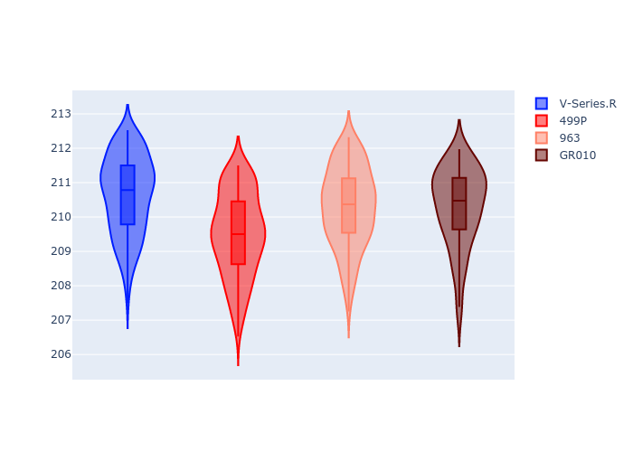
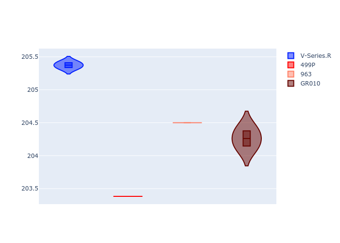
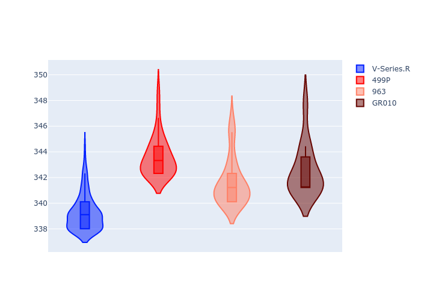
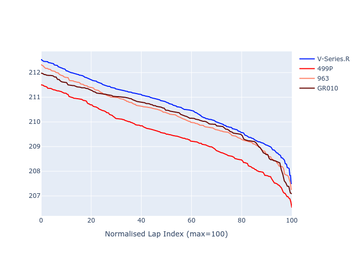

# Combined Plots

## Metadata

- BoP Accuracy: 95.60%
- Overall BoP Grade: A1
- Track: LEMANS
- Threshhold: 0.0kph
- Average Laptime: 3:30.18
- Average Quali Laptime: 3:23.93
- Laptime Std Dev: 0.42 seconds
- Filtered Average Topspeed: 341.77kph

## BoP Table
| Manufacturer   | Car        | Weight   | Power   | PINC   | E/Stint   | FDS    | RDP    | QDP    | TDP    |
|:---------------|:-----------|:---------|:--------|:-------|:----------|:-------|:-------|:-------|:-------|
| Cadillac       | V-Series.R | 1046kg   | 513.0kw | -      | 905MJ     | -      | 37.91% | 28.57% | 13.28% |
| Ferrari        | 499P       | 1064kg   | 509.0kw | -      | 901MJ     | 190kph | 38.44% | 16.67% | 5.59%  |
| Porsche        | 963        | 1048kg   | 516.0kw | -      | 910MJ     | -      | 35.21% | 25.00% | 3.20%  |
| Toyota         | GR010      | 1080kg   | 512.0kw | -      | 908MJ     | 190kph | 37.75% | 40.00% | 2.44%  |

## Performance Table
| Manufacturer   | Car        | RP      | QP      | Vavg      |   RDLC | BOP-Grade   | Match   |
|:---------------|:-----------|:--------|:--------|:----------|-------:|:------------|:--------|
| Cadillac       | V-Series.R | 3:30.64 | 3:24.86 | 339.25kph |   1.03 | +A2         | 90.03%  |
| Ferrari        | 499P       | 3:29.49 | 3:22.87 | 343.61kph |   1.03 | ~A1         | 97.32%  |
| Porsche        | 963        | 3:30.29 | 3:24.09 | 341.66kph |   1.03 | ~A1         | 95.64%  |
| Toyota         | GR010      | 3:30.31 | 3:23.88 | 342.55kph |   1.03 | ~A1         | 99.40%  |

## Race Laptimes

## Quali Laptimes

## Topspeeds

## Laptimes Lineplot

