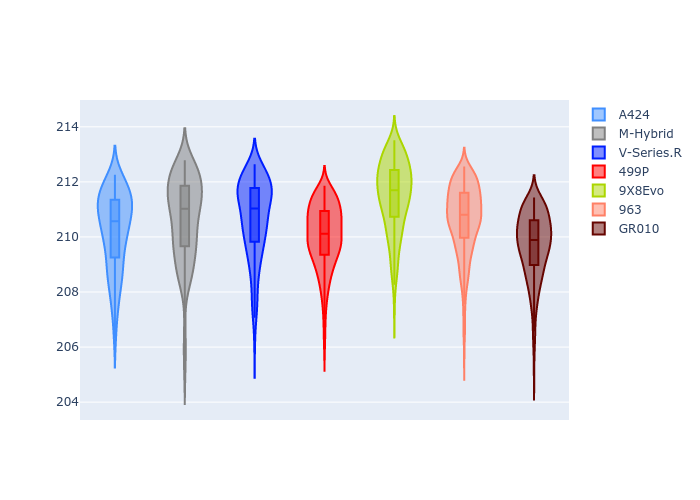
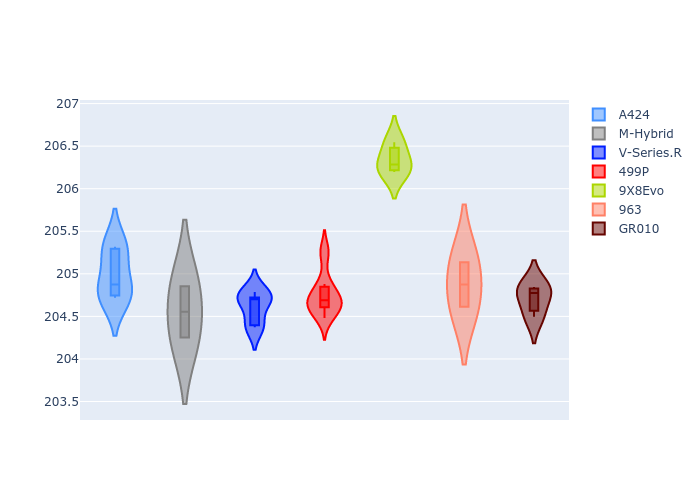
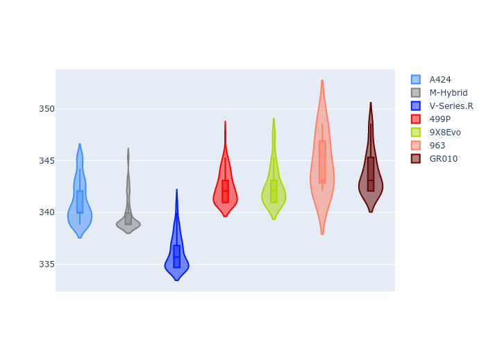
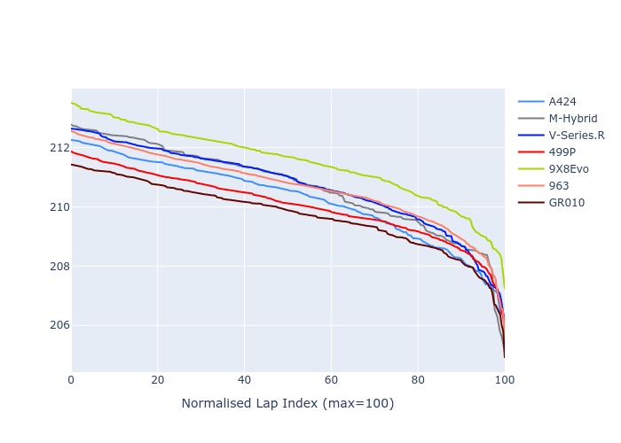

# Combined Plots

## Metadata

- BoP Accuracy: 93.42%
- Overall BoP Grade: A2
- Track: LEMANS
- Threshhold: 250.0kph
- Average Laptime: 3:30.50
- Average Quali Laptime: 3:25.49
- Laptime Std Dev: 0.53 seconds
- Filtered Average Topspeed: 341.47kph

## BoP Table
| Manufacturer   | Car        | Weight   | Power   | PINC   | E/Stint   | FDS    | RDP    | QDP    | TDP    |
|:---------------|:-----------|:---------|:--------|:-------|:----------|:-------|:-------|:-------|:-------|
| Alpine         | A424       | 1038kg   | 507.0kw | +0.90% | 903MJ     | -      | 44.91% | 62.50% | 24.00% |
| BMW            | M-Hybrid   | 1039kg   | 508.0kw | +0.90% | 904MJ     | -      | 41.75% | 50.00% | 8.15%  |
| Cadillac       | V-Series.R | 1036kg   | 509.0kw | -      | 900MJ     | -      | 31.03% | 75.00% | 11.68% |
| Ferrari        | 499P       | 1043kg   | 508.0kw | -1.70% | 889MJ     | 190kph | 36.57% | 70.00% | 5.75%  |
| Peugeot        | 9X8Evo     | 1047kg   | 508.0kw | -0.70% | 895MJ     | 190kph | 31.11% | 37.50% | 4.26%  |
| Porsche        | 963        | 1042kg   | 511.0kw | -      | 904MJ     | -      | 33.39% | 11.11% | 0.20%  |
| Toyota         | GR010      | 1053kg   | 508.0kw | +0.90% | 906MJ     | 190kph | 32.95% | 42.86% | 4.38%  |

## Performance Table
| Manufacturer   | Car        | RP      | QP      | Vavg      |   RDLC | BOP-Grade   | Match   |
|:---------------|:-----------|:--------|:--------|:----------|-------:|:------------|:--------|
| Alpine         | A424       | 3:30.24 | 3:25.44 | 341.05kph |   1.02 | ~A1         | 100.00% |
| BMW            | M-Hybrid   | 3:30.67 | 3:25.00 | 339.77kph |   1.03 | -B1         | 89.53%  |
| Cadillac       | V-Series.R | 3:30.70 | 3:25.12 | 336.13kph |   1.03 | -A2         | 92.86%  |
| Ferrari        | 499P       | 3:30.04 | 3:25.32 | 342.42kph |   1.02 | ~A1         | 100.00% |
| Peugeot        | 9X8Evo     | 3:31.49 | 3:26.93 | 342.50kph |   1.02 | +C2         | 75.00%  |
| Porsche        | 963        | 3:30.66 | 3:25.34 | 344.62kph |   1.03 | ~A1         | 97.28%  |
| Toyota         | GR010      | 3:29.71 | 3:25.30 | 343.78kph |   1.02 | ~A1         | 99.30%  |

## Race Laptimes

## Quali Laptimes

## Topspeeds

## Laptimes Lineplot

