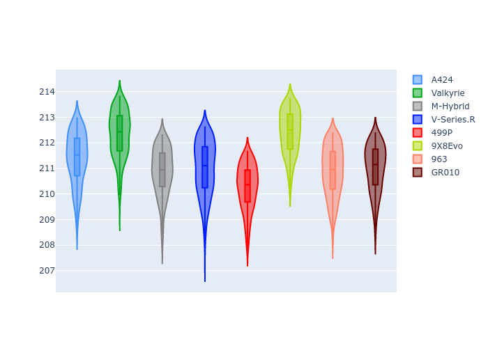
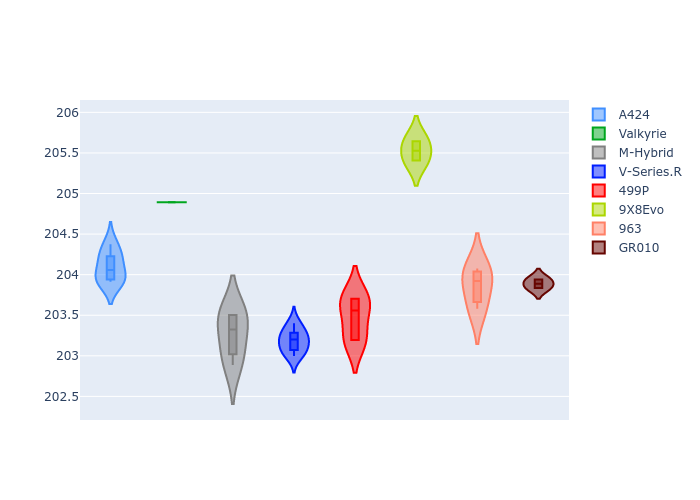
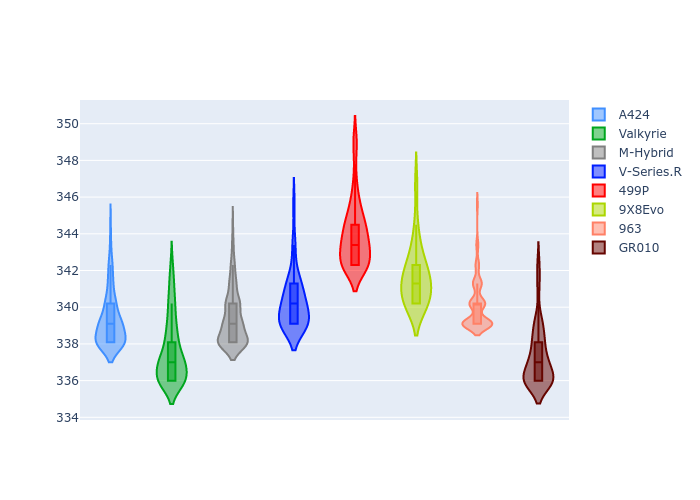
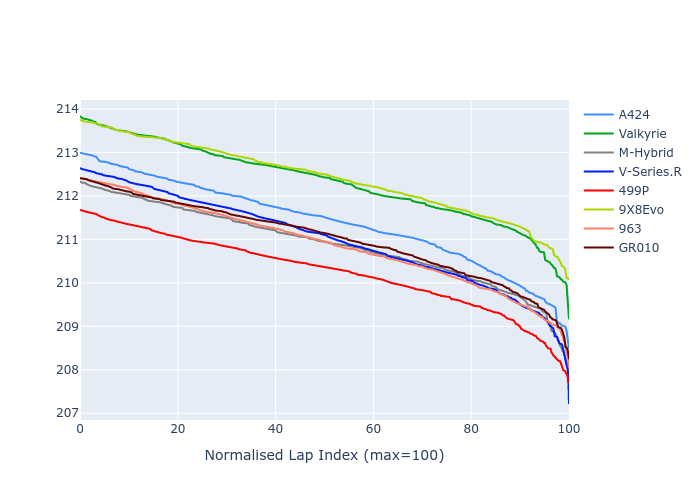

# Combined Plots

## Metadata

- BoP Accuracy: 89.41%
- Overall BoP Grade: B1
- Track: LEMANS
- Threshhold: 250.0kph
- Average Laptime: 3:31.26
- Average Quali Laptime: 3:25.05
- Laptime Std Dev: 0.70 seconds
- Filtered Average Topspeed: 339.93kph

## BoP Table
| Manufacturer   | Car        | Weight   | Power   | PINC   | E/Stint   | FDS    | RDP    | QDP    | TDP    |
|:---------------|:-----------|:---------|:--------|:-------|:----------|:-------|:-------|:-------|:-------|
| Alpine         | A424       | 1039kg   | 517.0kw | -1.70% | 897MJ     | -      | 51.89% | 42.86% | 16.41% |
| Aston Martin   | Valkyrie   | 1030kg   | 520.0kw | -0.80% | 910MJ     | -      | 53.93% | 12.50% | 14.64% |
| BMW            | M-Hybrid   | 1039kg   | 510.0kw | +2.00% | 919MJ     | -      | 52.72% | 44.44% | 37.84% |
| Cadillac       | V-Series.R | 1037kg   | 517.0kw | -0.80% | 905MJ     | -      | 51.28% | 38.89% | 3.11%  |
| Ferrari        | 499P       | 1042kg   | 515.0kw | -2.90% | 896MJ     | 190kph | 52.71% | 55.56% | 6.74%  |
| Peugeot        | 9X8Evo     | 1039kg   | 507.0kw | -1.20% | 889MJ     | 190kph | 51.77% | 40.00% | 3.28%  |
| Porsche        | 963        | 1041kg   | 511.0kw | +1.40% | 917MJ     | -      | 51.10% | 21.43% | 9.66%  |
| Toyota         | GR010      | 1053kg   | 520.0kw | -1.30% | 914MJ     | 190kph | 54.44% | 50.00% | 16.38% |

## Performance Table
| Manufacturer   | Car        | RP      | QP      | Vavg      |   RDLC | BOP-Grade   | Match   |
|:---------------|:-----------|:--------|:--------|:----------|-------:|:------------|:--------|
| Alpine         | A424       | 3:31.39 | 3:25.16 | 339.26kph |   1.03 | +A2         | 93.73%  |
| Aston Martin   | Valkyrie   | 3:32.31 | 3:25.78 | 337.61kph |   1.03 | +D1         | 65.29%  |
| BMW            | M-Hybrid   | 3:30.87 | 3:24.40 | 339.37kph |   1.03 | ~A1         | 98.97%  |
| Cadillac       | V-Series.R | 3:30.99 | 3:24.17 | 340.26kph |   1.03 | ~A1         | 99.03%  |
| Ferrari        | 499P       | 3:30.25 | 3:24.59 | 343.92kph |   1.03 | ~A1         | 96.57%  |
| Peugeot        | 9X8Evo     | 3:32.40 | 3:26.55 | 341.66kph |   1.03 | +D2         | 62.28%  |
| Porsche        | 963        | 3:30.88 | 3:24.77 | 340.10kph |   1.03 | ~A1         | 99.62%  |
| Toyota         | GR010      | 3:31.00 | 3:24.94 | 337.27kph |   1.03 | ~A1         | 99.76%  |

## Race Laptimes

## Quali Laptimes

## Topspeeds

## Laptimes Lineplot

