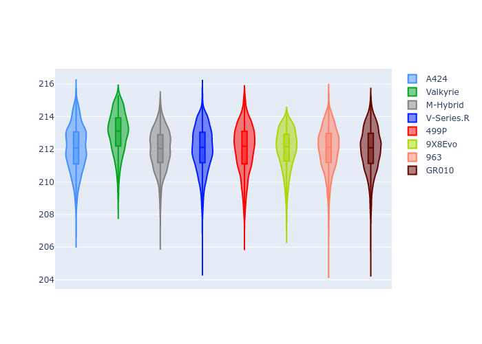
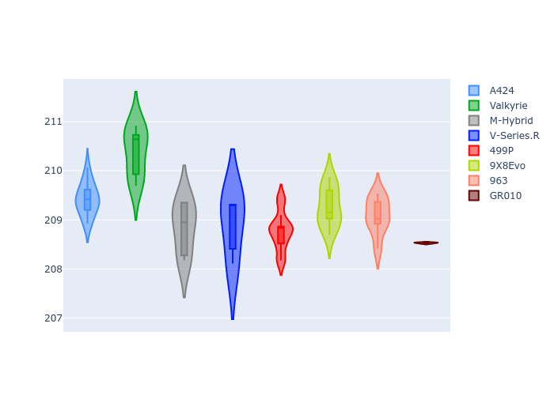
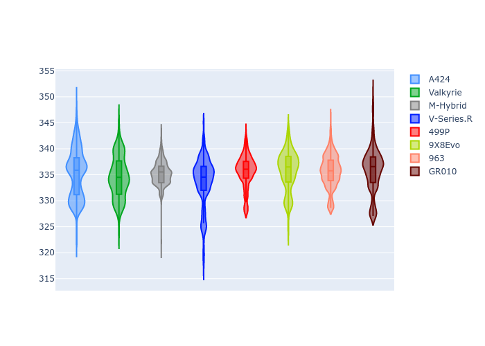
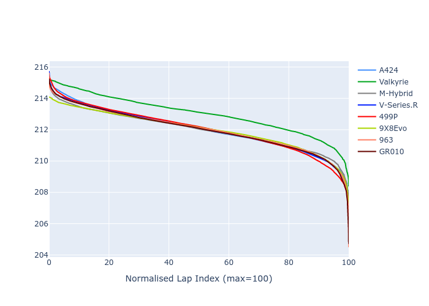

# Combined Plots

## Metadata

- BoP Accuracy: 99.89%
- Overall BoP Grade: A1
- Track: LM_TESTDAY
- Threshhold: 250.0kph
- Average Laptime: 3:32.14
- Average Quali Laptime: 3:29.15
- Laptime Std Dev: 0.33 seconds
- Filtered Average Topspeed: 335.21kph

## BoP Table
| Manufacturer   | Car        | Weight   | Power   | PINC   | E/Stint   | FDS    | RDP    | QDP    | TDP    |
|:---------------|:-----------|:---------|:--------|:-------|:----------|:-------|:-------|:-------|:-------|
| Alpine         | A424       | 1040kg   | 505.0kw | +2.90% | 894MJ     | -      | 52.20% | 54.51% | 24.58% |
| Aston Martin   | Valkyrie   | 1030kg   | 520.0kw | -      | 911MJ     | -      | 53.39% | 54.11% | 23.71% |
| BMW            | M-Hybrid   | 1040kg   | 509.0kw | +2.10% | 918MJ     | -      | 53.47% | 52.95% | 33.73% |
| Cadillac       | V-Series.R | 1043kg   | 520.0kw | -      | 910MJ     | -      | 49.22% | 60.31% | 18.04% |
| Ferrari        | 499P       | 1062kg   | 517.0kw | -3.90% | 898MJ     | 200kph | 51.56% | 44.72% | 9.86%  |
| Peugeot        | 9X8Evo     | 1030kg   | 518.0kw | -3.70% | 893MJ     | 200kph | 50.17% | 49.36% | 17.73% |
| Porsche        | 963        | 1036kg   | 508.0kw | -1.40% | 909MJ     | -      | 50.78% | 41.25% | 27.61% |
| Toyota         | GR010      | 1060kg   | 517.0kw | -5.00% | 906MJ     | 200kph | 51.68% | 51.25% | 14.48% |

## Performance Table
| Manufacturer   | Car        | RP      | QP      | Vavg      |   RDLC | BOP-Grade   | Match   |
|:---------------|:-----------|:--------|:--------|:----------|-------:|:------------|:--------|
| Alpine         | A424       | 3:32.05 | 3:29.42 | 335.24kph |   1.01 | ~A1         | 99.94%  |
| Aston Martin   | Valkyrie   | 3:33.01 | 3:30.38 | 334.55kph |   1.01 | ~A1         | 99.93%  |
| BMW            | M-Hybrid   | 3:31.99 | 3:28.85 | 335.26kph |   1.02 | ~A1         | 100.00% |
| Cadillac       | V-Series.R | 3:32.03 | 3:28.91 | 333.68kph |   1.01 | ~A1         | 99.79%  |
| Ferrari        | 499P       | 3:32.02 | 3:28.78 | 335.68kph |   1.02 | ~A1         | 99.72%  |
| Peugeot        | 9X8Evo     | 3:32.00 | 3:29.27 | 335.78kph |   1.01 | ~A1         | 100.00% |
| Porsche        | 963        | 3:32.03 | 3:29.08 | 335.68kph |   1.01 | ~A1         | 99.92%  |
| Toyota         | GR010      | 3:32.00 | 3:28.53 | 335.80kph |   1.02 | ~A1         | 99.85%  |

## Race Laptimes

## Quali Laptimes

## Topspeeds

## Laptimes Lineplot

