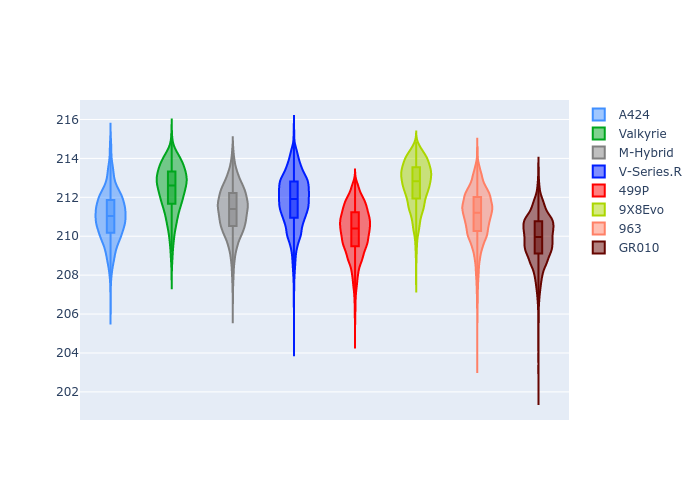
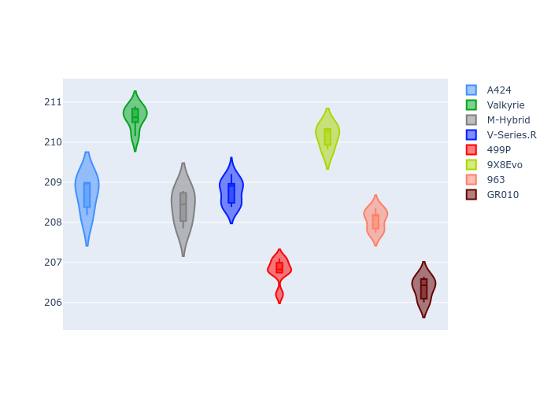
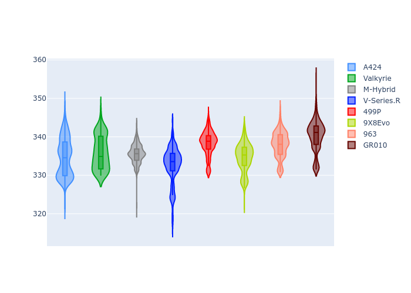
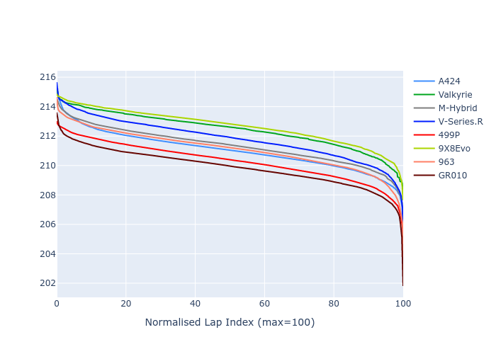

# Combined Plots

## Metadata

- BoP Accuracy: 99.52%
- Overall BoP Grade: A1
- Track: LM_TESTDAY
- Threshhold: 250.0kph
- Average Laptime: 3:31.31
- Average Quali Laptime: 3:28.48
- Laptime Std Dev: 0.91 seconds
- Filtered Average Topspeed: 336.23kph

## BoP Table
| Manufacturer   | Car        | Weight   | Power   | PINC   | E/Stint   | FDS    | RDP    | QDP    | TDP    |
|:---------------|:-----------|:---------|:--------|:-------|:----------|:-------|:-------|:-------|:-------|
| Alpine         | A424       | 1039kg   | 517.0kw | -1.70% | 897MJ     | -      | 51.38% | 57.54% | 26.10% |
| Aston Martin   | Valkyrie   | 1030kg   | 520.0kw | -0.80% | 910MJ     | -      | 52.56% | 51.11% | 27.23% |
| BMW            | M-Hybrid   | 1039kg   | 510.0kw | +2.00% | 919MJ     | -      | 52.62% | 53.36% | 32.99% |
| Cadillac       | V-Series.R | 1037kg   | 517.0kw | -0.80% | 905MJ     | -      | 48.29% | 59.47% | 18.65% |
| Ferrari        | 499P       | 1042kg   | 515.0kw | -2.90% | 896MJ     | 190kph | 51.25% | 43.28% | 10.17% |
| Peugeot        | 9X8Evo     | 1039kg   | 507.0kw | -1.20% | 889MJ     | 190kph | 48.70% | 50.83% | 18.68% |
| Porsche        | 963        | 1041kg   | 511.0kw | +1.40% | 917MJ     | -      | 50.57% | 42.80% | 29.05% |
| Toyota         | GR010      | 1053kg   | 520.0kw | -1.30% | 914MJ     | 190kph | 51.03% | 51.78% | 14.64% |

## Performance Table
| Manufacturer   | Car        | RP      | QP      | Vavg      |   RDLC | BOP-Grade   | Match   |
|:---------------|:-----------|:--------|:--------|:----------|-------:|:------------|:--------|
| Alpine         | A424       | 3:30.98 | 3:28.72 | 334.71kph |   1.01 | ~A1         | 99.38%  |
| Aston Martin   | Valkyrie   | 3:32.43 | 3:30.62 | 335.97kph |   1.01 | ~A1         | 99.27%  |
| BMW            | M-Hybrid   | 3:31.33 | 3:28.38 | 335.60kph |   1.01 | ~A1         | 100.00% |
| Cadillac       | V-Series.R | 3:31.81 | 3:28.75 | 332.62kph |   1.01 | ~A1         | 99.40%  |
| Ferrari        | 499P       | 3:30.29 | 3:26.79 | 338.27kph |   1.02 | ~A1         | 99.93%  |
| Peugeot        | 9X8Evo     | 3:32.67 | 3:30.15 | 334.60kph |   1.01 | ~A1         | 98.75%  |
| Porsche        | 963        | 3:31.09 | 3:28.06 | 337.97kph |   1.01 | ~A1         | 99.92%  |
| Toyota         | GR010      | 3:29.88 | 3:26.36 | 340.13kph |   1.02 | ~A1         | 99.54%  |

## Race Laptimes

## Quali Laptimes

## Topspeeds

## Laptimes Lineplot

