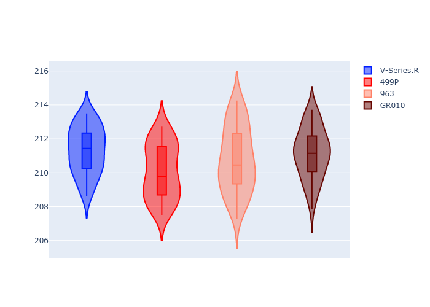
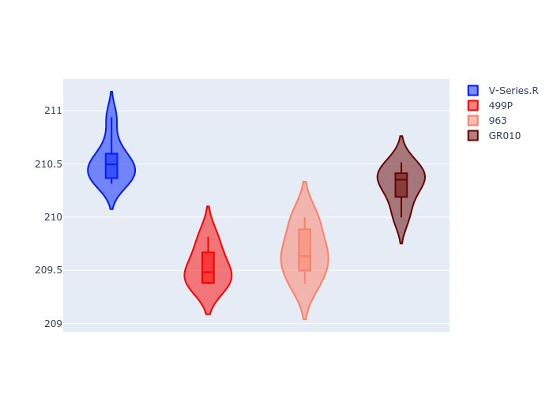
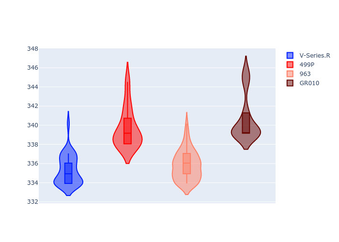
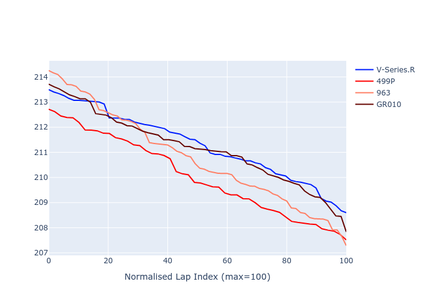

# Combined Plots

## Metadata

- BoP Accuracy: 94.73%
- Overall BoP Grade: A2
- Track: LM_TESTDAY
- Threshhold: 0.0kph
- Average Laptime: 3:30.82
- Average Quali Laptime: 3:31.01
- Laptime Std Dev: 0.48 seconds
- Filtered Average Topspeed: 337.86kph

## BoP Table
| Manufacturer   | Car        | Weight   | Power   | PINC   | E/Stint   | FDS    | RDP    | QDP    | TDP    |
|:---------------|:-----------|:---------|:--------|:-------|:----------|:-------|:-------|:-------|:-------|
| Cadillac       | V-Series.R | 1046kg   | 513.0kw | -      | 905MJ     | -      | 36.81% | 66.67% | 20.86% |
| Ferrari        | 499P       | 1064kg   | 509.0kw | -      | 901MJ     | 190kph | 39.06% | 25.00% | 9.38%  |
| Porsche        | 963        | 1048kg   | 516.0kw | -      | 910MJ     | -      | 33.50% | 32.00% | 28.93% |
| Toyota         | GR010      | 1080kg   | 512.0kw | -      | 908MJ     | 190kph | 43.94% | 60.00% | 7.58%  |

## Performance Table
| Manufacturer   | Car        | RP      | QP      | Vavg      |   RDLC | BOP-Grade   | Match   |
|:---------------|:-----------|:--------|:--------|:----------|-------:|:------------|:--------|
| Cadillac       | V-Series.R | 3:31.30 | 3:31.50 | 335.30kph |      1 | ~A1         | 100.00% |
| Ferrari        | 499P       | 3:30.06 | 3:30.46 | 339.68kph |      1 | ~A1         | 96.00%  |
| Porsche        | 963        | 3:30.78 | 3:30.70 | 335.82kph |      1 | -B1         | 86.36%  |
| Toyota         | GR010      | 3:31.15 | 3:31.36 | 340.65kph |      1 | ~A1         | 96.55%  |

## Race Laptimes

## Quali Laptimes

## Topspeeds

## Laptimes Lineplot

