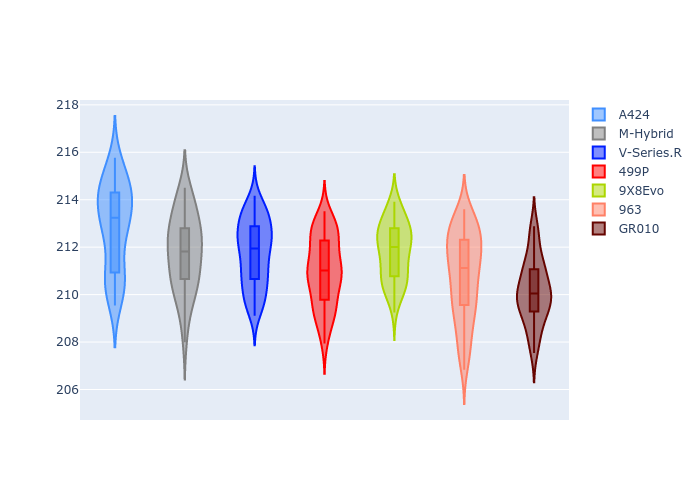
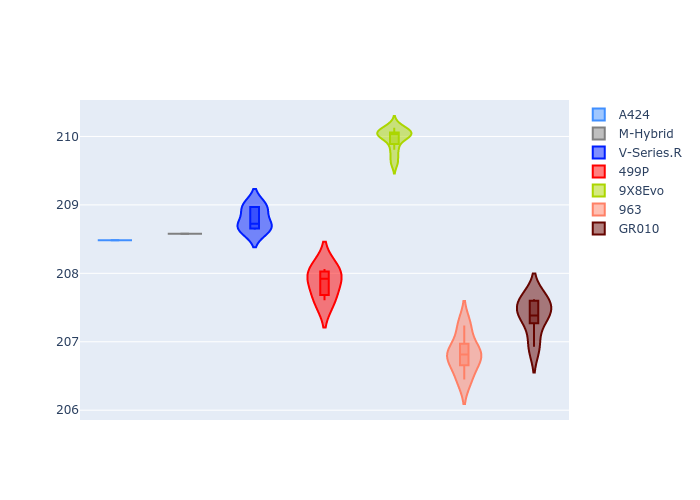
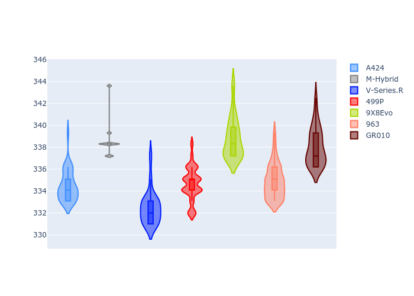
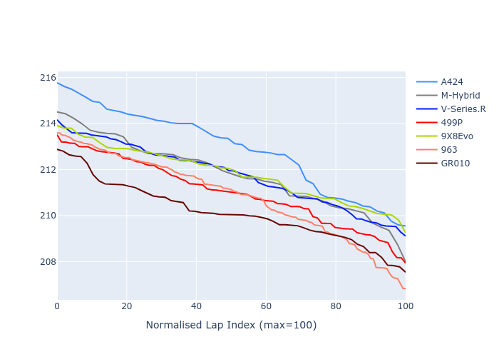

# Combined Plots

## Metadata

- BoP Accuracy: 90.63%
- Overall BoP Grade: A2
- Track: LM_TESTDAY
- Threshhold: 250.0kph
- Average Laptime: 3:31.46
- Average Quali Laptime: 3:28.67
- Laptime Std Dev: 0.82 seconds
- Filtered Average Topspeed: 336.02kph

## BoP Table
| Manufacturer   | Car        | Weight   | Power   | PINC   | E/Stint   | FDS    | RDP    | QDP    | TDP    |
|:---------------|:-----------|:---------|:--------|:-------|:----------|:-------|:-------|:-------|:-------|
| Alpine         | A424       | 1038kg   | 507.0kw | +0.90% | 903MJ     | -      | 40.00% | 20.00% | 28.80% |
| BMW            | M-Hybrid   | 1039kg   | 508.0kw | +0.90% | 904MJ     | -      | 37.07% | 20.00% | 7.76%  |
| Cadillac       | V-Series.R | 1036kg   | 509.0kw | -      | 900MJ     | -      | 41.14% | 33.33% | 12.00% |
| Ferrari        | 499P       | 1043kg   | 508.0kw | -1.70% | 889MJ     | 190kph | 39.80% | 18.75% | 16.42% |
| Peugeot        | 9X8Evo     | 1047kg   | 508.0kw | -0.70% | 895MJ     | 190kph | 42.02% | 34.78% | 29.91% |
| Porsche        | 963        | 1042kg   | 511.0kw | -      | 904MJ     | -      | 35.99% | 45.45% | 33.88% |
| Toyota         | GR010      | 1053kg   | 508.0kw | +0.90% | 906MJ     | 190kph | 40.97% | 62.50% | 23.61% |

## Performance Table
| Manufacturer   | Car        | RP      | QP      | Vavg      |   RDLC | BOP-Grade   | Match   |
|:---------------|:-----------|:--------|:--------|:----------|-------:|:------------|:--------|
| Alpine         | A424       | 3:32.90 | 3:29.04 | 334.48kph |   1.02 | +D1         | 68.00%  |
| BMW            | M-Hybrid   | 3:31.79 | 3:28.71 | 338.76kph |   1.01 | -A2         | 90.70%  |
| Cadillac       | V-Series.R | 3:31.75 | 3:29.27 | 332.47kph |   1.01 | ~A1         | 98.61%  |
| Ferrari        | 499P       | 3:31.00 | 3:28.32 | 334.66kph |   1.01 | ~A1         | 96.25%  |
| Peugeot        | 9X8Evo     | 3:31.82 | 3:30.30 | 338.84kph |   1.01 | ~A1         | 100.00% |
| Porsche        | 963        | 3:30.82 | 3:27.23 | 334.92kph |   1.02 | -B1         | 89.31%  |
| Toyota         | GR010      | 3:30.14 | 3:27.80 | 338.03kph |   1.01 | -A2         | 91.53%  |

## Race Laptimes

## Quali Laptimes

## Topspeeds

## Laptimes Lineplot

