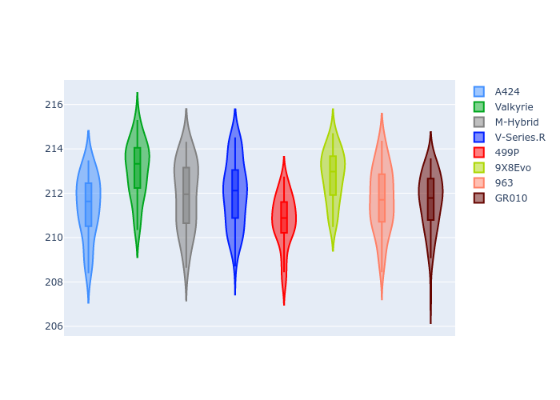
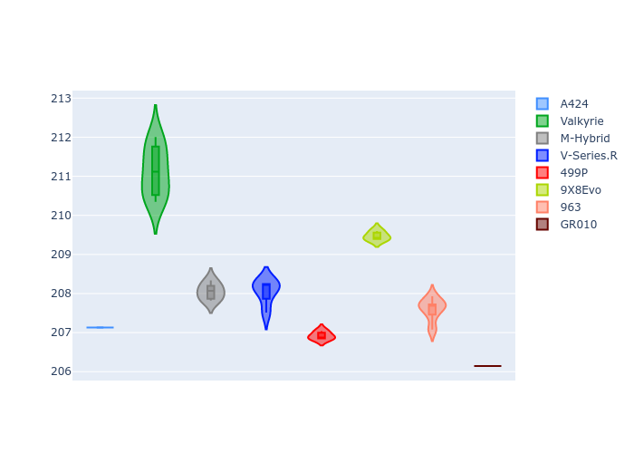
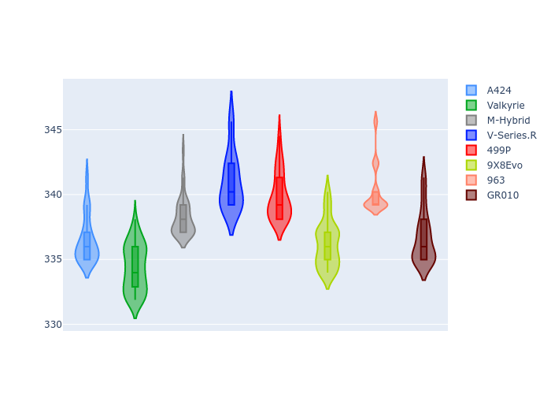
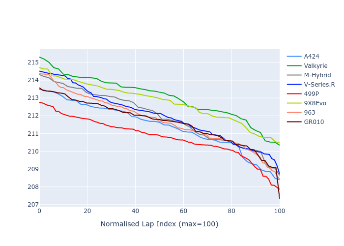

# Combined Plots

## Metadata

- BoP Accuracy: 90.56%
- Overall BoP Grade: A2
- Track: LM_TESTDAY
- Threshhold: 250.0kph
- Average Laptime: 3:31.90
- Average Quali Laptime: 3:29.02
- Laptime Std Dev: 0.68 seconds
- Filtered Average Topspeed: 337.90kph

## BoP Table
| Manufacturer   | Car        | Weight   | Power   | PINC   | E/Stint   | FDS    | RDP    | QDP    | TDP    |
|:---------------|:-----------|:---------|:--------|:-------|:----------|:-------|:-------|:-------|:-------|
| Alpine         | A424       | 1039kg   | 517.0kw | -1.70% | 897MJ     | -      | 38.69% | 6.25%  | 17.52% |
| Aston Martin   | Valkyrie   | 1030kg   | 520.0kw | -0.80% | 910MJ     | -      | 40.80% | 50.00% | 36.00% |
| BMW            | M-Hybrid   | 1039kg   | 510.0kw | +2.00% | 919MJ     | -      | 39.39% | 38.46% | 29.55% |
| Cadillac       | V-Series.R | 1037kg   | 517.0kw | -0.80% | 905MJ     | -      | 37.15% | 45.45% | 3.56%  |
| Ferrari        | 499P       | 1042kg   | 515.0kw | -2.90% | 896MJ     | 190kph | 43.14% | 15.00% | 13.73% |
| Peugeot        | 9X8Evo     | 1039kg   | 507.0kw | -1.20% | 889MJ     | 190kph | 42.34% | 30.00% | 29.93% |
| Porsche        | 963        | 1041kg   | 511.0kw | +1.40% | 917MJ     | -      | 39.37% | 27.27% | 5.12%  |
| Toyota         | GR010      | 1053kg   | 520.0kw | -1.30% | 914MJ     | 190kph | 47.52% | 9.09%  | 30.50% |

## Performance Table
| Manufacturer   | Car        | RP      | QP      | Vavg      |   RDLC | BOP-Grade   | Match   |
|:---------------|:-----------|:--------|:--------|:----------|-------:|:------------|:--------|
| Alpine         | A424       | 3:31.39 | 3:28.22 | 336.47kph |   1.02 | ~A1         | 96.23%  |
| Aston Martin   | Valkyrie   | 3:33.04 | 3:32.16 | 334.34kph |   1    | +C1         | 76.47%  |
| BMW            | M-Hybrid   | 3:31.90 | 3:29.02 | 338.25kph |   1.01 | -A2         | 92.31%  |
| Cadillac       | V-Series.R | 3:31.99 | 3:28.99 | 340.98kph |   1.01 | -B1         | 87.23%  |
| Ferrari        | 499P       | 3:30.78 | 3:27.84 | 339.87kph |   1.01 | -A2         | 92.05%  |
| Peugeot        | 9X8Evo     | 3:32.77 | 3:30.22 | 336.22kph |   1.01 | +B1         | 89.66%  |
| Porsche        | 963        | 3:31.73 | 3:28.58 | 340.35kph |   1.02 | -A2         | 92.00%  |
| Toyota         | GR010      | 3:31.61 | 3:27.11 | 336.69kph |   1.02 | ~A1         | 98.51%  |

## Race Laptimes

## Quali Laptimes

## Topspeeds

## Laptimes Lineplot

