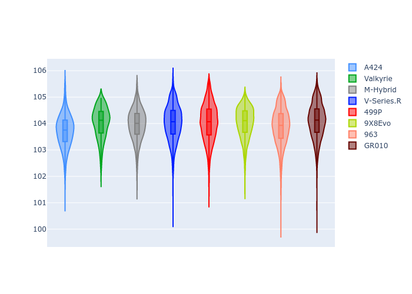

# Combined Plots

## Metadata

- BoP Accuracy: 99.70%
- Overall BoP Grade: A1
- Track: QATAR
- Threshhold: 250.0kph
- Average Laptime: 1:43.97
- Average Quali Laptime: 1:40.01
- Average Topspeed: 303.86kph

## BoP Table
| Manufacturer   | Car        | Weight   | Power   | PINC   | E/Stint   | FDS    | RDP    | QDP    | TDP    |
|:---------------|:-----------|:---------|:--------|:-------|:----------|:-------|:-------|:-------|:-------|
| Alpine         | A424       | 1067kg   | 520.0kw | -0.10% | 923MJ     | -      | 51.64% | 59.31% | 26.80% |
| Aston Martin   | Valkyrie   | 1031kg   | 511.0kw | -      | 903MJ     | -      | 53.50% | 53.33% | 21.51% |
| BMW            | M-Hybrid   | 1061kg   | 512.0kw | +0.10% | 909MJ     | -      | 52.89% | 56.22% | 33.41% |
| Cadillac       | V-Series.R | 1049kg   | 510.0kw | +0.10% | 899MJ     | -      | 48.63% | 60.80% | 19.01% |
| Ferrari        | 499P       | 1073kg   | 508.0kw | -0.10% | 907MJ     | 190kph | 51.38% | 44.98% | 9.83%  |
| Peugeot        | 9X8Evo     | 1046kg   | 511.0kw | -      | 916MJ     | 190kph | 48.87% | 52.78% | 15.41% |
| Porsche        | 963        | 1067kg   | 516.0kw | -0.10% | 914MJ     | -      | 50.70% | 44.30% | 29.51% |
| Toyota         | GR010      | 1083kg   | 512.0kw | -0.10% | 910MJ     | 190kph | 51.09% | 52.71% | 11.46% |

## Performance Table
| Manufacturer   | Car        | RP      | QP      | Vavg      |   RDLC | BOP-Grade   | Match   |
|:---------------|:-----------|:--------|:--------|:----------|-------:|:------------|:--------|
| Alpine         | A424       | 1:43.70 | 1:40.04 | 303.35kph |   1.04 | ~A1         | 99.79%  |
| Aston Martin   | Valkyrie   | 1:44.03 | 1:39.87 | 304.75kph |   1.04 | ~A1         | 100.00% |
| BMW            | M-Hybrid   | 1:43.96 | 1:39.92 | 301.85kph |   1.04 | ~A1         | 99.81%  |
| Cadillac       | V-Series.R | 1:44.03 | 1:40.03 | 300.18kph |   1.04 | ~A1         | 99.56%  |
| Ferrari        | 499P       | 1:44.03 | 1:39.95 | 305.10kph |   1.04 | ~A1         | 99.16%  |
| Peugeot        | 9X8Evo     | 1:44.03 | 1:40.22 | 305.42kph |   1.04 | ~A1         | 100.00% |
| Porsche        | 963        | 1:43.88 | 1:40.21 | 304.57kph |   1.04 | ~A1         | 99.86%  |
| Toyota         | GR010      | 1:44.09 | 1:39.87 | 305.69kph |   1.04 | ~A1         | 99.45%  |

## Race Laptimes

## Quali Laptimes

## Topspeeds

## Laptimes Lineplot

