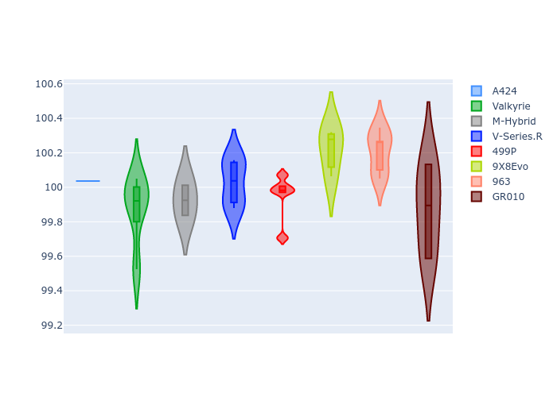

# Combined Plots

## Metadata

- BoP Accuracy: 99.45%
- Overall BoP Grade: A1
- Track: QATAR
- Threshhold: 210.0kph

## BoP Table
| Manufacturer   | Car        | Weight   | Power   | PINC   | E/Stint   | FDS    |
|:---------------|:-----------|:---------|:--------|:-------|:----------|:-------|
| Alpine         | A424       | 1067kg   | 520.0kw | -1.00% | 921MJ     | -      |
| Aston Martin   | Valkyrie   | 1042kg   | 506.0kw | +0.40% | 901MJ     | -      |
| BMW            | M-Hybrid   | 1061kg   | 512.0kw | +1.00% | 911MJ     | -      |
| Cadillac       | V-Series.R | 1054kg   | 510.0kw | +1.00% | 902MJ     | -      |
| Ferrari        | 499P       | 1083kg   | 508.0kw | -1.00% | 906MJ     | 190kph |
| Peugeot        | 9X8Evo     | 1063kg   | 510.0kw | -1.00% | 914MJ     | 190kph |
| Porsche        | 963        | 1067kg   | 516.0kw | -1.00% | 912MJ     | -      |
| Toyota         | GR010      | 1100kg   | 512.0kw | +1.00% | 915MJ     | 190kph |

## Performance Table
| Manufacturer   | Car        | RP      | QP      | Vavg      |   RDLC | BOP-Grade   | Match   |
|:---------------|:-----------|:--------|:--------|:----------|-------:|:------------|:--------|
| Alpine         | A424       | 1:42.38 | 1:39.23 | 300.97kph |   1.03 | ~A1         | 99.77%  |
| Aston Martin   | Valkyrie   | 1:43.32 | 1:39.42 | 300.67kph |   1.04 | ~A1         | 100.00% |
| BMW            | M-Hybrid   | 1:42.55 | 1:39.07 | 300.37kph |   1.04 | ~A1         | 99.61%  |
| Cadillac       | V-Series.R | 1:42.83 | 1:39.42 | 297.33kph |   1.03 | ~A1         | 99.96%  |
| Ferrari        | 499P       | 1:43.05 | 1:39.46 | 299.41kph |   1.04 | ~A1         | 99.98%  |
| Peugeot        | 9X8Evo     | 1:43.31 | 1:39.81 | 301.15kph |   1.04 | ~A1         | 96.44%  |
| Porsche        | 963        | 1:42.70 | 1:39.28 | 299.23kph |   1.03 | ~A1         | 99.88%  |
| Toyota         | GR010      | 1:43.01 | 1:39.32 | 300.65kph |   1.04 | ~A1         | 99.98%  |

## Race Laptimes

## Quali Laptimes

## Topspeeds

## Laptimes Lineplot

