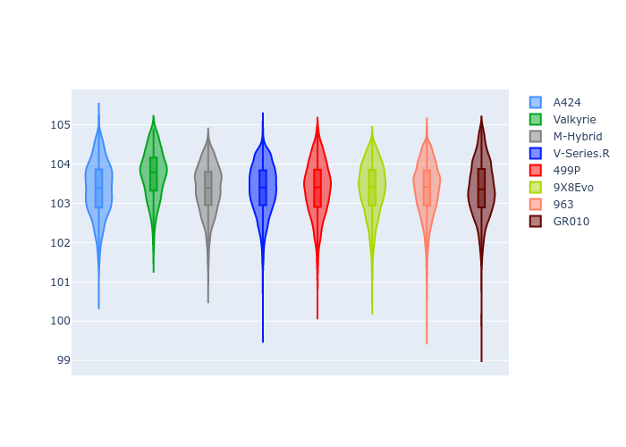
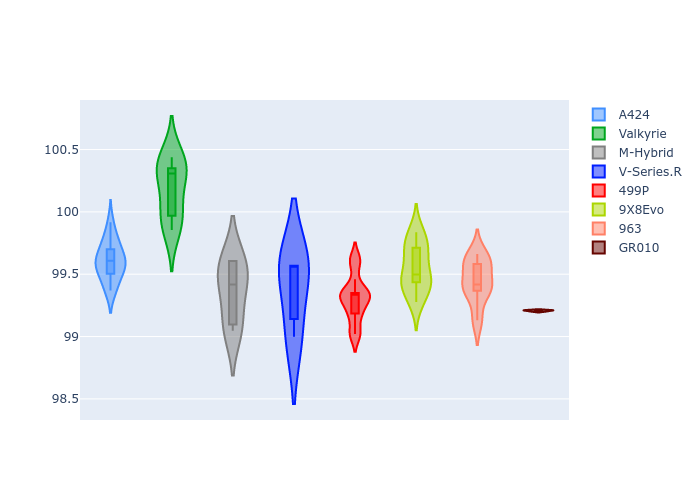
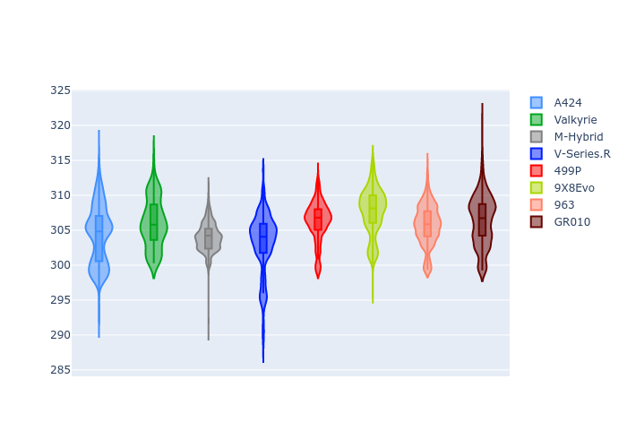
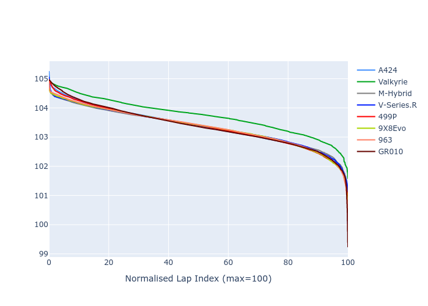

# Combined Plots

## Metadata

- BoP Accuracy: 99.89%
- Overall BoP Grade: A1
- Track: QATAR
- Threshhold: 0.0kph
- Average Laptime: 1:43.41
- Average Quali Laptime: 1:39.64
- Laptime Std Dev: 0.12 seconds
- Filtered Average Topspeed: 305.44kph

## BoP Table
| Manufacturer   | Car        | Weight   | Power   | PINC   | E/Stint   | FDS    | RDP    | QDP    | TDP    |
|:---------------|:-----------|:---------|:--------|:-------|:----------|:-------|:-------|:-------|:-------|
| Alpine         | A424       | 1039kg   | 510.0kw | -      | 912MJ     | -      | 51.45% | 55.09% | 24.89% |
| Aston Martin   | Valkyrie   | 1030kg   | 520.0kw | -      | 911MJ     | -      | 53.07% | 48.70% | 24.00% |
| BMW            | M-Hybrid   | 1039kg   | 511.0kw | -      | 906MJ     | -      | 52.63% | 52.34% | 34.06% |
| Cadillac       | V-Series.R | 1044kg   | 520.0kw | -      | 907MJ     | -      | 48.80% | 57.26% | 18.10% |
| Ferrari        | 499P       | 1061kg   | 507.0kw | -      | 905MJ     | 190kph | 51.39% | 44.34% | 9.89%  |
| Peugeot        | 9X8Evo     | 1031kg   | 513.0kw | -      | 916MJ     | 200kph | 49.16% | 50.25% | 18.00% |
| Porsche        | 963        | 1036kg   | 506.0kw | -      | 902MJ     | -      | 50.61% | 41.90% | 27.68% |
| Toyota         | GR010      | 1060kg   | 506.0kw | -      | 903MJ     | 190kph | 51.33% | 51.71% | 14.89% |

## Performance Table
| Manufacturer   | Car        | RP      | QP      | Vavg      |   RDLC | BOP-Grade   | Match   |
|:---------------|:-----------|:--------|:--------|:----------|-------:|:------------|:--------|
| Alpine         | A424       | 1:43.37 | 1:39.76 | 304.33kph |   1.04 | ~A1         | 99.88%  |
| Aston Martin   | Valkyrie   | 1:43.73 | 1:40.28 | 305.96kph |   1.03 | ~A1         | 100.00% |
| BMW            | M-Hybrid   | 1:43.36 | 1:39.52 | 304.00kph |   1.04 | ~A1         | 100.00% |
| Cadillac       | V-Series.R | 1:43.36 | 1:39.49 | 303.25kph |   1.04 | ~A1         | 99.90%  |
| Ferrari        | 499P       | 1:43.36 | 1:39.39 | 306.27kph |   1.04 | ~A1         | 99.92%  |
| Peugeot        | 9X8Evo     | 1:43.35 | 1:39.74 | 307.64kph |   1.04 | ~A1         | 100.00% |
| Porsche        | 963        | 1:43.36 | 1:39.76 | 305.75kph |   1.04 | ~A1         | 99.93%  |
| Toyota         | GR010      | 1:43.37 | 1:39.19 | 306.36kph |   1.04 | ~A1         | 99.49%  |

## Race Laptimes

## Quali Laptimes

## Topspeeds

## Laptimes Lineplot

