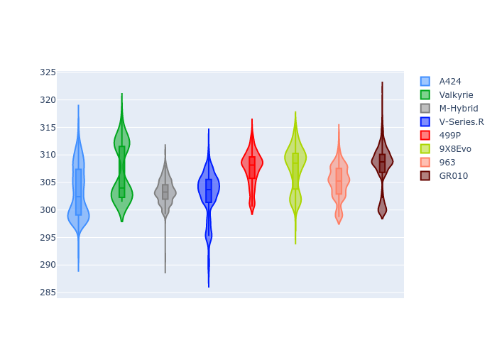

# Combined Plots

## Metadata

- BoP Accuracy: 99.80%
- Overall BoP Grade: A1
- Track: QATAR
- Threshhold: 0.0kph

## BoP Table
| Manufacturer   | Car        | Weight   | Power   | PINC   | E/Stint   | FDS    |
|:---------------|:-----------|:---------|:--------|:-------|:----------|:-------|
| Alpine         | A424       | 1043kg   | 510.0kw | -      | 912MJ     | -      |
| Aston Martin   | Valkyrie   | 1032kg   | 519.0kw | -      | 910MJ     | -      |
| BMW            | M-Hybrid   | 1043kg   | 512.0kw | -      | 907MJ     | -      |
| Cadillac       | V-Series.R | 1050kg   | 520.0kw | -      | 908MJ     | -      |
| Ferrari        | 499P       | 1067kg   | 512.0kw | -      | 910MJ     | 190kph |
| Peugeot        | 9X8Evo     | 1032kg   | 511.0kw | -      | 914MJ     | 190kph |
| Porsche        | 963        | 1043kg   | 511.0kw | -      | 907MJ     | -      |
| Toyota         | GR010      | 1068kg   | 513.0kw | -      | 910MJ     | 190kph |

## Performance Table
| Manufacturer   | Car        | RP      | QP      | Vavg      |   RDLC | BOP-Grade   | Match   |
|:---------------|:-----------|:--------|:--------|:----------|-------:|:------------|:--------|
| Alpine         | A424       | 1:42.20 | 1:39.07 | 302.12kph |   1.03 | ~A1         | 99.62%  |
| Aston Martin   | Valkyrie   | 1:42.20 | 1:38.38 | 304.19kph |   1.04 | ~A1         | 100.00% |
| BMW            | M-Hybrid   | 1:42.19 | 1:38.73 | 301.46kph |   1.04 | ~A1         | 99.96%  |
| Cadillac       | V-Series.R | 1:42.20 | 1:38.83 | 299.07kph |   1.03 | ~A1         | 99.96%  |
| Ferrari        | 499P       | 1:42.19 | 1:38.66 | 302.68kph |   1.04 | ~A1         | 99.94%  |
| Peugeot        | 9X8Evo     | 1:42.20 | 1:38.76 | 305.41kph |   1.03 | ~A1         | 99.04%  |
| Porsche        | 963        | 1:42.20 | 1:38.81 | 301.43kph |   1.03 | ~A1         | 99.89%  |
| Toyota         | GR010      | 1:42.21 | 1:38.58 | 303.31kph |   1.04 | ~A1         | 99.97%  |

## Race Laptimes

## Quali Laptimes

## Topspeeds

## Laptimes Lineplot

