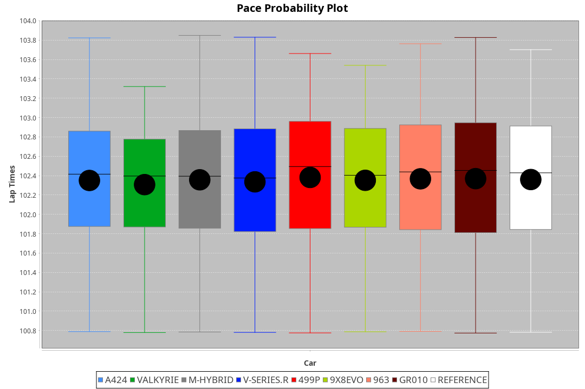
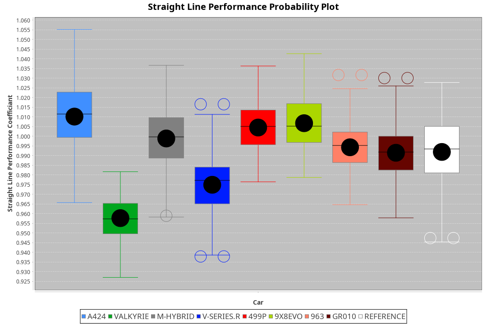
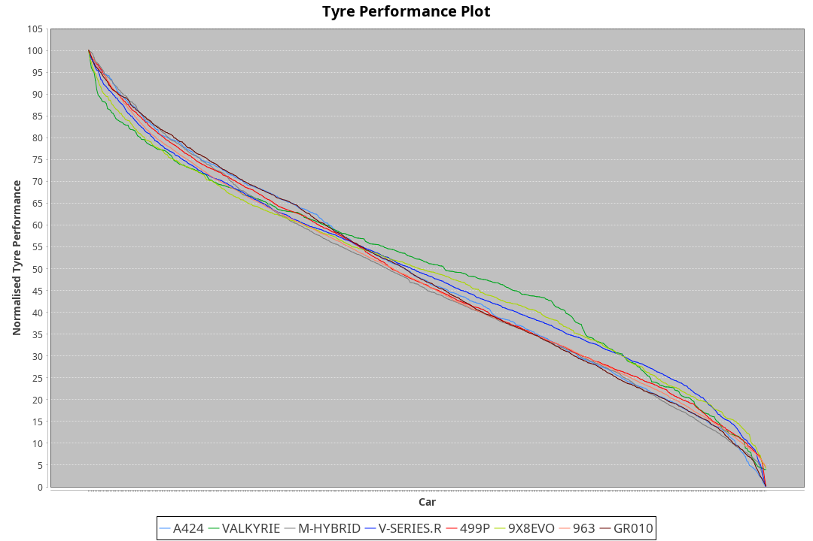

| Manufacturer | Car        | Weight | Power   | PINC    | E/Stint | FDS     |
|:-|:-|:-|:-|:-|:-|:-|
| Alpine       | A424       | 1050kg | 510.0kw |    -    | 913MJ   |    -    |
| Aston Martin | Valkyrie   | 1030kg | 519.0kw |    -    | 910MJ   |    -    |
| BMW          | M-Hybrid   | 1059kg | 520.0kw |    -    | 916MJ   |    -    |
| Cadillac     | V-Series.R | 1052kg | 515.0kw |    -    | 904MJ   |    -    |
| Ferrari      | 499P       | 1070kg | 504.0kw |    -    | 903MJ   | 190kph  |
| Peugeot      | 9X8Evo     | 1032kg | 505.0kw |    -    | 909MJ   | 190kph  |
| Porsche      | 963        | 1058kg | 514.0kw |    -    | 911MJ   |    -    |
| Toyota       | GR010      | 1074kg | 504.0kw |    -    | 903MJ   | 190kph  |

### BoP Accuracy: 95.13%; Overall BoP Grade: A1
| Manufacturer | Car        | Type  | RP      | QP      | Weight | Power¹  | Threshhold | PINC    | Power²   | E/Stint | AVG Vmax  | FDS     | RDLC | L/Stint | BOP-Grade | Model Accuracy | Model Points | Match%  | SimDiff |
|:-|:-|:-|:-|:-|:-|:-|:-|:-|:-|:-|:-|:-|:-|:-|:-|:-|:-|:-|:-|
| Alpine       | A424       | LMDH  | 1:42.30 | 1:38.76 | 1050kg | 510.0kw | 0.0kph     |    -    | 510.00kw |  913MJ  | 308.38kph |    -    | 1.02 | 33      | ~A1       | 99.58%         | 1429         | 98.97%  | -0.10   |
| Aston Martin | Valkyrie   | LMHNH | 1:42.30 | 1:38.68 | 1030kg | 519.0kw | 0.0kph     |    -    | 519.00kw |  910MJ  | 297.83kph |    -    | 1.06 | 33      | +C2       | 100.00%        | 247          | 72.67%  | -0.16   |
| BMW          | M-Hybrid   | LMDH  | 1:42.31 | 1:38.66 | 1059kg | 520.0kw | 0.0kph     |    -    | 520.00kw |  916MJ  | 304.27kph |    -    | 1.02 | 33      | ~A1       | 99.97%         | 2912         | 100.00% | -0.36   |
| Cadillac     | V-Series.R | LMDH  | 1:42.30 | 1:38.81 | 1052kg | 515.0kw | 0.0kph     |    -    | 515.00kw |  904MJ  | 307.84kph |    -    | 1.02 | 33      | +A2       | 99.49%         | 5225         | 94.82%  | +0.19   |
| Ferrari      | 499P       | LMHHU | 1:42.31 | 1:38.52 | 1070kg | 504.0kw | 0.0kph     |    -    | 504.00kw |  903MJ  | 310.85kph | 190kph  | 1.02 | 33      | ~A1       | 100.00%        | 5378         | 99.02%  | +0.06   |
| Peugeot      | 9X8Evo     | LMHHU | 1:42.32 | 1:38.83 | 1032kg | 505.0kw | 0.0kph     |    -    | 505.00kw |  909MJ  | 316.38kph | 190kph  | 1.03 | 33      | ~A1       | 100.00%        | 1459         | 95.55%  | +0.18   |
| Porsche      | 963        | LMDH  | 1:42.32 | 1:38.56 | 1058kg | 514.0kw | 0.0kph     |    -    | 514.00kw |  911MJ  | 304.49kph |    -    | 1.02 | 33      | ~A1       | 99.92%         | 14207        | 100.00% | -0.06   |
| Toyota       | GR010      | LMHHU | 1:42.31 | 1:38.39 | 1074kg | 504.0kw | 0.0kph     |    -    | 504.00kw |  903MJ  | 308.79kph | 190kph  | 1.02 | 33      | ~A1       | 99.86%         | 4280         | 100.00% | +0.26   |

## Power below Threshhold
| N/Nmax    | A424    | VALKYRIE | M-HYBRID | V-SERIES.R | 499P    | 9X8EVO  | 963     | GR010   |
|:-|:-|:-|:-|:-|:-|:-|:-|:-|
|  0.550    |  251    |  256     |  256     |  254       |  248    |  249    |  253    |  248    |
|  0.575    |  274    |  279     |  279     |  277       |  271    |  272    |  276    |  271    |
|  0.600    |  295    |  299     |  300     |  297       |  291    |  292    |  297    |  291    |
|  0.625    |  316    |  321     |  322     |  319       |  312    |  312    |  318    |  312    |
|  0.650    |  337    |  342     |  343     |  340       |  333    |  333    |  339    |  333    |
|  0.675    |  358    |  364     |  365     |  362       |  354    |  355    |  361    |  354    |
|  0.700    |  380    |  386     |  387     |  383       |  375    |  376    |  383    |  375    |
|  0.725    |  401    |  408     |  409     |  405       |  396    |  397    |  404    |  396    |
|  0.750    |  422    |  429     |  430     |  426       |  416    |  417    |  425    |  416    |
|  0.775    |  441    |  448     |  449     |  445       |  435    |  436    |  444    |  435    |
|  0.800    |  458    |  466     |  467     |  463       |  453    |  454    |  462    |  453    |
|  0.825    |  473    |  481     |  482     |  478       |  468    |  469    |  477    |  468    |
|  0.850    |  485    |  493     |  494     |  489       |  479    |  480    |  488    |  479    |
|  0.875    |  495    |  504     |  505     |  500       |  489    |  490    |  499    |  489    |
|  0.900    |  502    |  511     |  512     |  507       |  496    |  497    |  506    |  496    |
|  0.925    |  507    |  516     |  517     |  512       |  501    |  502    |  511    |  501    |
| **0.950** | **510** | **519**  | **520**  | **515**    | **504** | **505** | **514** | **504** |
|  0.975    |  508    |  517     |  518     |  513       |  502    |  503    |  512    |  502    |
|  1.000    |  505    |  513     |  514     |  509       |  499    |  500    |  508    |  499    |
|  1.025    |  436    |  443     |  444     |  440       |  430    |  431    |  439    |  430    |

## Power above Threshhold
| N/Nmax    | A424    | VALKYRIE | M-HYBRID | V-SERIES.R | 499P    | 9X8EVO  | 963     | GR010   |
|:-|:-|:-|:-|:-|:-|:-|:-|:-|
|  0.550    |  251    |  256     |  256     |  254       |  248    |  249    |  253    |  248    |
|  0.575    |  274    |  279     |  279     |  277       |  271    |  272    |  276    |  271    |
|  0.600    |  295    |  299     |  300     |  297       |  291    |  292    |  297    |  291    |
|  0.625    |  316    |  321     |  322     |  319       |  312    |  312    |  318    |  312    |
|  0.650    |  337    |  342     |  343     |  340       |  333    |  333    |  339    |  333    |
|  0.675    |  358    |  364     |  365     |  362       |  354    |  355    |  361    |  354    |
|  0.700    |  380    |  386     |  387     |  383       |  375    |  376    |  383    |  375    |
|  0.725    |  401    |  408     |  409     |  405       |  396    |  397    |  404    |  396    |
|  0.750    |  422    |  429     |  430     |  426       |  416    |  417    |  425    |  416    |
|  0.775    |  441    |  448     |  449     |  445       |  435    |  436    |  444    |  435    |
|  0.800    |  458    |  466     |  467     |  463       |  453    |  454    |  462    |  453    |
|  0.825    |  473    |  481     |  482     |  478       |  468    |  469    |  477    |  468    |
|  0.850    |  485    |  493     |  494     |  489       |  479    |  480    |  488    |  479    |
|  0.875    |  495    |  504     |  505     |  500       |  489    |  490    |  499    |  489    |
|  0.900    |  502    |  511     |  512     |  507       |  496    |  497    |  506    |  496    |
|  0.925    |  507    |  516     |  517     |  512       |  501    |  502    |  511    |  501    |
| **0.950** | **510** | **519**  | **520**  | **515**    | **504** | **505** | **514** | **504** |
|  0.975    |  508    |  517     |  518     |  513       |  502    |  503    |  512    |  502    |
|  1.000    |  505    |  513     |  514     |  509       |  499    |  500    |  508    |  499    |
|  1.025    |  436    |  443     |  444     |  440       |  430    |  431    |  439    |  430    |
