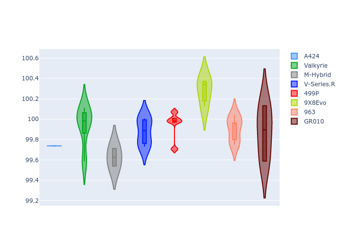
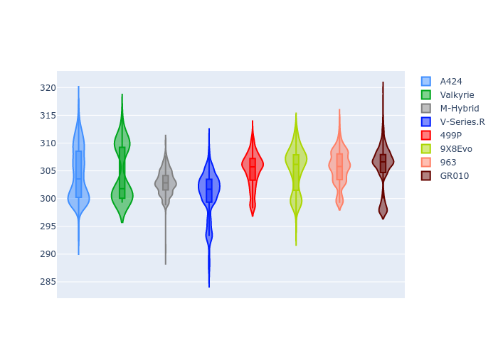

# Combined Plots

## Metadata

- BoP Accuracy: 99.43%
- Overall BoP Grade: A1
- Track: QATAR
- Threshhold: 250.0kph

## BoP Table
| Manufacturer   | Car        | Weight   | Power   | PINC   | E/Stint   | FDS    | RDP    | QDP    | TDP    |
|:---------------|:-----------|:---------|:--------|:-------|:----------|:-------|:-------|:-------|:-------|
| Alpine         | A424       | 1057kg   | 520.0kw | -0.10% | 922MJ     | -      | 52.35% | 61.85% | 27.84% |
| Aston Martin   | Valkyrie   | 1042kg   | 505.0kw | +0.40% | 900MJ     | -      | 53.59% | 53.33% | 21.51% |
| BMW            | M-Hybrid   | 1051kg   | 512.0kw | +0.10% | 908MJ     | -      | 53.26% | 57.23% | 34.54% |
| Cadillac       | V-Series.R | 1044kg   | 510.0kw | +0.10% | 899MJ     | -      | 47.80% | 56.73% | 19.63% |
| Ferrari        | 499P       | 1073kg   | 508.0kw | -0.10% | 907MJ     | 190kph | 53.02% | 42.32% | 9.88%  |
| Peugeot        | 9X8Evo     | 1060kg   | 510.0kw | -0.10% | 916MJ     | 190kph | 48.47% | 51.26% | 16.02% |
| Porsche        | 963        | 1057kg   | 516.0kw | -0.10% | 913MJ     | -      | 50.87% | 45.25% | 30.77% |
| Toyota         | GR010      | 1090kg   | 512.0kw | -0.10% | 911MJ     | 190kph | 52.43% | 57.12% | 12.82% |

## Performance Table
| Manufacturer   | Car        | RP      | QP      | Vavg      |   RDLC | BOP-Grade   | Match   |
|:---------------|:-----------|:--------|:--------|:----------|-------:|:------------|:--------|
| Alpine         | A424       | 1:42.04 | 1:38.78 | 302.50kph |   1.03 | ~A1         | 99.68%  |
| Aston Martin   | Valkyrie   | 1:43.28 | 1:39.36 | 300.48kph |   1.04 | ~A1         | 99.53%  |
| BMW            | M-Hybrid   | 1:42.41 | 1:38.78 | 300.67kph |   1.04 | ~A1         | 100.00% |
| Cadillac       | V-Series.R | 1:42.64 | 1:39.02 | 297.44kph |   1.04 | ~A1         | 99.96%  |
| Ferrari        | 499P       | 1:42.34 | 1:38.25 | 301.05kph |   1.04 | ~A1         | 99.76%  |
| Peugeot        | 9X8Evo     | 1:43.06 | 1:39.54 | 302.16kph |   1.04 | ~A1         | 96.90%  |
| Porsche        | 963        | 1:42.32 | 1:38.75 | 301.31kph |   1.04 | ~A1         | 99.80%  |
| Toyota         | GR010      | 1:42.41 | 1:38.21 | 301.21kph |   1.04 | ~A1         | 99.85%  |

## Race Laptimes

## Quali Laptimes

## Topspeeds

## Laptimes Lineplot

