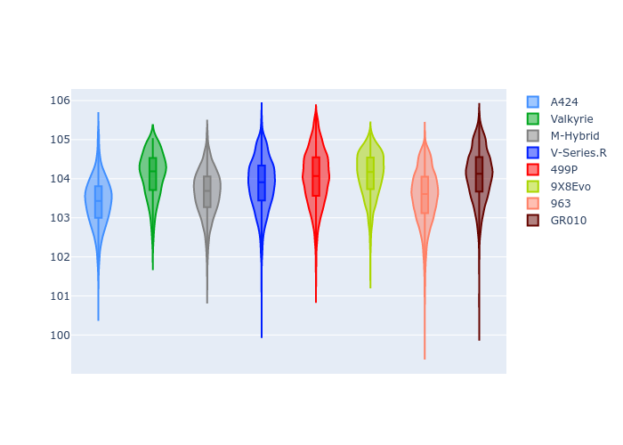

# Combined Plots

## Metadata

- BoP Accuracy: 98.90%
- Overall BoP Grade: A1
- Track: QATAR
- Threshhold: 210.0kph

## BoP Table
| Manufacturer   | Car        | Weight   | Power   | PINC   | E/Stint   | FDS    |
|:---------------|:-----------|:---------|:--------|:-------|:----------|:-------|
| Alpine         | A424       | 1057kg   | 520.0kw | -1.00% | 920MJ     | -      |
| Aston Martin   | Valkyrie   | 1042kg   | 505.0kw | +0.40% | 900MJ     | -      |
| BMW            | M-Hybrid   | 1051kg   | 512.0kw | +1.00% | 910MJ     | -      |
| Cadillac       | V-Series.R | 1044kg   | 510.0kw | +1.00% | 901MJ     | -      |
| Ferrari        | 499P       | 1073kg   | 508.0kw | -1.00% | 905MJ     | 190kph |
| Peugeot        | 9X8Evo     | 1060kg   | 510.0kw | -1.00% | 914MJ     | 190kph |
| Porsche        | 963        | 1057kg   | 516.0kw | -1.00% | 911MJ     | -      |
| Toyota         | GR010      | 1090kg   | 512.0kw | +1.00% | 914MJ     | 190kph |

## Performance Table
| Manufacturer   | Car        | RP      | QP      | Vavg      |   RDLC | BOP-Grade   | Match   |
|:---------------|:-----------|:--------|:--------|:----------|-------:|:------------|:--------|
| Alpine         | A424       | 1:42.09 | 1:38.96 | 302.00kph |   1.03 | ~A1         | 99.69%  |
| Aston Martin   | Valkyrie   | 1:43.39 | 1:39.48 | 300.46kph |   1.04 | ~A1         | 97.49%  |
| BMW            | M-Hybrid   | 1:42.27 | 1:38.81 | 301.41kph |   1.04 | ~A1         | 99.49%  |
| Cadillac       | V-Series.R | 1:42.54 | 1:39.15 | 298.36kph |   1.03 | ~A1         | 99.94%  |
| Ferrari        | 499P       | 1:42.78 | 1:39.20 | 300.42kph |   1.04 | ~A1         | 99.98%  |
| Peugeot        | 9X8Evo     | 1:43.23 | 1:39.72 | 301.46kph |   1.04 | +A2         | 94.81%  |
| Porsche        | 963        | 1:42.41 | 1:39.01 | 300.25kph |   1.03 | ~A1         | 99.84%  |
| Toyota         | GR010      | 1:42.73 | 1:39.07 | 301.64kph |   1.04 | ~A1         | 99.97%  |

## Race Laptimes

## Quali Laptimes

## Topspeeds

## Laptimes Lineplot

