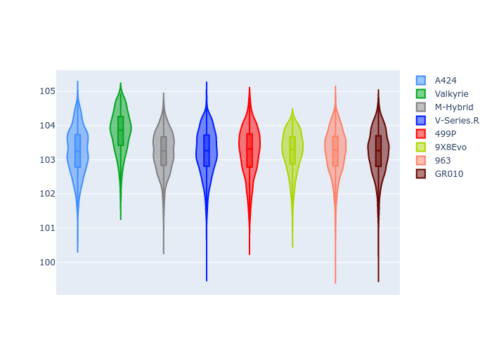
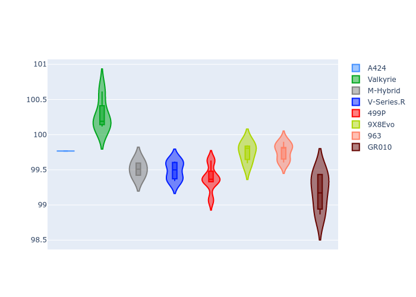
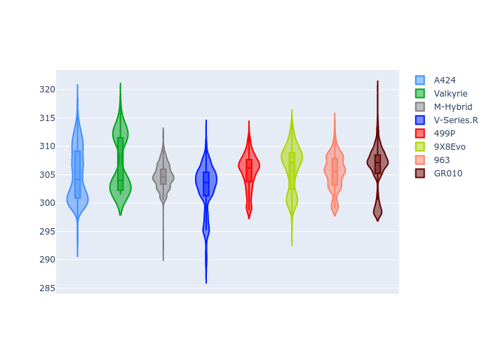
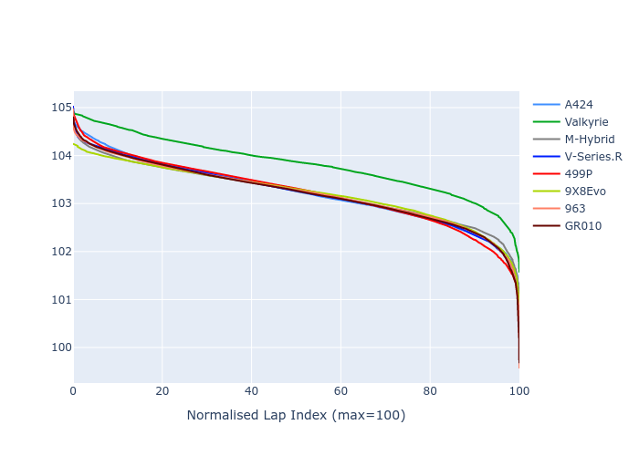

# Combined Plots

## Metadata

- BoP Accuracy: 99.65%
- Overall BoP Grade: A1
- Track: QATAR
- Threshhold: 250.0kph
- Average Laptime: 1:43.30
- Average Quali Laptime: 1:39.51
- Laptime Std Dev: 0.20 seconds
- Filtered Average Topspeed: 305.22kph

## BoP Table
| Manufacturer   | Car        | Weight   | Power   | PINC   | E/Stint   | FDS    | RDP    | QDP    | TDP    |
|:---------------|:-----------|:---------|:--------|:-------|:----------|:-------|:-------|:-------|:-------|
| Alpine         | A424       | 1042kg   | 505.0kw | +2.90% | 915MJ     | -      | 52.20% | 54.51% | 24.58% |
| Aston Martin   | Valkyrie   | 1030kg   | 520.0kw | -      | 911MJ     | -      | 53.39% | 54.11% | 23.71% |
| BMW            | M-Hybrid   | 1041kg   | 508.0kw | +2.30% | 909MJ     | -      | 53.47% | 52.95% | 33.73% |
| Cadillac       | V-Series.R | 1043kg   | 520.0kw | -      | 907MJ     | -      | 49.22% | 60.31% | 18.04% |
| Ferrari        | 499P       | 1062kg   | 515.0kw | -2.80% | 905MJ     | 190kph | 51.56% | 44.72% | 9.86%  |
| Peugeot        | 9X8Evo     | 1030kg   | 520.0kw | -2.20% | 917MJ     | 200kph | 50.17% | 49.36% | 17.73% |
| Porsche        | 963        | 1034kg   | 515.0kw | -2.80% | 902MJ     | -      | 50.78% | 41.25% | 27.61% |
| Toyota         | GR010      | 1058kg   | 517.0kw | -4.40% | 901MJ     | 200kph | 51.68% | 51.25% | 14.48% |

## Performance Table
| Manufacturer   | Car        | RP      | QP      | Vavg      |   RDLC | BOP-Grade   | Match   |
|:---------------|:-----------|:--------|:--------|:----------|-------:|:------------|:--------|
| Alpine         | A424       | 1:43.24 | 1:39.63 | 305.02kph |   1.04 | ~A1         | 99.94%  |
| Aston Martin   | Valkyrie   | 1:43.82 | 1:40.18 | 304.34kph |   1.04 | ~A1         | 97.87%  |
| BMW            | M-Hybrid   | 1:43.23 | 1:39.37 | 305.02kph |   1.04 | ~A1         | 100.00% |
| Cadillac       | V-Series.R | 1:43.23 | 1:39.38 | 303.55kph |   1.04 | ~A1         | 99.86%  |
| Ferrari        | 499P       | 1:43.23 | 1:39.32 | 305.53kph |   1.04 | ~A1         | 99.74%  |
| Peugeot        | 9X8Evo     | 1:43.23 | 1:39.56 | 306.85kph |   1.04 | ~A1         | 100.00% |
| Porsche        | 963        | 1:43.23 | 1:39.46 | 305.74kph |   1.04 | ~A1         | 99.92%  |
| Toyota         | GR010      | 1:43.22 | 1:39.21 | 305.74kph |   1.04 | ~A1         | 99.85%  |

## Race Laptimes

## Quali Laptimes

## Topspeeds

## Laptimes Lineplot

