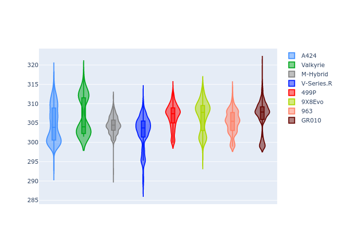

# Combined Plots

## Metadata

- BoP Accuracy: 99.75%
- Overall BoP Grade: A1
- Track: QATAR
- Threshhold: 250.0kph
- Average Laptime: 1:43.45
- Average Quali Laptime: 1:39.54
- Average Topspeed: 305.57kph

## BoP Table
| Manufacturer   | Car        | Weight   | Power   | PINC   | E/Stint   | FDS    | RDP    | QDP    | TDP    |
|:---------------|:-----------|:---------|:--------|:-------|:----------|:-------|:-------|:-------|:-------|
| Alpine         | A424       | 1040kg   | 489.0kw | +6.30% | 908MJ     | -      | 51.64% | 59.31% | 26.80% |
| Aston Martin   | Valkyrie   | 1030kg   | 520.0kw | -      | 911MJ     | -      | 53.50% | 53.33% | 21.51% |
| BMW            | M-Hybrid   | 1040kg   | 496.0kw | +4.80% | 904MJ     | -      | 52.89% | 56.22% | 33.41% |
| Cadillac       | V-Series.R | 1044kg   | 520.0kw | -      | 907MJ     | -      | 48.63% | 60.80% | 19.01% |
| Ferrari        | 499P       | 1060kg   | 520.0kw | -2.70% | 910MJ     | 190kph | 51.38% | 44.98% | 9.83%  |
| Peugeot        | 9X8Evo     | 1030kg   | 520.0kw | -2.60% | 916MJ     | 190kph | 48.87% | 52.78% | 15.41% |
| Porsche        | 963        | 1036kg   | 500.0kw | +1.00% | 899MJ     | -      | 50.70% | 44.30% | 29.51% |
| Toyota         | GR010      | 1059kg   | 520.0kw | -3.50% | 906MJ     | 190kph | 51.09% | 52.71% | 11.46% |

## Performance Table
| Manufacturer   | Car        | RP      | QP      | Vavg      |   RDLC | BOP-Grade   | Match   |
|:---------------|:-----------|:--------|:--------|:----------|-------:|:------------|:--------|
| Alpine         | A424       | 1:43.44 | 1:39.79 | 304.73kph |   1.04 | ~A1         | 98.99%  |
| Aston Martin   | Valkyrie   | 1:43.60 | 1:39.48 | 306.79kph |   1.04 | ~A1         | 100.00% |
| BMW            | M-Hybrid   | 1:43.43 | 1:39.43 | 304.48kph |   1.04 | ~A1         | 99.91%  |
| Cadillac       | V-Series.R | 1:43.44 | 1:39.48 | 302.74kph |   1.04 | ~A1         | 99.68%  |
| Ferrari        | 499P       | 1:43.43 | 1:39.39 | 306.79kph |   1.04 | ~A1         | 99.82%  |
| Peugeot        | 9X8Evo     | 1:43.43 | 1:39.67 | 306.81kph |   1.04 | ~A1         | 100.00% |
| Porsche        | 963        | 1:43.44 | 1:39.80 | 305.28kph |   1.04 | ~A1         | 99.85%  |
| Toyota         | GR010      | 1:43.43 | 1:39.25 | 306.93kph |   1.04 | ~A1         | 99.76%  |

## Race Laptimes

## Quali Laptimes

## Topspeeds

## Laptimes Lineplot

