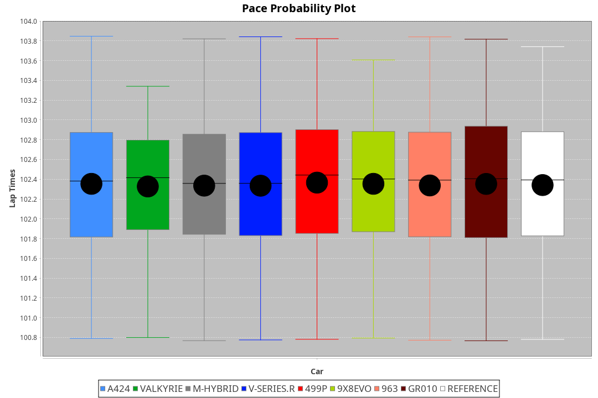
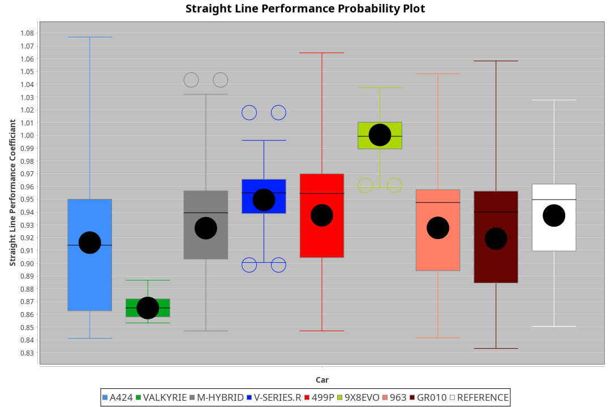
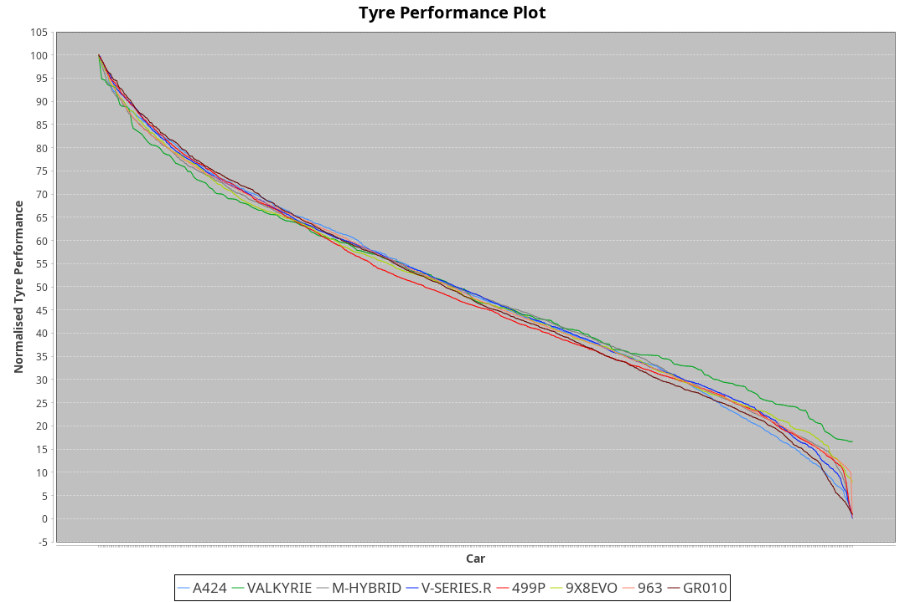

| Manufacturer | Car        | Weight | Power   | PINC    | E/Stint | FDS     |
|:-|:-|:-|:-|:-|:-|:-|
| Alpine       | A424       | 1036kg | 520.0kw | -0.60%  | 918MJ   |    -    |
| Aston Martin | Valkyrie   | 1030kg | 520.0kw |    -    | 911MJ   |    -    |
| BMW          | M-Hybrid   | 1038kg | 520.0kw | -0.20%  | 913MJ   |    -    |
| Cadillac     | V-Series.R | 1047kg | 518.0kw | 0.30%   | 907MJ   |    -    |
| Ferrari      | 499P       | 1066kg | 514.0kw |    -    | 912MJ   | 190kph  |
| Peugeot      | 9X8Evo     | 1030kg | 520.0kw | -4.30%  | 911MJ   | 190kph  |
| Porsche      | 963        | 1041kg | 511.0kw | 1.40%   | 910MJ   |    -    |
| Toyota       | GR010      | 1071kg | 508.0kw | 2.30%   | 912MJ   | 190kph  |

### BoP Accuracy: 72.41%; Overall BoP Grade: C2
| Manufacturer | Car        | Type  | RP      | QP      | Weight | Power¹  | Threshhold | PINC    | Power²   | E/Stint | AVG Vmax  | FDS     | RDLC | L/Stint | BOP-Grade | Model Accuracy | Model Points | Match% | SimDiff |
|:-|:-|:-|:-|:-|:-|:-|:-|:-|:-|:-|:-|:-|:-|:-|:-|:-|:-|:-|:-|
| Alpine       | A424       | LMDH  | 1:41.55 | 1:39.16 | 1036kg | 520.0kw | 250.0kph   | -0.60%  | 516.90kw |  918MJ  | 302.01kph |    -    | 1.01 | 33      | -B1       | 99.49%         | 1360         | 85.70% | -0.64   |
| Aston Martin | Valkyrie   | LMHNH | 1:44.28 | 1:41.04 | 1030kg | 520.0kw | 0.0kph     |    -    | 520.00kw |  911MJ  | 293.43kph |    -    | 1.04 | 33      | +Ω2       | 100.00%        | 312          | -6.77% | -0.87   |
| BMW          | M-Hybrid   | LMDH  | 1:41.55 | 1:38.29 | 1038kg | 520.0kw | 250.0kph   | -0.20%  | 519.00kw |  913MJ  | 300.86kph |    -    | 1.01 | 33      | -B1       | 98.62%         | 2363         | 85.52% | -0.32   |
| Cadillac     | V-Series.R | LMDH  | 1:41.55 | 1:38.63 | 1047kg | 518.0kw | 250.0kph   | 0.30%   | 519.60kw |  907MJ  | 295.40kph |    -    | 1.01 | 33      | -B1       | 98.50%         | 4201         | 85.69% | +0.14   |
| Ferrari      | 499P       | LMHHU | 1:41.54 | 1:38.48 | 1066kg | 514.0kw | 250.0kph   |    -    | 514.00kw |  912MJ  | 298.87kph | 190kph  | 1.02 | 33      | -B2       | 100.00%        | 4441         | 82.02% | +0.15   |
| Peugeot      | 9X8Evo     | LMHHU | 1:41.55 | 1:38.85 | 1030kg | 520.0kw | 250.0kph   | -4.30%  | 497.60kw |  911MJ  | 299.94kph | 190kph  | 1.02 | 33      | -C1       | 100.00%        | 808          | 78.81% | +0.75   |
| Porsche      | 963        | LMDH  | 1:41.54 | 1:38.25 | 1041kg | 511.0kw | 250.0kph   | 1.40%   | 518.20kw |  910MJ  | 298.87kph |    -    | 1.01 | 33      | -B2       | 99.87%         | 12613        | 83.14% | -0.04   |
| Toyota       | GR010      | LMHHU | 1:41.56 | 1:38.31 | 1071kg | 508.0kw | 250.0kph   | 2.30%   | 519.70kw |  912MJ  | 296.48kph | 190kph  | 1.02 | 33      | -B1       | 99.73%         | 2956         | 85.16% | +0.85   |

## Power below Threshhold
| N/Nmax    | A424    | VALKYRIE | M-HYBRID | V-SERIES.R | 499P    | 9X8EVO  | 963     | GR010   |
|:-|:-|:-|:-|:-|:-|:-|:-|:-|
|  0.550    |  256    |  256     |  256     |  255       |  253    |  256    |  252    |  250    |
|  0.575    |  279    |  279     |  279     |  278       |  276    |  279    |  275    |  273    |
|  0.600    |  300    |  300     |  300     |  299       |  297    |  300    |  295    |  293    |
|  0.625    |  322    |  322     |  322     |  321       |  318    |  322    |  316    |  314    |
|  0.650    |  343    |  343     |  343     |  342       |  339    |  343    |  337    |  335    |
|  0.675    |  365    |  365     |  365     |  364       |  361    |  365    |  359    |  357    |
|  0.700    |  387    |  387     |  387     |  386       |  383    |  387    |  380    |  378    |
|  0.725    |  409    |  409     |  409     |  407       |  404    |  409    |  402    |  399    |
|  0.750    |  430    |  430     |  430     |  428       |  425    |  430    |  422    |  420    |
|  0.775    |  449    |  449     |  449     |  447       |  444    |  449    |  441    |  439    |
|  0.800    |  467    |  467     |  467     |  465       |  462    |  467    |  459    |  456    |
|  0.825    |  482    |  482     |  482     |  480       |  477    |  482    |  474    |  471    |
|  0.850    |  494    |  494     |  494     |  492       |  488    |  494    |  485    |  483    |
|  0.875    |  505    |  505     |  505     |  503       |  499    |  505    |  496    |  493    |
|  0.900    |  512    |  512     |  512     |  510       |  506    |  512    |  503    |  500    |
|  0.925    |  517    |  517     |  517     |  515       |  511    |  517    |  508    |  505    |
| **0.950** | **520** | **520**  | **520**  | **518**    | **514** | **520** | **511** | **508** |
|  0.975    |  518    |  518     |  518     |  516       |  512    |  518    |  509    |  506    |
|  1.000    |  514    |  514     |  514     |  512       |  508    |  514    |  505    |  503    |
|  1.025    |  444    |  444     |  444     |  442       |  439    |  444    |  436    |  434    |

## Power above Threshhold
| N/Nmax    | A424       | VALKYRIE | M-HYBRID   | V-SERIES.R | 499P    | 9X8EVO     | 963        | GR010      |
|:-|:-|:-|:-|:-|:-|:-|:-|:-|
|  0.550    |  254.43    |  256     |  255.47    |  256.27    |  253    |  245.32    |  255.08    |  256.34    |
|  0.575    |  277.47    |  279     |  278.52    |  279.30    |  276    |  267.34    |  278.08    |  279.37    |
|  0.600    |  298.51    |  300     |  299.55    |  299.32    |  297    |  287.37    |  299.09    |  299.39    |
|  0.625    |  319.54    |  322     |  321.59    |  321.34    |  318    |  307.40    |  321.10    |  321.42    |
|  0.650    |  340.58    |  343     |  342.63    |  342.37    |  339    |  328.42    |  342.10    |  342.45    |
|  0.675    |  362.62    |  365     |  364.67    |  364.39    |  361    |  349.45    |  364.11    |  364.48    |
|  0.700    |  384.65    |  387     |  386.72    |  386.41    |  383    |  370.48    |  386.11    |  386.51    |
|  0.725    |  406.69    |  409     |  407.75    |  408.44    |  404    |  391.50    |  407.12    |  408.54    |
|  0.750    |  427.73    |  430     |  428.79    |  429.46    |  425    |  411.53    |  428.13    |  429.57    |
|  0.775    |  446.76    |  449     |  447.83    |  448.48    |  444    |  429.55    |  447.13    |  448.59    |
|  0.800    |  463.79    |  467     |  465.86    |  466.50    |  462    |  446.57    |  465.14    |  466.61    |
|  0.825    |  478.82    |  482     |  480.89    |  481.51    |  477    |  461.59    |  480.14    |  481.63    |
|  0.850    |  490.84    |  494     |  492.91    |  493.53    |  488    |  472.61    |  492.15    |  493.65    |
|  0.875    |  501.85    |  505     |  503.93    |  504.54    |  499    |  482.62    |  503.15    |  504.66    |
|  0.900    |  508.87    |  512     |  510.95    |  511.55    |  506    |  489.63    |  510.15    |  511.67    |
|  0.925    |  513.87    |  517     |  515.95    |  516.55    |  511    |  494.64    |  515.15    |  516.68    |
| **0.950** | **516.88** | **520**  | **518.96** | **519.55** | **514** | **497.64** | **518.15** | **519.68** |
|  0.975    |  514.88    |  518     |  516.96    |  517.55    |  512    |  495.64    |  516.15    |  517.68    |
|  1.000    |  510.87    |  514     |  512.95    |  513.55    |  508    |  492.63    |  512.15    |  513.68    |
|  1.025    |  441.75    |  444     |  442.82    |  443.47    |  439    |  424.55    |  442.13    |  443.58    |
