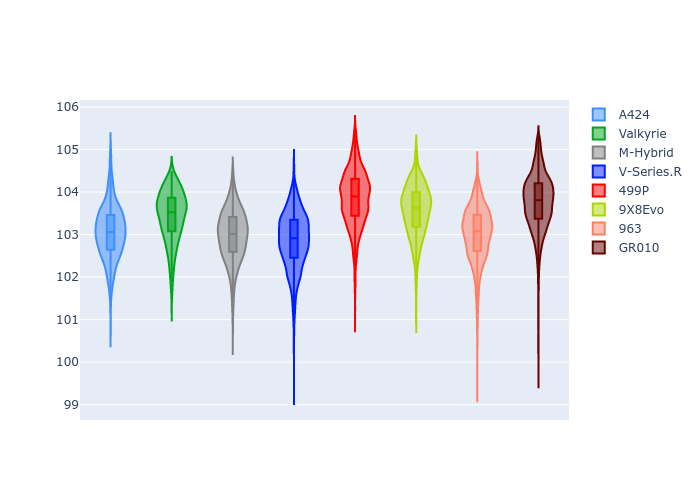
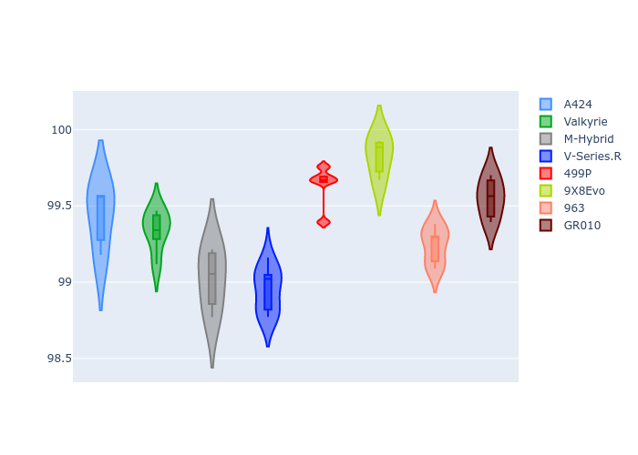
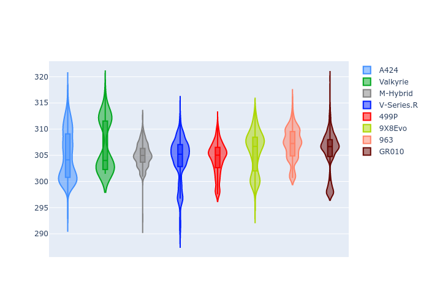
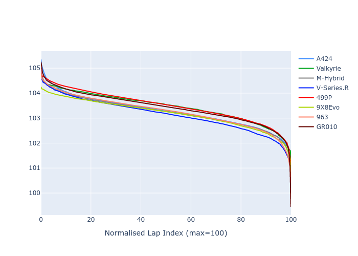

# Combined Plots

## Metadata

- BoP Accuracy: 98.96%
- Overall BoP Grade: A1
- Track: QATAR
- Threshhold: 250.0kph
- Average Laptime: 1:43.32
- Average Quali Laptime: 1:39.38
- Average Topspeed: 305.50kph

## BoP Table
| Manufacturer   | Car        | Weight   | Power   | PINC   | E/Stint   | FDS    | RDP    | QDP    | TDP    |
|:---------------|:-----------|:---------|:--------|:-------|:----------|:-------|:-------|:-------|:-------|
| Alpine         | A424       | 1048kg   | 515.0kw | +0.70% | 919MJ     | -      | 51.64% | 59.31% | 26.80% |
| Aston Martin   | Valkyrie   | 1030kg   | 520.0kw | -      | 911MJ     | -      | 53.50% | 53.33% | 21.51% |
| BMW            | M-Hybrid   | 1040kg   | 517.0kw | -      | 911MJ     | -      | 52.89% | 56.22% | 33.41% |
| Cadillac       | V-Series.R | 1030kg   | 520.0kw | -      | 906MJ     | -      | 48.63% | 60.80% | 19.01% |
| Ferrari        | 499P       | 1065kg   | 503.0kw | -0.60% | 900MJ     | 190kph | 51.38% | 44.98% | 9.83%  |
| Peugeot        | 9X8Evo     | 1045kg   | 516.0kw | -1.00% | 918MJ     | 190kph | 48.87% | 52.78% | 15.41% |
| Porsche        | 963        | 1043kg   | 514.0kw | +0.40% | 911MJ     | -      | 50.70% | 44.30% | 29.51% |
| Toyota         | GR010      | 1069kg   | 501.0kw | +1.10% | 902MJ     | 190kph | 51.09% | 52.71% | 11.46% |

## Performance Table
| Manufacturer   | Car        | RP      | QP      | Vavg      |   RDLC | BOP-Grade   | Match   |
|:---------------|:-----------|:--------|:--------|:----------|-------:|:------------|:--------|
| Alpine         | A424       | 1:43.04 | 1:39.44 | 304.95kph |   1.04 | ~A1         | 99.85%  |
| Aston Martin   | Valkyrie   | 1:43.44 | 1:39.34 | 306.79kph |   1.04 | ~A1         | 100.00% |
| BMW            | M-Hybrid   | 1:42.98 | 1:39.02 | 305.03kph |   1.04 | ~A1         | 100.00% |
| Cadillac       | V-Series.R | 1:42.86 | 1:38.95 | 304.22kph |   1.04 | ~A1         | 99.93%  |
| Ferrari        | 499P       | 1:43.86 | 1:39.63 | 304.41kph |   1.04 | ~A1         | 95.87%  |
| Peugeot        | 9X8Evo     | 1:43.57 | 1:39.83 | 305.75kph |   1.04 | ~A1         | 99.61%  |
| Porsche        | 963        | 1:43.02 | 1:39.24 | 307.09kph |   1.04 | ~A1         | 99.91%  |
| Toyota         | GR010      | 1:43.78 | 1:39.55 | 305.75kph |   1.04 | ~A1         | 96.53%  |

## Race Laptimes

## Quali Laptimes

## Topspeeds

## Laptimes Lineplot

