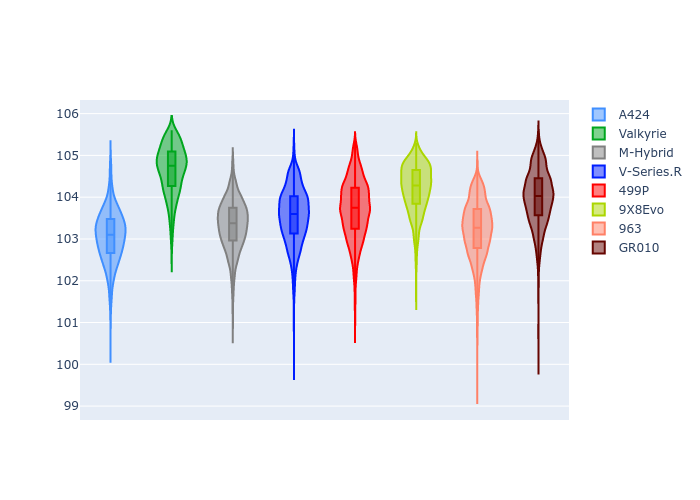

# Combined Plots

## Metadata

- BoP Accuracy: 98.38%
- Overall BoP Grade: A1
- Track: QATAR
- Threshhold: 210.0kph

## BoP Table
| Manufacturer   | Car        | Weight   | Power   | PINC   | E/Stint   | FDS    |
|:---------------|:-----------|:---------|:--------|:-------|:----------|:-------|
| Alpine         | A424       | 1047kg   | 520.0kw | -      | 921MJ     | -      |
| Aston Martin   | Valkyrie   | 1042kg   | 504.0kw | +0.40% | 899MJ     | -      |
| BMW            | M-Hybrid   | 1041kg   | 512.0kw | -      | 907MJ     | -      |
| Cadillac       | V-Series.R | 1034kg   | 510.0kw | -      | 898MJ     | -      |
| Ferrari        | 499P       | 1063kg   | 508.0kw | -      | 906MJ     | 190kph |
| Peugeot        | 9X8Evo     | 1050kg   | 510.0kw | -      | 915MJ     | 190kph |
| Porsche        | 963        | 1047kg   | 516.0kw | -      | 912MJ     | -      |
| Toyota         | GR010      | 1080kg   | 512.0kw | -      | 911MJ     | 190kph |

## Performance Table
| Manufacturer   | Car        | RP      | QP      | Vavg      |   RDLC | BOP-Grade   | Match   |
|:---------------|:-----------|:--------|:--------|:----------|-------:|:------------|:--------|
| Alpine         | A424       | 1:41.66 | 1:38.56 | 303.83kph |   1.03 | ~A1         | 98.43%  |
| Aston Martin   | Valkyrie   | 1:43.45 | 1:39.53 | 300.26kph |   1.04 | +A2         | 92.48%  |
| BMW            | M-Hybrid   | 1:42.13 | 1:38.68 | 301.67kph |   1.03 | ~A1         | 99.84%  |
| Cadillac       | V-Series.R | 1:42.41 | 1:39.02 | 298.63kph |   1.03 | ~A1         | 99.96%  |
| Ferrari        | 499P       | 1:42.35 | 1:38.81 | 302.23kph |   1.04 | ~A1         | 99.94%  |
| Peugeot        | 9X8Evo     | 1:42.79 | 1:39.32 | 303.29kph |   1.03 | ~A1         | 96.78%  |
| Porsche        | 963        | 1:41.98 | 1:38.60 | 302.07kph |   1.03 | ~A1         | 99.70%  |
| Toyota         | GR010      | 1:42.60 | 1:38.95 | 301.87kph |   1.04 | ~A1         | 99.95%  |

## Race Laptimes

## Quali Laptimes

## Topspeeds

## Laptimes Lineplot

