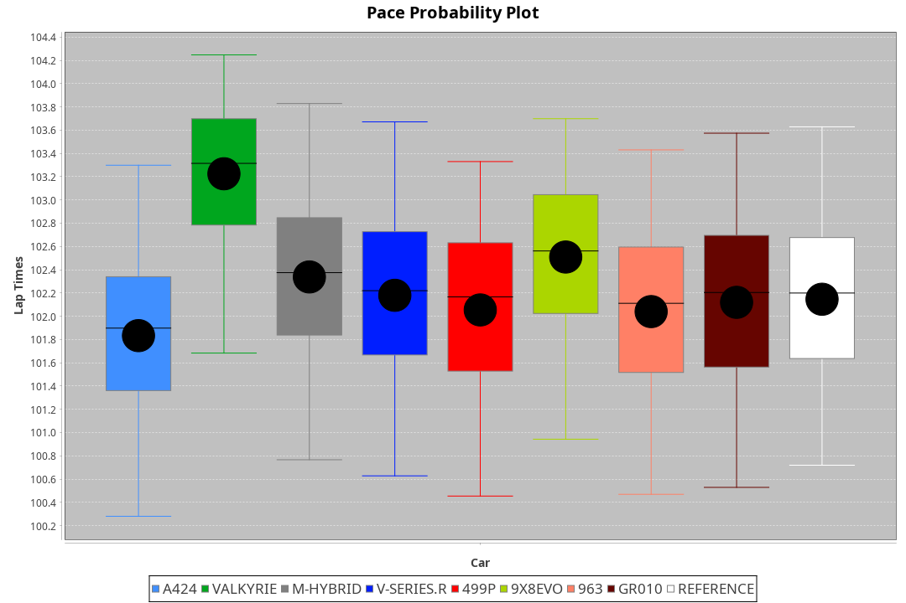
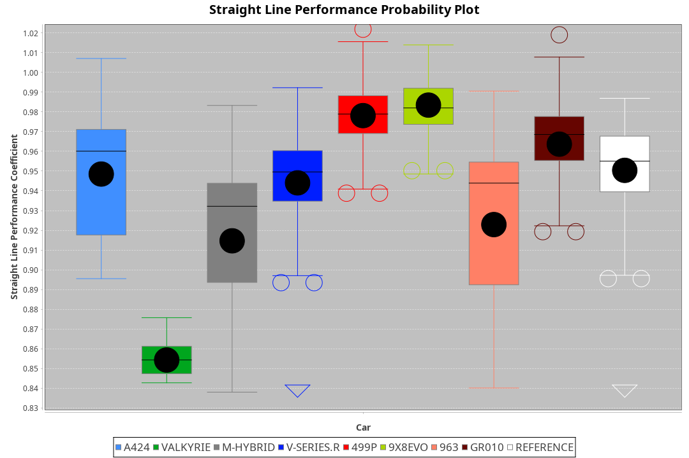
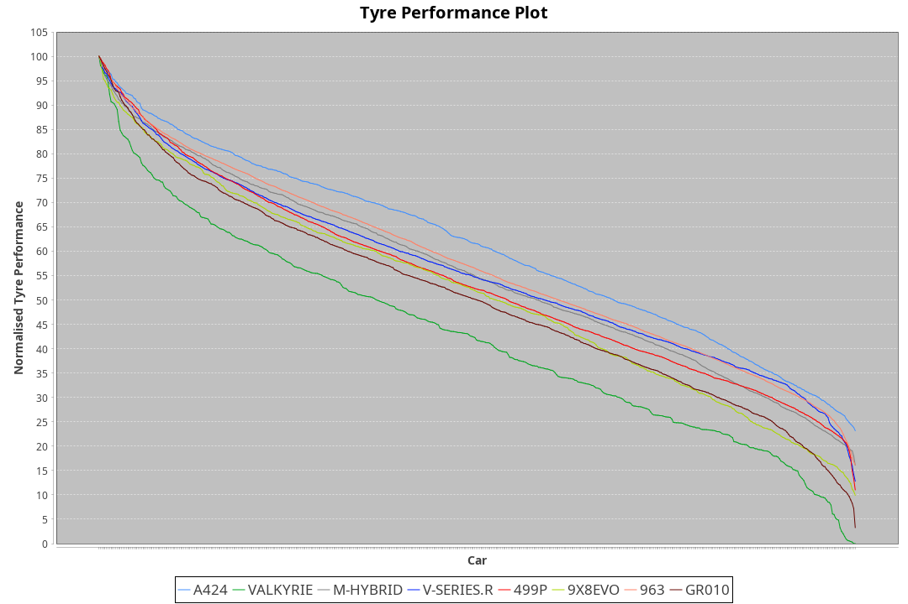

| Manufacturer | Car        | Weight | Power   | PINC    | E/Stint | FDS     |
|:-|:-|:-|:-|:-|:-|:-|
| Toyota       | GR010      | 1080kg | 512.0kw |    -    | 910MJ   | 190kph  |
| Ferrari      | 499P       | 1063kg | 508.0kw |    -    | 906MJ   | 190kph  |
| Cadillac     | V-Series.R | 1034kg | 510.0kw |    -    | 898MJ   |    -    |
| Porsche      | 963        | 1047kg | 516.0kw |    -    | 912MJ   |    -    |
| BMW          | M-Hybrid   | 1041kg | 512.0kw |    -    | 907MJ   |    -    |
| Alpine       | A424       | 1047kg | 520.0kw |    -    | 921MJ   |    -    |
| Aston Martin | Valkyrie   | 1042kg | 504.0kw | 0.40%   | 899MJ   |    -    |
| Peugeot      | 9X8Evo     | 1050kg | 510.0kw |    -    | 915MJ   | 190kph  |

### BoP Accuracy: 82.51%; Overall BoP Grade: B2
| Manufacturer | Car        | Type  | RP      | QP      | Weight | Power¹  | Threshhold | PINC    | Power²   | E/Stint | AVG Vmax  | FDS     | RDLC | L/Stint | BOP-Grade | Model Accuracy | Model Points | Match%  | SimDiff |
|:-|:-|:-|:-|:-|:-|:-|:-|:-|:-|:-|:-|:-|:-|:-|:-|:-|:-|:-|:-|
| Alpine       | A424       | LMDH  | 1:41.80 | 1:38.26 | 1047kg | 520.0kw | 210.0kph   |    -    | 520.00kw |  921MJ  | 306.13kph |    -    | 1.03 | 33      | -C2       | 96.10%         | 2390         | 72.25%  | -0.16   |
| Aston Martin | Valkyrie   | LMHNH | 1:43.17 | 1:39.07 | 1042kg | 504.0kw | 250.0kph   | 0.40%   | 506.00kw |  899MJ  | 302.87kph |    -    | 1.03 | 33      | +Ω1       | 100.00%        | 466          | 42.22%  | -0.00   |
| BMW          | M-Hybrid   | LMDH  | 1:42.24 | 1:38.42 | 1041kg | 512.0kw | 210.0kph   |    -    | 512.00kw |  907MJ  | 306.76kph |    -    | 1.04 | 33      | -A2       | 100.00%        | 3339         | 91.80%  | -0.18   |
| Cadillac     | V-Series.R | LMDH  | 1:42.26 | 1:38.58 | 1034kg | 510.0kw | 210.0kph   |    -    | 510.00kw |  898MJ  | 308.83kph |    -    | 1.04 | 33      | ~A1       | 99.56%         | 5841         | 95.89%  | +0.27   |
| Ferrari      | 499P       | LMHHU | 1:42.35 | 1:38.48 | 1063kg | 508.0kw | 210.0kph   |    -    | 508.00kw |  906MJ  | 306.14kph | 190kph  | 1.04 | 33      | ~A1       | 99.57%         | 7417         | 100.00% | +0.05   |
| Peugeot      | 9X8Evo     | LMHHU | 1:42.60 | 1:38.95 | 1050kg | 510.0kw | 210.0kph   |    -    | 510.00kw |  915MJ  | 314.95kph | 190kph  | 1.01 | 33      | +C1       | 100.00%        | 1891         | 79.35%  | +0.37   |
| Porsche      | 963        | LMDH  | 1:42.12 | 1:38.18 | 1047kg | 516.0kw | 210.0kph   |    -    | 516.00kw |  912MJ  | 307.11kph |    -    | 1.03 | 33      | -B1       | 98.39%         | 16118        | 88.79%  | -0.35   |
| Toyota       | GR010      | LMHHU | 1:42.60 | 1:38.81 | 1080kg | 512.0kw | 210.0kph   |    -    | 512.00kw |  910MJ  | 304.23kph | 190kph  | 1.03 | 33      | +B1       | 99.90%         | 5196         | 89.78%  | +0.01   |

## Power below Threshhold
| N/Nmax    | A424    | VALKYRIE | M-HYBRID | V-SERIES.R | 499P    | 9X8EVO  | 963     | GR010   |
|:-|:-|:-|:-|:-|:-|:-|:-|:-|
|  0.550    |  256    |  248     |  252     |  251       |  250    |  251    |  254    |  252    |
|  0.575    |  279    |  271     |  275     |  274       |  273    |  274    |  277    |  275    |
|  0.600    |  300    |  291     |  296     |  295       |  293    |  295    |  298    |  296    |
|  0.625    |  322    |  312     |  317     |  316       |  314    |  316    |  319    |  317    |
|  0.650    |  343    |  333     |  338     |  337       |  335    |  337    |  340    |  338    |
|  0.675    |  365    |  354     |  359     |  358       |  357    |  358    |  362    |  359    |
|  0.700    |  387    |  375     |  381     |  380       |  378    |  380    |  384    |  381    |
|  0.725    |  409    |  396     |  403     |  401       |  399    |  401    |  406    |  403    |
|  0.750    |  430    |  416     |  423     |  422       |  420    |  422    |  427    |  423    |
|  0.775    |  449    |  435     |  442     |  441       |  439    |  441    |  446    |  442    |
|  0.800    |  467    |  453     |  460     |  458       |  456    |  458    |  463    |  460    |
|  0.825    |  482    |  468     |  475     |  473       |  471    |  473    |  478    |  475    |
|  0.850    |  494    |  479     |  486     |  485       |  483    |  485    |  490    |  486    |
|  0.875    |  505    |  489     |  497     |  495       |  493    |  495    |  501    |  497    |
|  0.900    |  512    |  496     |  504     |  502       |  500    |  502    |  508    |  504    |
|  0.925    |  517    |  501     |  509     |  507       |  505    |  507    |  513    |  509    |
| **0.950** | **520** | **504**  | **512**  | **510**    | **508** | **510** | **516** | **512** |
|  0.975    |  518    |  502     |  510     |  508       |  506    |  508    |  514    |  510    |
|  1.000    |  514    |  499     |  506     |  505       |  503    |  505    |  510    |  506    |
|  1.025    |  444    |  430     |  437     |  436       |  434    |  436    |  441    |  437    |

## Power above Threshhold
| N/Nmax    | A424    | VALKYRIE   | M-HYBRID | V-SERIES.R | 499P    | 9X8EVO  | 963     | GR010   |
|:-|:-|:-|:-|:-|:-|:-|:-|:-|
|  0.550    |  256    |  249.01    |  252     |  251       |  250    |  251    |  254    |  252    |
|  0.575    |  279    |  272.01    |  275     |  274       |  273    |  274    |  277    |  275    |
|  0.600    |  300    |  292.01    |  296     |  295       |  293    |  295    |  298    |  296    |
|  0.625    |  322    |  313.01    |  317     |  316       |  314    |  316    |  319    |  317    |
|  0.650    |  343    |  334.01    |  338     |  337       |  335    |  337    |  340    |  338    |
|  0.675    |  365    |  355.01    |  359     |  358       |  357    |  358    |  362    |  359    |
|  0.700    |  387    |  377.01    |  381     |  380       |  378    |  380    |  384    |  381    |
|  0.725    |  409    |  398.01    |  403     |  401       |  399    |  401    |  406    |  403    |
|  0.750    |  430    |  418.01    |  423     |  422       |  420    |  422    |  427    |  423    |
|  0.775    |  449    |  437.01    |  442     |  441       |  439    |  441    |  446    |  442    |
|  0.800    |  467    |  454.01    |  460     |  458       |  456    |  458    |  463    |  460    |
|  0.825    |  482    |  469.01    |  475     |  473       |  471    |  473    |  478    |  475    |
|  0.850    |  494    |  481.02    |  486     |  485       |  483    |  485    |  490    |  486    |
|  0.875    |  505    |  491.02    |  497     |  495       |  493    |  495    |  501    |  497    |
|  0.900    |  512    |  498.02    |  504     |  502       |  500    |  502    |  508    |  504    |
|  0.925    |  517    |  503.02    |  509     |  507       |  505    |  507    |  513    |  509    |
| **0.950** | **520** | **506.02** | **512**  | **510**    | **508** | **510** | **516** | **512** |
|  0.975    |  518    |  504.02    |  510     |  508       |  506    |  508    |  514    |  510    |
|  1.000    |  514    |  501.02    |  506     |  505       |  503    |  505    |  510    |  506    |
|  1.025    |  444    |  432.01    |  437     |  436       |  434    |  436    |  441    |  437    |
