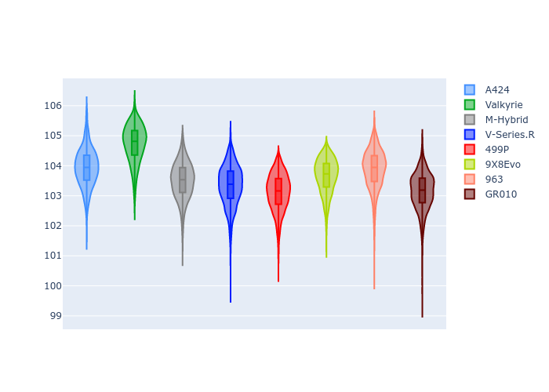
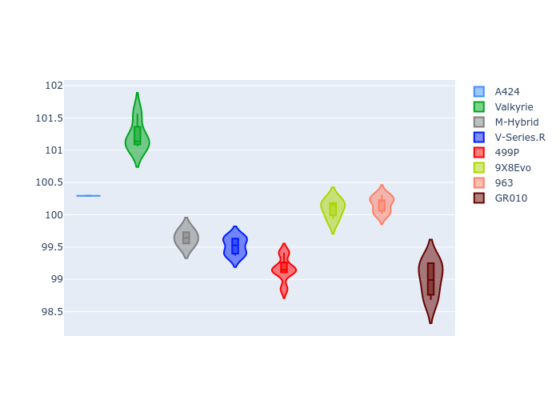
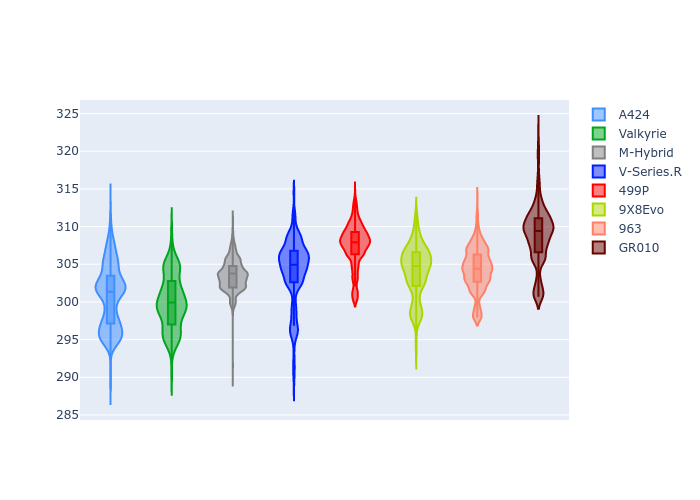
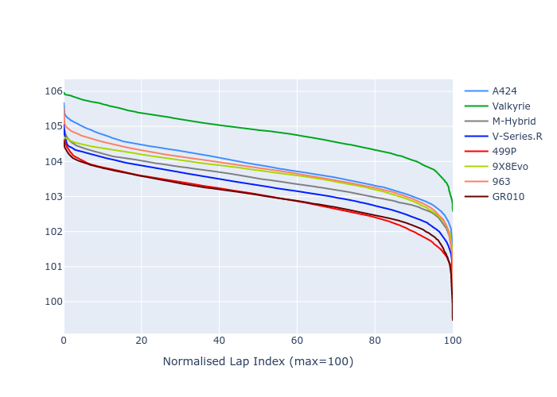

# Combined Plots

## Metadata

- BoP Accuracy: 97.56%
- Overall BoP Grade: A1
- Track: QATAR
- Threshhold: 250.0kph
- Average Laptime: 1:43.66
- Average Quali Laptime: 1:39.69
- Average Topspeed: 304.35kph

## BoP Table
| Manufacturer   | Car        | Weight   | Power   | PINC   | E/Stint   | FDS    | RDP    | QDP    | TDP    |
|:---------------|:-----------|:---------|:--------|:-------|:----------|:-------|:-------|:-------|:-------|
| Alpine         | A424       | 1044kg   | 508.0kw | -2.60% | 904MJ     | -      | 51.64% | 59.31% | 26.80% |
| Aston Martin   | Valkyrie   | 1042kg   | 504.0kw | +0.40% | 899MJ     | -      | 53.50% | 53.33% | 21.51% |
| BMW            | M-Hybrid   | 1037kg   | 505.0kw | +0.80% | 902MJ     | -      | 52.89% | 56.22% | 33.41% |
| Cadillac       | V-Series.R | 1030kg   | 503.0kw | +3.40% | 899MJ     | -      | 48.63% | 60.80% | 19.01% |
| Ferrari        | 499P       | 1037kg   | 501.0kw | -      | 897MJ     | 190kph | 51.38% | 44.98% | 9.83%  |
| Peugeot        | 9X8Evo     | 1031kg   | 520.0kw | -5.20% | 909MJ     | 190kph | 48.87% | 52.78% | 15.41% |
| Porsche        | 963        | 1064kg   | 508.0kw | +1.00% | 909MJ     | -      | 50.70% | 44.30% | 29.51% |
| Toyota         | GR010      | 1065kg   | 503.0kw | +3.40% | 909MJ     | 190kph | 51.09% | 52.71% | 11.46% |

## Performance Table
| Manufacturer   | Car        | RP      | QP      | Vavg      |   RDLC | BOP-Grade   | Match   |
|:---------------|:-----------|:--------|:--------|:----------|-------:|:------------|:--------|
| Alpine         | A424       | 1:43.91 | 1:40.26 | 301.04kph |   1.04 | ~A1         | 98.04%  |
| Aston Martin   | Valkyrie   | 1:44.71 | 1:40.52 | 302.41kph |   1.04 | +B2         | 83.20%  |
| BMW            | M-Hybrid   | 1:43.49 | 1:39.50 | 303.44kph |   1.04 | ~A1         | 100.00% |
| Cadillac       | V-Series.R | 1:43.33 | 1:39.38 | 303.42kph |   1.04 | ~A1         | 99.96%  |
| Ferrari        | 499P       | 1:43.13 | 1:38.96 | 307.44kph |   1.04 | ~A1         | 99.89%  |
| Peugeot        | 9X8Evo     | 1:43.66 | 1:39.91 | 304.41kph |   1.04 | ~A1         | 100.00% |
| Porsche        | 963        | 1:43.87 | 1:40.04 | 304.09kph |   1.04 | ~A1         | 99.80%  |
| Toyota         | GR010      | 1:43.16 | 1:38.98 | 308.56kph |   1.04 | ~A1         | 99.61%  |

## Race Laptimes

## Quali Laptimes

## Topspeeds

## Laptimes Lineplot

