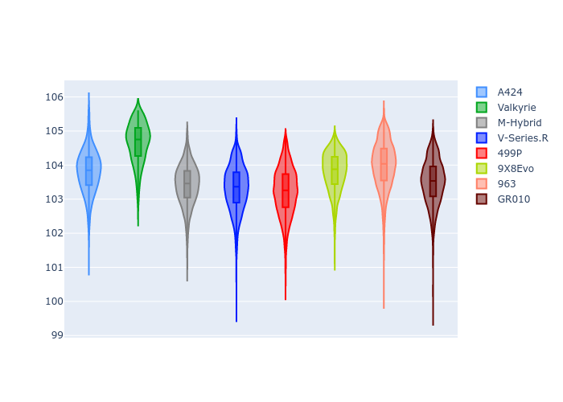
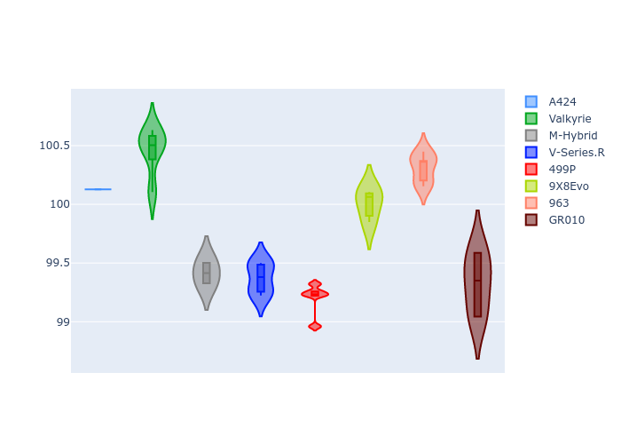

# Combined Plots

## Metadata

- BoP Accuracy: 98.95%
- Overall BoP Grade: A1
- Track: QATAR
- Threshhold: 250.0kph

## BoP Table
| Manufacturer   | Car        | Weight   | Power   | PINC   | E/Stint   | FDS    |
|:---------------|:-----------|:---------|:--------|:-------|:----------|:-------|
| Alpine         | A424       | 1044kg   | 508.0kw | -2.60% | 904MJ     | -      |
| Aston Martin   | Valkyrie   | 1042kg   | 504.0kw | +0.40% | 899MJ     | -      |
| BMW            | M-Hybrid   | 1037kg   | 505.0kw | +0.80% | 902MJ     | -      |
| Cadillac       | V-Series.R | 1030kg   | 503.0kw | +3.40% | 899MJ     | -      |
| Ferrari        | 499P       | 1037kg   | 501.0kw | -      | 897MJ     | 190kph |
| Peugeot        | 9X8Evo     | 1031kg   | 520.0kw | -5.20% | 909MJ     | 190kph |
| Porsche        | 963        | 1064kg   | 508.0kw | +1.00% | 909MJ     | -      |
| Toyota         | GR010      | 1065kg   | 503.0kw | +3.40% | 909MJ     | 190kph |

## Performance Table
| Manufacturer   | Car        | RP      | QP      | Vavg      |   RDLC | BOP-Grade   | Match   |
|:---------------|:-----------|:--------|:--------|:----------|-------:|:------------|:--------|
| Alpine         | A424       | 1:42.83 | 1:39.66 | 299.41kph |   1.03 | ~A1         | 98.16%  |
| Aston Martin   | Valkyrie   | 1:43.45 | 1:39.53 | 300.26kph |   1.04 | ~A1         | 95.61%  |
| BMW            | M-Hybrid   | 1:42.34 | 1:38.88 | 301.25kph |   1.03 | ~A1         | 99.96%  |
| Cadillac       | V-Series.R | 1:42.16 | 1:38.79 | 300.32kph |   1.03 | ~A1         | 99.68%  |
| Ferrari        | 499P       | 1:42.13 | 1:38.60 | 303.42kph |   1.04 | ~A1         | 99.27%  |
| Peugeot        | 9X8Evo     | 1:42.52 | 1:39.06 | 302.99kph |   1.03 | ~A1         | 99.37%  |
| Porsche        | 963        | 1:42.82 | 1:39.39 | 299.44kph |   1.03 | ~A1         | 99.85%  |
| Toyota         | GR010      | 1:42.19 | 1:38.57 | 304.26kph |   1.04 | ~A1         | 99.71%  |

## Race Laptimes

## Quali Laptimes

## Topspeeds

## Laptimes Lineplot

