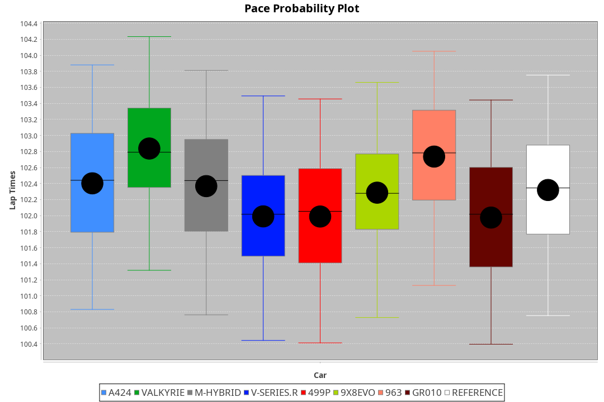
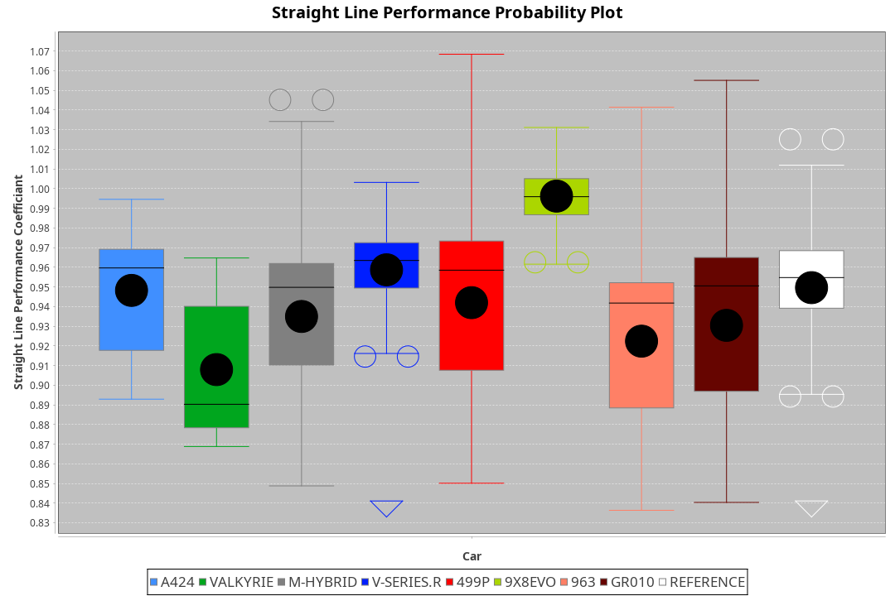
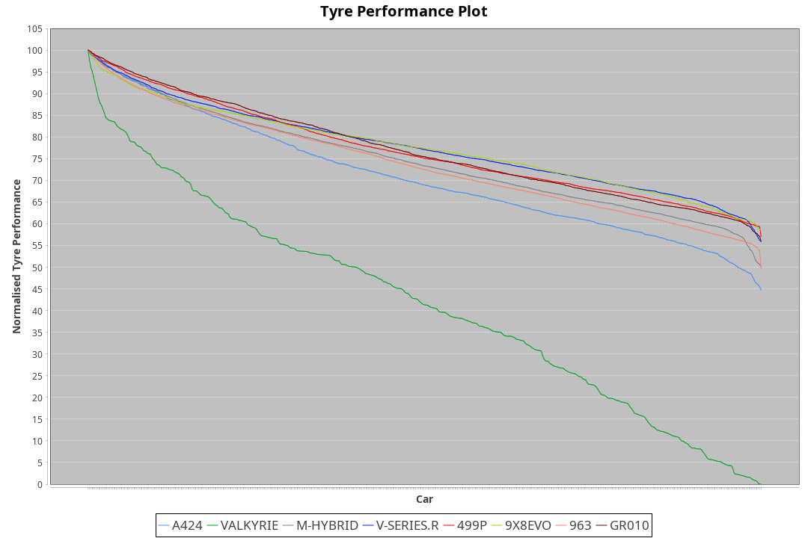

| Manufacturer | Car        | Weight | Power   | PINC    | E/Stint | FDS     |
|:-|:-|:-|:-|:-|:-|:-|
| Alpine       | A424       | 1044kg | 508.0kw | -2.60%  | 904MJ   |    -    |
| Aston Martin | Valkyrie   | 1042kg | 504.0kw | 0.40%   | 899MJ   |    -    |
| BMW          | M-Hybrid   | 1037kg | 505.0kw | 0.80%   | 902MJ   |    -    |
| Cadillac     | V-Series.R | 1030kg | 503.0kw | 3.40%   | 899MJ   |    -    |
| Ferrari      | 499P       | 1037kg | 501.0kw |    -    | 897MJ   | 190kph  |
| Peugeot      | 9X8Evo     | 1031kg | 520.0kw | -5.20%  | 909MJ   | 190kph  |
| Porsche      | 963        | 1064kg | 508.0kw | 1.00%   | 909MJ   |    -    |
| Toyota       | GR010      | 1065kg | 503.0kw | 3.40%   | 909MJ   | 190kph  |

### BoP Accuracy: 57.13%; Overall BoP Grade: E1
| Manufacturer | Car        | Type  | RP      | QP      | Weight | Power¹  | Threshhold | PINC    | Power²   | E/Stint | AVG Vmax  | FDS     | RDLC | L/Stint | BOP-Grade | Model Accuracy | Model Points | Match%  | SimDiff |
|:-|:-|:-|:-|:-|:-|:-|:-|:-|:-|:-|:-|:-|:-|:-|:-|:-|:-|:-|:-|
| Alpine       | A424       | LMDH  | 1:42.83 | 1:40.37 | 1044kg | 508.0kw | 250.0kph   | -2.60%  | 494.80kw |  904MJ  | 296.99kph |    -    | 1.01 | 33      | +C1       | 99.49%         | 1360         | 79.29%  | -0.64   |
| Aston Martin | Valkyrie   | LMHNH | 1:45.62 | 1:42.29 | 1042kg | 504.0kw | 250.0kph   | 0.40%   | 506.00kw |  899MJ  | 289.22kph |    -    | 1.02 | 33      | +Ω2       | 100.00%        | 312          | -45.27% | -0.87   |
| BMW          | M-Hybrid   | LMDH  | 1:42.28 | 1:38.97 | 1037kg | 505.0kw | 250.0kph   | 0.80%   | 509.00kw |  902MJ  | 298.60kph |    -    | 1.02 | 33      | -A2       | 98.62%         | 2363         | 94.98%  | -0.32   |
| Cadillac     | V-Series.R | LMDH  | 1:41.50 | 1:38.58 | 1030kg | 503.0kw | 250.0kph   | 3.40%   | 520.10kw |  899MJ  | 296.47kph |    -    | 1.03 | 33      | -E1       | 98.50%         | 4201         | 55.59%  | +0.14   |
| Ferrari      | 499P       | LMHHU | 1:41.57 | 1:38.50 | 1037kg | 501.0kw | 250.0kph   |    -    | 501.00kw |  897MJ  | 299.08kph | 190kph  | 1.05 | 33      | -E1       | 100.00%        | 4441         | 55.87%  | +0.15   |
| Peugeot      | 9X8Evo     | LMHHU | 1:41.72 | 1:39.01 | 1031kg | 520.0kw | 250.0kph   | -5.20%  | 493.00kw |  909MJ  | 299.08kph | 190kph  | 1.02 | 33      | -D2       | 100.00%        | 808          | 60.14%  | +0.75   |
| Porsche      | 963        | LMDH  | 1:42.43 | 1:39.09 | 1064kg | 508.0kw | 250.0kph   | 1.00%   | 513.10kw |  909MJ  | 295.56kph |    -    | 0.99 | 33      | ~A1       | 99.87%         | 12613        | 100.00% | -0.04   |
| Toyota       | GR010      | LMHHU | 1:41.53 | 1:38.29 | 1065kg | 503.0kw | 250.0kph   | 3.40%   | 520.10kw |  909MJ  | 296.89kph | 190kph  | 1.03 | 33      | -E1       | 99.73%         | 2956         | 56.43%  | +0.85   |

## Power below Threshhold
| N/Nmax    | A424    | VALKYRIE | M-HYBRID | V-SERIES.R | 499P    | 9X8EVO  | 963     | GR010   |
|:-|:-|:-|:-|:-|:-|:-|:-|:-|
|  0.550    |  250    |  248     |  249     |  248       |  247    |  256    |  250    |  248    |
|  0.575    |  273    |  271     |  272     |  271       |  270    |  279    |  273    |  271    |
|  0.600    |  293    |  291     |  292     |  291       |  290    |  300    |  293    |  291    |
|  0.625    |  314    |  312     |  312     |  311       |  310    |  322    |  314    |  311    |
|  0.650    |  335    |  333     |  333     |  332       |  331    |  343    |  335    |  332    |
|  0.675    |  357    |  354     |  355     |  353       |  352    |  365    |  357    |  353    |
|  0.700    |  378    |  375     |  376     |  374       |  373    |  387    |  378    |  374    |
|  0.725    |  399    |  396     |  397     |  395       |  394    |  409    |  399    |  395    |
|  0.750    |  420    |  416     |  417     |  416       |  414    |  430    |  420    |  416    |
|  0.775    |  439    |  435     |  436     |  435       |  433    |  449    |  439    |  435    |
|  0.800    |  456    |  453     |  454     |  452       |  450    |  467    |  456    |  452    |
|  0.825    |  471    |  468     |  469     |  467       |  465    |  482    |  471    |  467    |
|  0.850    |  483    |  479     |  480     |  478       |  476    |  494    |  483    |  478    |
|  0.875    |  493    |  489     |  490     |  488       |  486    |  505    |  493    |  488    |
|  0.900    |  500    |  496     |  497     |  495       |  493    |  512    |  500    |  495    |
|  0.925    |  505    |  501     |  502     |  500       |  498    |  517    |  505    |  500    |
| **0.950** | **508** | **504**  | **505**  | **503**    | **501** | **520** | **508** | **503** |
|  0.975    |  506    |  502     |  503     |  501       |  499    |  518    |  506    |  501    |
|  1.000    |  503    |  499     |  500     |  498       |  496    |  514    |  503    |  498    |
|  1.025    |  434    |  430     |  431     |  430       |  428    |  444    |  434    |  430    |

## Power above Threshhold
| N/Nmax    | A424       | VALKYRIE   | M-HYBRID   | V-SERIES.R | 499P    | 9X8EVO     | 963        | GR010      |
|:-|:-|:-|:-|:-|:-|:-|:-|:-|
|  0.550    |  243.39    |  249.01    |  251.02    |  256.05    |  247    |  242.47    |  253.04    |  256.05    |
|  0.575    |  266.43    |  272.01    |  274.02    |  279.05    |  270    |  265.52    |  276.04    |  279.05    |
|  0.600    |  285.46    |  292.01    |  294.02    |  300.06    |  290    |  284.55    |  296.05    |  300.06    |
|  0.625    |  305.49    |  313.01    |  315.02    |  322.06    |  310    |  304.59    |  317.05    |  322.06    |
|  0.650    |  326.52    |  334.01    |  336.03    |  343.07    |  331    |  325.63    |  338.05    |  343.07    |
|  0.675    |  347.56    |  355.01    |  357.03    |  365.07    |  352    |  345.67    |  360.06    |  365.07    |
|  0.700    |  368.59    |  377.01    |  379.03    |  387.08    |  373    |  366.71    |  382.06    |  387.08    |
|  0.725    |  389.62    |  398.01    |  400.03    |  409.08    |  394    |  387.76    |  403.06    |  409.08    |
|  0.750    |  408.65    |  418.01    |  421.03    |  430.08    |  414    |  407.79    |  424.07    |  430.08    |
|  0.775    |  427.68    |  437.01    |  440.03    |  449.09    |  433    |  425.83    |  443.07    |  449.09    |
|  0.800    |  444.71    |  454.01    |  457.04    |  467.09    |  450    |  442.86    |  461.07    |  467.09    |
|  0.825    |  458.73    |  469.01    |  472.04    |  482.09    |  465    |  456.89    |  476.07    |  482.09    |
|  0.850    |  469.75    |  481.02    |  484.04    |  494.10    |  476    |  467.91    |  487.08    |  494.10    |
|  0.875    |  479.77    |  491.02    |  494.04    |  505.10    |  486    |  477.93    |  498.08    |  505.10    |
|  0.900    |  486.78    |  498.02    |  501.04    |  512.10    |  493    |  484.94    |  505.08    |  512.10    |
|  0.925    |  491.79    |  503.02    |  506.04    |  517.10    |  498    |  489.95    |  510.08    |  517.10    |
| **0.950** | **494.79** | **506.02** | **509.04** | **520.10** | **501** | **492.96** | **513.08** | **520.10** |
|  0.975    |  492.79    |  504.02    |  507.04    |  518.10    |  499    |  490.96    |  511.08    |  518.10    |
|  1.000    |  489.78    |  501.02    |  504.04    |  514.10    |  496    |  487.95    |  507.08    |  514.10    |
|  1.025    |  422.68    |  432.01    |  435.03    |  444.09    |  428    |  420.82    |  438.07    |  444.09    |
