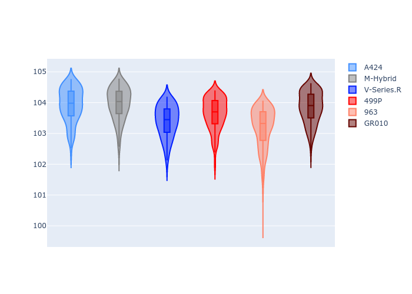
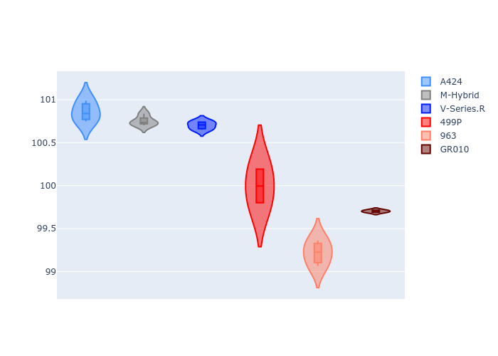

# Combined Plots

## Metadata

- BoP Accuracy: 91.70%
- Overall BoP Grade: A2
- Track: QATAR
- Threshhold: 0.0kph

## BoP Table
| Manufacturer   | Car        | Weight   | Power   | PINC   | E/Stint   | FDS    | RDP    | QDP     | TDP    |
|:---------------|:-----------|:---------|:--------|:-------|:----------|:-------|:-------|:--------|:-------|
| Alpine         | A424       | 1070kg   | 510.0kw | -      | 909MJ     | -      | 60.15% | 75.00%  | 8.48%  |
| BMW            | M-Hybrid   | 1060kg   | 506.0kw | -      | 904MJ     | -      | 59.18% | 100.00% | 45.81% |
| Cadillac       | V-Series.R | 1032kg   | 499.0kw | -      | 890MJ     | -      | 58.08% | 80.00%  | 6.60%  |
| Ferrari        | 499P       | 1075kg   | 503.0kw | -      | 902MJ     | 190kph | 58.66% | 40.00%  | 7.62%  |
| Porsche        | 963        | 1048kg   | 505.0kw | -      | 900MJ     | -      | 53.25% | 100.00% | 7.76%  |
| Toyota         | GR010      | 1089kg   | 510.0kw | -      | 914MJ     | 190kph | 59.22% | 66.67%  | 14.83% |

## Performance Table
| Manufacturer   | Car        | RP      | QP      | Vavg      |   RDLC | BOP-Grade   | Match   |
|:---------------|:-----------|:--------|:--------|:----------|-------:|:------------|:--------|
| Alpine         | A424       | 1:43.70 | 1:41.80 | 299.20kph |   1.02 | +B2         | 81.50%  |
| BMW            | M-Hybrid   | 1:43.73 | 1:41.72 | 292.40kph |   1.02 | +B2         | 82.05%  |
| Cadillac       | V-Series.R | 1:43.17 | 1:41.64 | 295.37kph |   1.02 | ~A1         | 100.00% |
| Ferrari        | 499P       | 1:43.42 | 1:41.03 | 297.88kph |   1.02 | ~A1         | 100.00% |
| Porsche        | 963        | 1:42.97 | 1:40.17 | 298.34kph |   1.03 | ~A1         | 97.04%  |
| Toyota         | GR010      | 1:43.62 | 1:40.70 | 295.87kph |   1.03 | +B1         | 89.62%  |

## Race Laptimes

## Quali Laptimes

## Topspeeds

## Laptimes Lineplot

