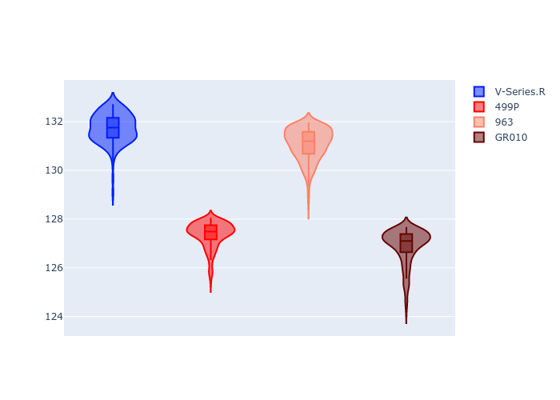
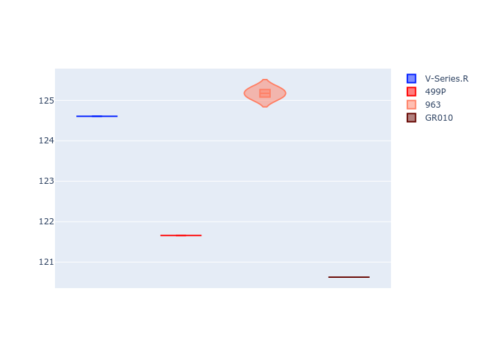
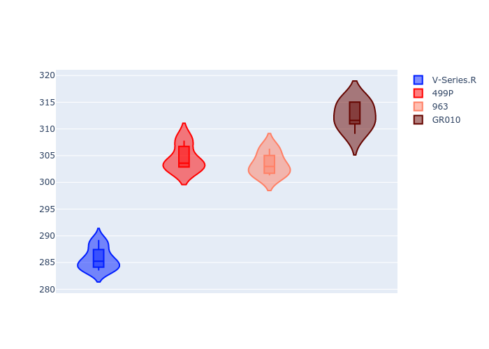
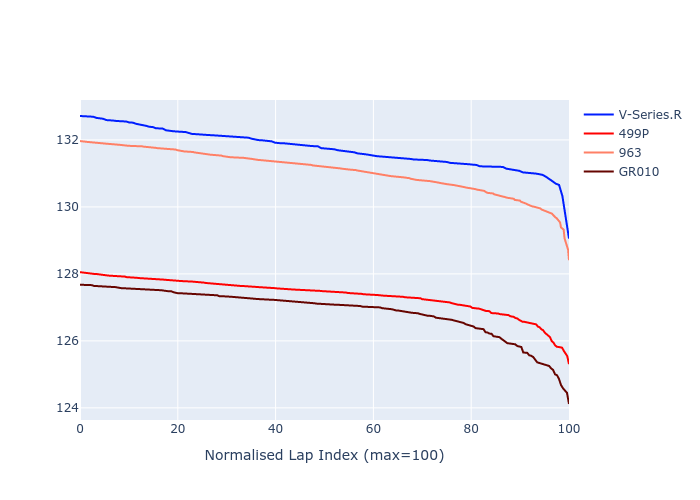

# Combined Plots

## Metadata

- BoP Accuracy: 36.67%
- Overall BoP Grade: Ω1
- Track: REFERENCETRACK
- Threshhold: 0.0kph

## BoP Table
| Manufacturer   | Car        | Weight   | Power   | PINC   | E/Stint   | FDS   | RDP    | QDP    | TDP    |
|:---------------|:-----------|:---------|:--------|:-------|:----------|:------|:-------|:-------|:-------|
| Cadillac       | V-Series.R | 1030kg   | 520.0kw | -      | 908MJ     | -     | 60.57% | 33.33% | 10.98% |
| Ferrari        | 499P       | 1030kg   | 520.0kw | -      | 906MJ     | -     | 57.14% | 33.33% | 1.36%  |
| Porsche        | 963        | 1030kg   | 520.0kw | -      | 912MJ     | -     | 55.50% | 40.00% | 0.77%  |
| Toyota         | GR010      | 1030kg   | 520.0kw | -      | 912MJ     | -     | 48.80% | 25.00% | 0.99%  |

## Performance Table
| Manufacturer   | Car        | RP      | QP      | Vavg      |   RDLC | BOP-Grade   | Match   |
|:---------------|:-----------|:--------|:--------|:----------|-------:|:------------|:--------|
| Cadillac       | V-Series.R | 2:10.06 | 2:02.87 | 285.70kph |   1.06 | +Ω1         | 1.34%   |
| Ferrari        | 499P       | 2:05.19 | 1:59.46 | 304.49kph |   1.05 | -C1         | 78.52%  |
| Porsche        | 963        | 2:09.49 | 2:03.50 | 303.38kph |   1.05 | +Ω1         | 3.45%   |
| Toyota         | GR010      | 2:04.82 | 1:58.56 | 312.47kph |   1.05 | -D2         | 63.37%  |

## Race Laptimes

## Quali Laptimes

## Topspeeds

## Laptimes Lineplot

