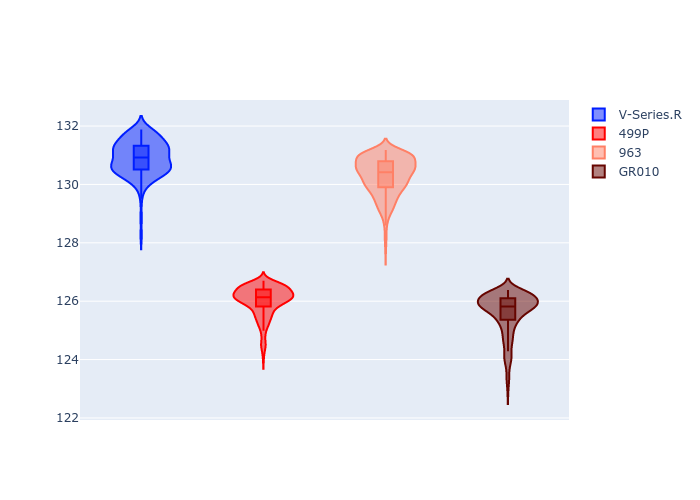
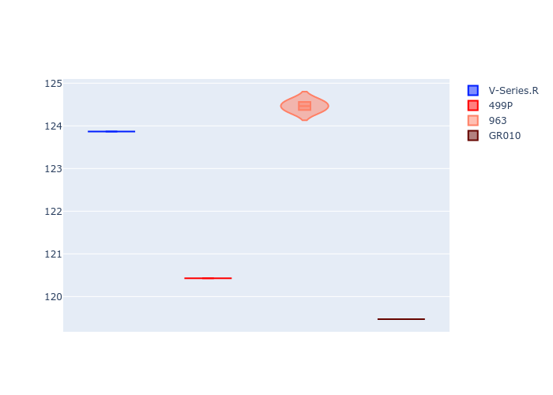
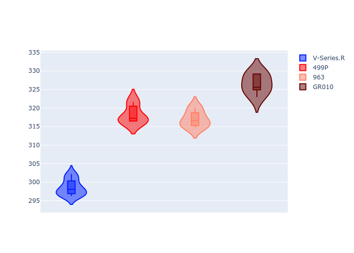
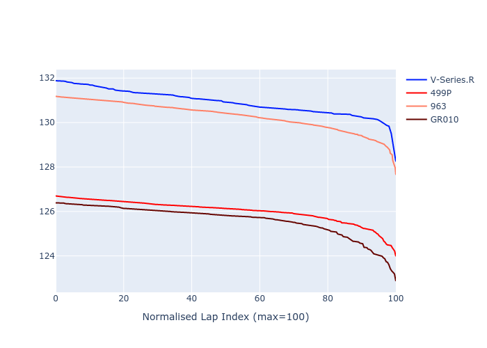

# Combined Plots

## Metadata

- BoP Accuracy: 71.56%
- Overall BoP Grade: C2
- Track: REFERENCETRACK
- Threshhold: 0.0kph
- Average Laptime: 2:09.71
- Average Quali Laptime: 2:03.43
- Laptime Std Dev: 0.89 seconds
- Filtered Average Topspeed: 314.96kph

## BoP Table
| Manufacturer   | Car        | Weight   | Power   | PINC   | E/Stint   | FDS   | RDP    | QDP    | TDP    |
|:---------------|:-----------|:---------|:--------|:-------|:----------|:------|:-------|:-------|:-------|
| Cadillac       | V-Series.R | 1030kg   | 520.0kw | -      | 908MJ     | -     | 60.57% | 33.33% | 10.98% |
| Ferrari        | 499P       | 1030kg   | 520.0kw | -      | 906MJ     | -     | 57.14% | 33.33% | 1.36%  |
| Porsche        | 963        | 1030kg   | 520.0kw | -      | 912MJ     | -     | 55.50% | 40.00% | 0.77%  |
| Toyota         | GR010      | 1030kg   | 520.0kw | -      | 912MJ     | -     | 49.60% | 25.00% | 0.99%  |

## Performance Table
| Manufacturer   | Car        | RP      | QP      | Vavg      |   RDLC | BOP-Grade   | Match   |
|:---------------|:-----------|:--------|:--------|:----------|-------:|:------------|:--------|
| Cadillac       | V-Series.R | 2:10.87 | 2:03.83 | 298.44kph |   1.06 | +Ω1         | 32.21%  |
| Ferrari        | 499P       | 2:09.07 | 2:03.22 | 318.07kph |   1.05 | ~A1         | 99.65%  |
| Porsche        | 963        | 2:10.26 | 2:04.43 | 316.92kph |   1.05 | +D2         | 61.27%  |
| Toyota         | GR010      | 2:08.65 | 2:02.22 | 326.41kph |   1.05 | -A2         | 93.12%  |

## Race Laptimes

## Quali Laptimes

## Topspeeds

## Laptimes Lineplot

