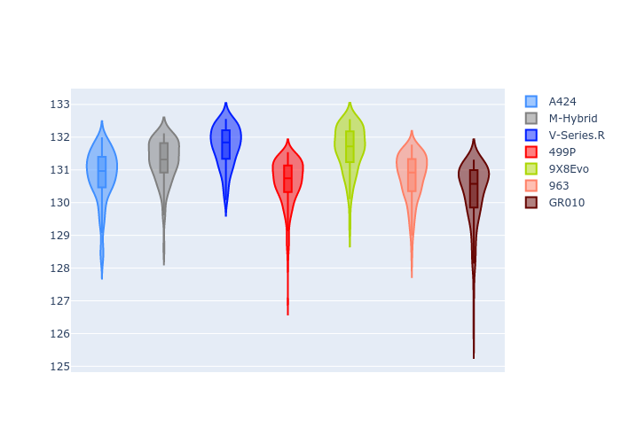
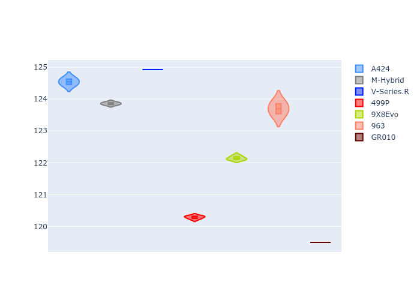
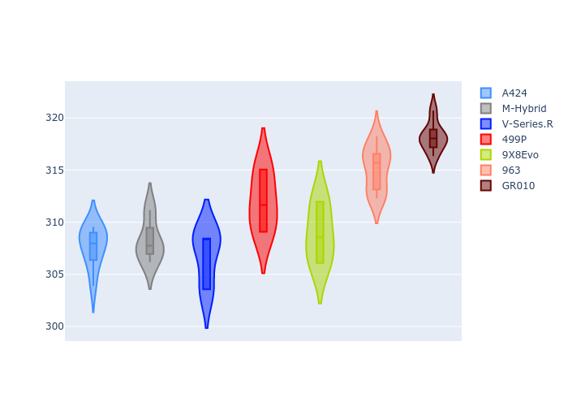
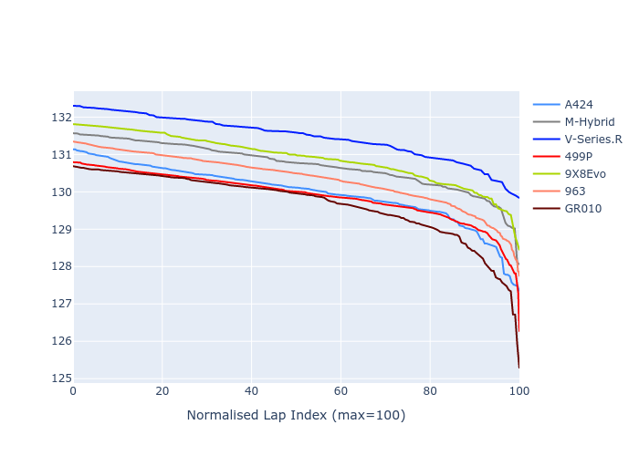

# Combined Plots

## Metadata

- BoP Accuracy: 84.23%
- Overall BoP Grade: B2
- Track: REFERENCETRACK
- Threshhold: 0.0kph
- Average Laptime: 2:10.42
- Average Quali Laptime: 2:03.89
- Laptime Std Dev: 0.59 seconds
- Filtered Average Topspeed: 310.98kph

## BoP Table
| Manufacturer   | Car        | Weight   | Power   | PINC   | E/Stint   | FDS   | RDP    | QDP     | TDP   |
|:---------------|:-----------|:---------|:--------|:-------|:----------|:------|:-------|:--------|:------|
| Alpine         | A424       | 1030kg   | 520.0kw | -      | 918MJ     | -     | 49.36% | 50.00%  | 1.83% |
| BMW            | M-Hybrid   | 1030kg   | 520.0kw | -      | 914MJ     | -     | 56.07% | 66.67%  | 2.08% |
| Cadillac       | V-Series.R | 1030kg   | 520.0kw | -      | 909MJ     | -     | 54.89% | 100.00% | 2.44% |
| Ferrari        | 499P       | 1030kg   | 520.0kw | -      | 914MJ     | -     | 51.49% | 60.00%  | 0.79% |
| Peugeot        | 9X8Evo     | 1030kg   | 520.0kw | -      | 916MJ     | -     | 50.72% | 100.00% | 1.40% |
| Porsche        | 963        | 1030kg   | 520.0kw | -      | 913MJ     | -     | 50.90% | 22.22%  | 1.58% |
| Toyota         | GR010      | 1030kg   | 520.0kw | -      | 913MJ     | -     | 50.98% | 20.00%  | 3.14% |

## Performance Table
| Manufacturer   | Car        | RP      | QP      | Vavg      |   RDLC | BOP-Grade   | Match   |
|:---------------|:-----------|:--------|:--------|:----------|-------:|:------------|:--------|
| Alpine         | A424       | 2:09.98 | 2:04.50 | 307.70kph |   1.04 | ~A1         | 98.28%  |
| BMW            | M-Hybrid   | 2:10.71 | 2:03.82 | 308.21kph |   1.06 | +B1         | 86.08%  |
| Cadillac       | V-Series.R | 2:11.46 | 2:04.89 | 306.82kph |   1.05 | +Ω1         | 37.98%  |
| Ferrari        | 499P       | 2:09.89 | 2:03.08 | 311.92kph |   1.06 | ~A1         | 99.17%  |
| Peugeot        | 9X8Evo     | 2:10.90 | 2:05.04 | 308.88kph |   1.05 | +C2         | 71.90%  |
| Porsche        | 963        | 2:10.35 | 2:03.66 | 315.19kph |   1.05 | ~A1         | 100.00% |
| Toyota         | GR010      | 2:09.66 | 2:02.26 | 318.17kph |   1.06 | ~A1         | 96.17%  |

## Race Laptimes

## Quali Laptimes

## Topspeeds

## Laptimes Lineplot

