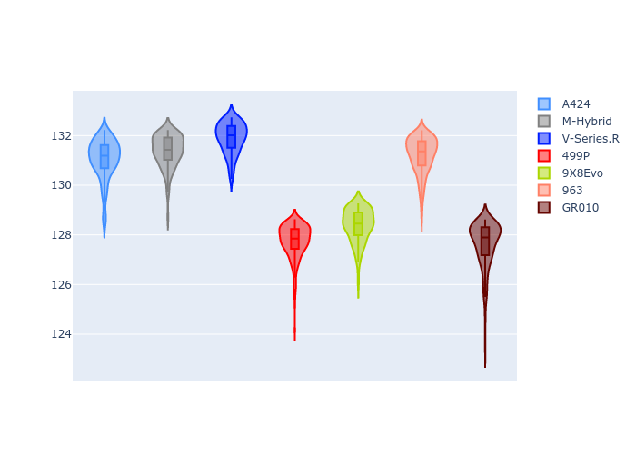
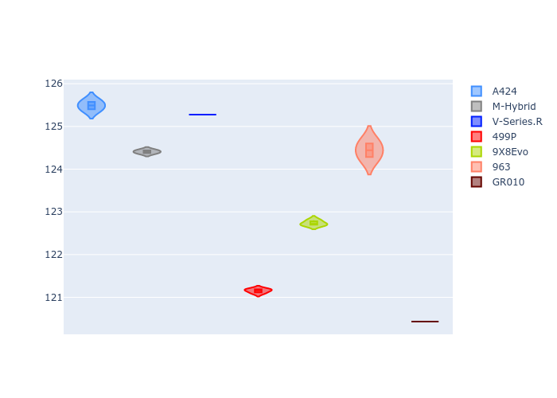

# Combined Plots

## Metadata

- BoP Accuracy: 49.49%
- Overall BoP Grade: Ω1
- Track: REFERENCETRACK
- Threshhold: 0.0kph
- Average Laptime: 2:09.89
- Average Quali Laptime: 2:03.42
- Average Topspeed: 310.97kph

## BoP Table
| Manufacturer   | Car        | Weight   | Power   | PINC   | E/Stint   | FDS   | RDP    | QDP     | TDP   |
|:---------------|:-----------|:---------|:--------|:-------|:----------|:------|:-------|:--------|:------|
| Alpine         | A424       | 1030kg   | 520.0kw | -      | 918MJ     | -     | 49.36% | 50.00%  | 1.83% |
| BMW            | M-Hybrid   | 1030kg   | 520.0kw | -      | 914MJ     | -     | 56.07% | 66.67%  | 2.08% |
| Cadillac       | V-Series.R | 1030kg   | 520.0kw | -      | 909MJ     | -     | 54.89% | 100.00% | 2.44% |
| Ferrari        | 499P       | 1030kg   | 520.0kw | -      | 914MJ     | -     | 51.49% | 60.00%  | 0.79% |
| Peugeot        | 9X8Evo     | 1030kg   | 520.0kw | -      | 916MJ     | -     | 50.72% | 100.00% | 1.40% |
| Porsche        | 963        | 1030kg   | 520.0kw | -      | 913MJ     | -     | 50.90% | 22.22%  | 1.58% |
| Toyota         | GR010      | 1030kg   | 520.0kw | -      | 913MJ     | -     | 50.98% | 20.00%  | 3.14% |

## Performance Table
| Manufacturer   | Car        | RP      | QP      | Vavg      |   RDLC | BOP-Grade   | Match   |
|:---------------|:-----------|:--------|:--------|:----------|-------:|:------------|:--------|
| Alpine         | A424       | 2:11.05 | 2:05.49 | 307.69kph |   1.04 | +Ω1         | 32.76%  |
| BMW            | M-Hybrid   | 2:11.37 | 2:04.41 | 308.20kph |   1.06 | +Ω1         | 19.59%  |
| Cadillac       | V-Series.R | 2:11.89 | 2:05.28 | 306.81kph |   1.05 | +Ω1         | 6.98%   |
| Ferrari        | 499P       | 2:07.74 | 2:01.15 | 311.91kph |   1.05 | -B1         | 85.95%  |
| Peugeot        | 9X8Evo     | 2:08.37 | 2:02.74 | 308.87kph |   1.05 | ~A1         | 95.24%  |
| Porsche        | 963        | 2:11.22 | 2:04.44 | 315.18kph |   1.05 | +Ω1         | 26.97%  |
| Toyota         | GR010      | 2:07.61 | 2:00.43 | 318.16kph |   1.06 | -C1         | 78.95%  |

## Race Laptimes

## Quali Laptimes

## Topspeeds

## Laptimes Lineplot

