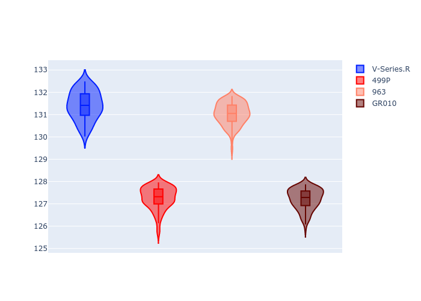
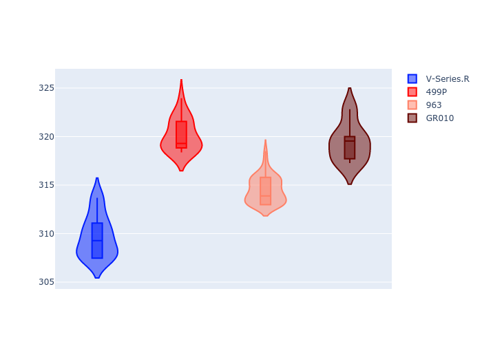
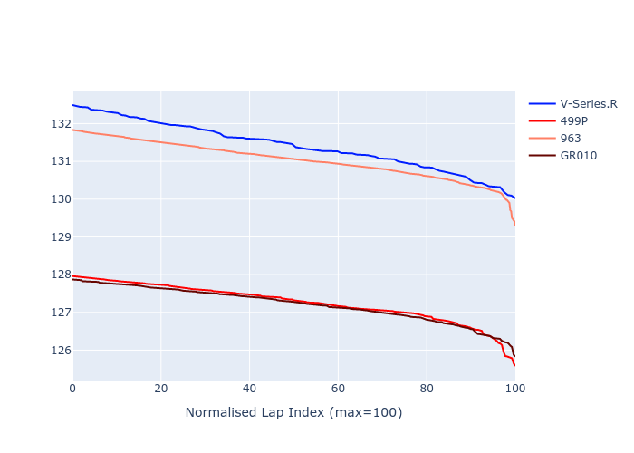

# Combined Plots

## Metadata

- BoP Accuracy: 10.82%
- Overall BoP Grade: Ω1
- Track: REFERENCETRACK
- Threshhold: 0.0kph
- Average Laptime: 2:09.23
- Average Quali Laptime: 2:04.05
- Average Topspeed: 315.93kph

## BoP Table
| Manufacturer   | Car        | Weight   | Power   | PINC   | E/Stint   | FDS   | RDP    | QDP    | TDP    |
|:---------------|:-----------|:---------|:--------|:-------|:----------|:------|:-------|:-------|:-------|
| Cadillac       | V-Series.R | 1030kg   | 520.0kw | -      | 906MJ     | -     | 53.88% | 50.00% | 21.12% |
| Ferrari        | 499P       | 1030kg   | 520.0kw | -      | 906MJ     | -     | 58.11% | 20.00% | 4.15%  |
| Porsche        | 963        | 1030kg   | 520.0kw | -      | 909MJ     | -     | 60.72% | 25.00% | 10.69% |
| Toyota         | GR010      | 1030kg   | 520.0kw | -      | 907MJ     | -     | 56.77% | 25.00% | 2.48%  |

## Performance Table
| Manufacturer   | Car        | RP      | QP      | Vavg      |   RDLC | BOP-Grade   | Match   |
|:---------------|:-----------|:--------|:--------|:----------|-------:|:------------|:--------|
| Cadillac       | V-Series.R | 2:11.41 | 2:05.65 | 309.71kph |   1.05 | +Ω1         | 0.85%   |
| Ferrari        | 499P       | 2:07.26 | 2:02.75 | 320.11kph |   1.04 | -Ω1         | 23.40%  |
| Porsche        | 963        | 2:11.03 | 2:06.05 | 314.51kph |   1.04 | +Ω1         | 2.48%   |
| Toyota         | GR010      | 2:07.21 | 2:01.75 | 319.40kph |   1.04 | -Ω1         | 16.54%  |

## Race Laptimes

## Quali Laptimes

## Topspeeds

## Laptimes Lineplot

