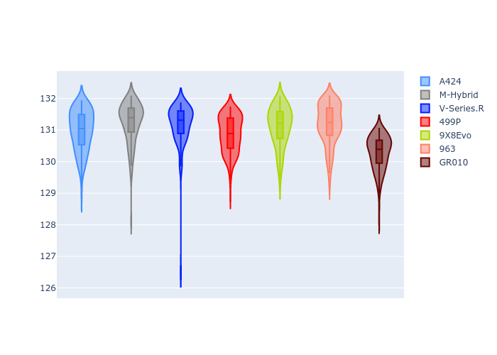
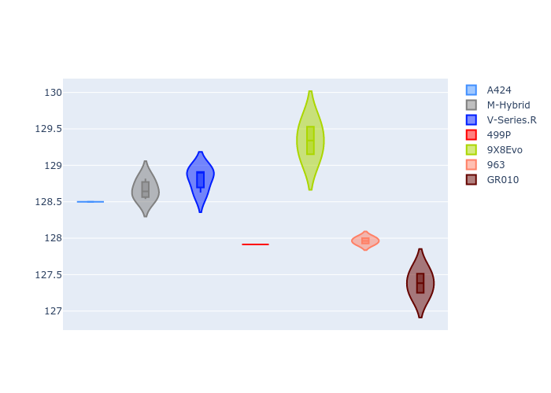
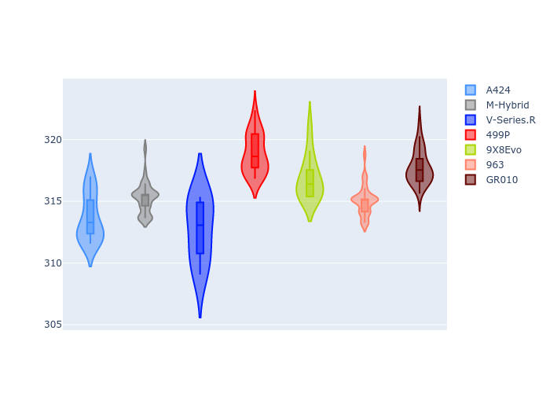
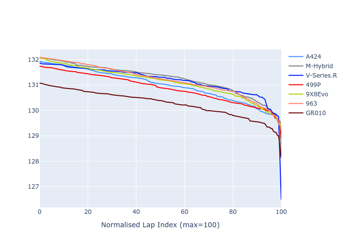

# Combined Plots

## Metadata

- BoP Accuracy: 84.53%
- Overall BoP Grade: B2
- Track: REFERENCETRACK
- Threshhold: 0.0kph
- Average Laptime: 2:10.56
- Average Quali Laptime: 2:07.97
- Laptime Std Dev: 0.51 seconds
- Filtered Average Topspeed: 315.65kph

## BoP Table
| Manufacturer   | Car        | Weight   | Power   | PINC   | E/Stint   | FDS   | RDP    | QDP    | TDP   |
|:---------------|:-----------|:---------|:--------|:-------|:----------|:------|:-------|:-------|:------|
| Alpine         | A424       | 1030kg   | 520.0kw | -      | 917MJ     | -     | 49.77% | 25.00% | 9.44% |
| BMW            | M-Hybrid   | 1030kg   | 520.0kw | -      | 914MJ     | -     | 49.88% | 60.00% | 6.84% |
| Cadillac       | V-Series.R | 1030kg   | 520.0kw | -      | 910MJ     | -     | 46.63% | 75.00% | 3.70% |
| Ferrari        | 499P       | 1030kg   | 520.0kw | -      | 913MJ     | -     | 52.53% | 11.11% | 7.86% |
| Peugeot        | 9X8Evo     | 1030kg   | 520.0kw | -      | 923MJ     | -     | 51.88% | 40.00% | 2.90% |
| Porsche        | 963        | 1030kg   | 520.0kw | -      | 912MJ     | -     | 48.03% | 20.00% | 5.44% |
| Toyota         | GR010      | 1030kg   | 520.0kw | -      | 915MJ     | -     | 49.73% | 33.33% | 7.04% |

## Performance Table
| Manufacturer   | Car        | RP      | QP      | Vavg      |   RDLC | BOP-Grade   | Match   |
|:---------------|:-----------|:--------|:--------|:----------|-------:|:------------|:--------|
| Alpine         | A424       | 2:10.57 | 2:08.10 | 313.55kph |   1.02 | +A2         | 93.87%  |
| BMW            | M-Hybrid   | 2:11.04 | 2:08.47 | 315.18kph |   1.02 | -C2         | 70.05%  |
| Cadillac       | V-Series.R | 2:11.15 | 2:08.80 | 312.65kph |   1.02 | -E1         | 56.67%  |
| Ferrari        | 499P       | 2:10.19 | 2:07.26 | 318.77kph |   1.02 | ~A1         | 100.00% |
| Peugeot        | 9X8Evo     | 2:10.60 | 2:08.85 | 316.77kph |   1.01 | ~A1         | 95.02%  |
| Porsche        | 963        | 2:10.84 | 2:07.63 | 314.97kph |   1.03 | +C1         | 77.21%  |
| Toyota         | GR010      | 2:09.53 | 2:06.67 | 317.66kph |   1.02 | ~A1         | 98.93%  |

## Race Laptimes

## Quali Laptimes

## Topspeeds

## Laptimes Lineplot

