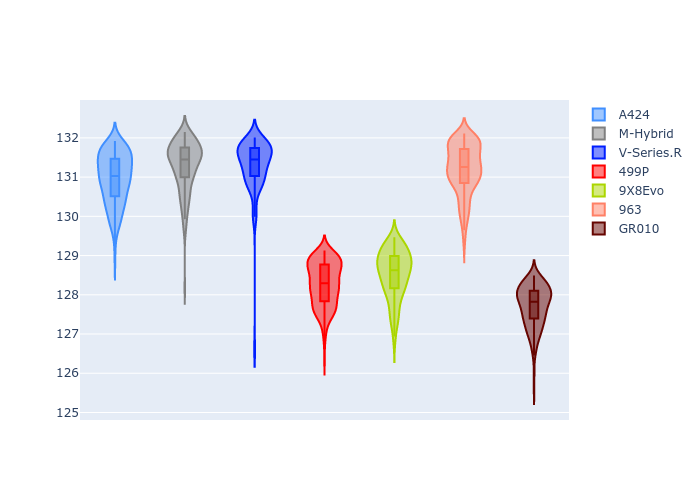
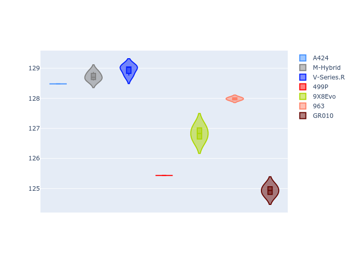
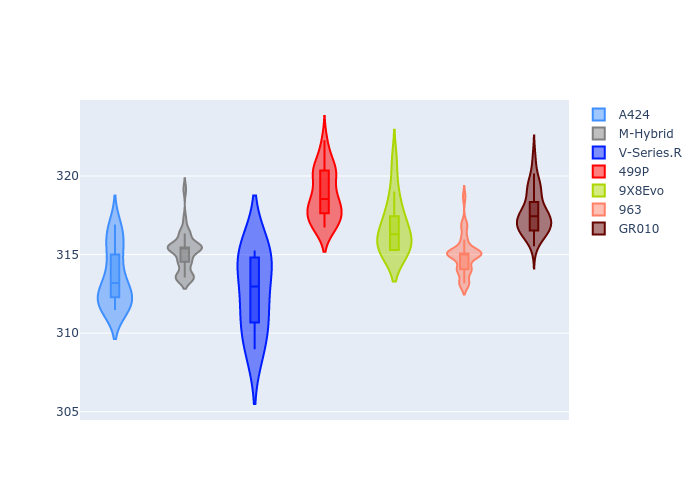
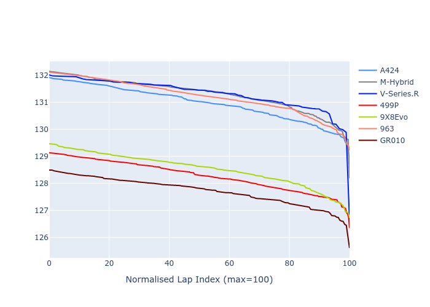

# Combined Plots

## Metadata

- BoP Accuracy: 34.05%
- Overall BoP Grade: Ω1
- Track: REFERENCETRACK
- Threshhold: 0.0kph

## BoP Table
| Manufacturer   | Car        | Weight   | Power   | PINC   | E/Stint   | FDS   | RDP    | QDP    | TDP   |
|:---------------|:-----------|:---------|:--------|:-------|:----------|:------|:-------|:-------|:------|
| Alpine         | A424       | 1030kg   | 520.0kw | -      | 916MJ     | -     | 49.77% | 25.00% | 9.44% |
| BMW            | M-Hybrid   | 1030kg   | 520.0kw | -      | 913MJ     | -     | 49.88% | 60.00% | 6.84% |
| Cadillac       | V-Series.R | 1030kg   | 520.0kw | -      | 910MJ     | -     | 46.63% | 75.00% | 3.70% |
| Ferrari        | 499P       | 1030kg   | 520.0kw | -      | 913MJ     | -     | 53.04% | 11.11% | 7.86% |
| Peugeot        | 9X8Evo     | 1030kg   | 520.0kw | -      | 923MJ     | -     | 51.88% | 40.00% | 2.90% |
| Porsche        | 963        | 1030kg   | 520.0kw | -      | 913MJ     | -     | 48.03% | 20.00% | 5.44% |
| Toyota         | GR010      | 1030kg   | 520.0kw | -      | 916MJ     | -     | 49.73% | 33.33% | 7.04% |

## Performance Table
| Manufacturer   | Car        | RP      | QP      | Vavg      |   RDLC | BOP-Grade   | Match   |
|:---------------|:-----------|:--------|:--------|:----------|-------:|:------------|:--------|
| Alpine         | A424       | 2:12.33 | 2:08.63 | 310.02kph |   1.03 | +Ω1         | 22.17%  |
| BMW            | M-Hybrid   | 2:12.78 | 2:08.97 | 311.65kph |   1.03 | +Ω1         | 8.70%   |
| Cadillac       | V-Series.R | 2:12.89 | 2:09.30 | 309.16kph |   1.03 | -Ω1         | 4.44%   |
| Ferrari        | 499P       | 2:08.71 | 2:04.75 | 315.23kph |   1.03 | -C2         | 70.70%  |
| Peugeot        | 9X8Evo     | 2:09.11 | 2:06.28 | 313.22kph |   1.02 | -B1         | 86.88%  |
| Porsche        | 963        | 2:12.57 | 2:08.13 | 311.46kph |   1.03 | +Ω1         | 13.35%  |
| Toyota         | GR010      | 2:08.04 | 2:04.17 | 314.17kph |   1.03 | -Ω1         | 32.09%  |

## Race Laptimes

## Quali Laptimes

## Topspeeds

## Laptimes Lineplot

