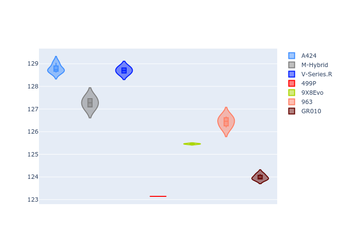
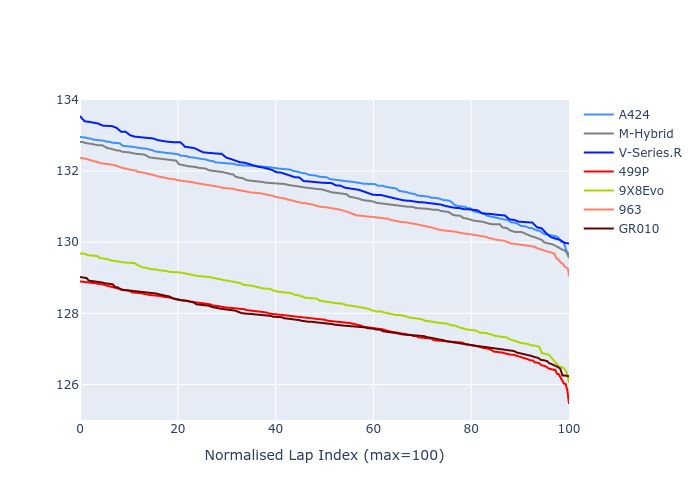

# Combined Plots

## Metadata

- BoP Accuracy: 44.88%
- Overall BoP Grade: Ω1
- Track: REFERENCETRACK
- Threshhold: 0.0kph
- Average Laptime: 2:09.95
- Average Quali Laptime: 2:06.25
- Average Topspeed: 312.96kph

## BoP Table
| Manufacturer   | Car        | Weight   | Power   | PINC   | E/Stint   | FDS   | RDP    | QDP     | TDP    |
|:---------------|:-----------|:---------|:--------|:-------|:----------|:------|:-------|:--------|:-------|
| Alpine         | A424       | 1030kg   | 520.0kw | -      | 913MJ     | -     | 46.25% | 100.00% | 13.95% |
| BMW            | M-Hybrid   | 1030kg   | 520.0kw | -      | 912MJ     | -     | 54.22% | 40.00%  | 10.62% |
| Cadillac       | V-Series.R | 1030kg   | 520.0kw | -      | 911MJ     | -     | 53.20% | 66.67%  | 30.73% |
| Ferrari        | 499P       | 1030kg   | 520.0kw | -      | 912MJ     | -     | 46.66% | 20.00%  | 11.63% |
| Peugeot        | 9X8Evo     | 1030kg   | 520.0kw | -      | 911MJ     | -     | 49.50% | 50.00%  | 18.03% |
| Porsche        | 963        | 1030kg   | 520.0kw | -      | 911MJ     | -     | 51.94% | 42.86%  | 3.54%  |
| Toyota         | GR010      | 1030kg   | 520.0kw | -      | 916MJ     | -     | 54.63% | 50.00%  | 8.80%  |

## Performance Table
| Manufacturer   | Car        | RP      | QP      | Vavg      |   RDLC | BOP-Grade   | Match   |
|:---------------|:-----------|:--------|:--------|:----------|-------:|:------------|:--------|
| Alpine         | A424       | 2:11.71 | 2:08.78 | 312.05kph |   1.02 | +Ω1         | 31.35%  |
| BMW            | M-Hybrid   | 2:11.41 | 2:07.28 | 311.21kph |   1.03 | +Ω1         | 45.23%  |
| Cadillac       | V-Series.R | 2:11.76 | 2:08.70 | 308.66kph |   1.02 | +Ω1         | 39.81%  |
| Ferrari        | 499P       | 2:07.73 | 2:03.14 | 316.42kph |   1.04 | -Ω1         | 38.81%  |
| Peugeot        | 9X8Evo     | 2:08.32 | 2:05.46 | 314.43kph |   1.02 | -D2         | 63.32%  |
| Porsche        | 963        | 2:10.98 | 2:06.44 | 312.75kph |   1.04 | +D2         | 61.30%  |
| Toyota         | GR010      | 2:07.74 | 2:03.98 | 315.20kph |   1.03 | -Ω1         | 34.38%  |

## Race Laptimes

## Quali Laptimes

## Topspeeds

## Laptimes Lineplot

