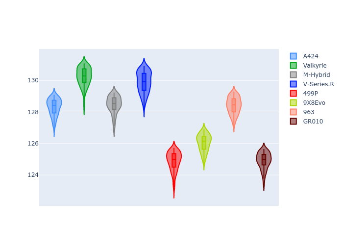
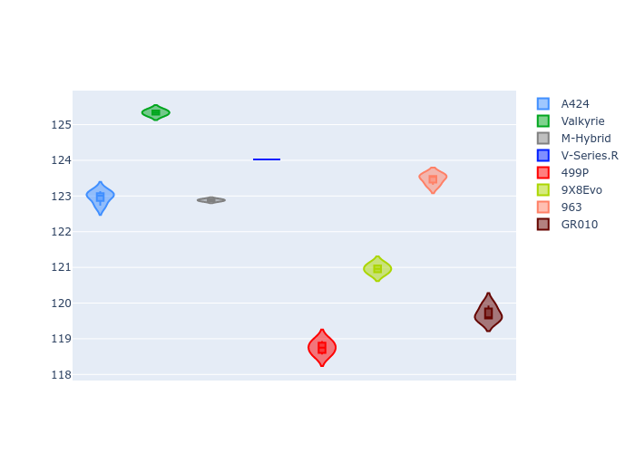
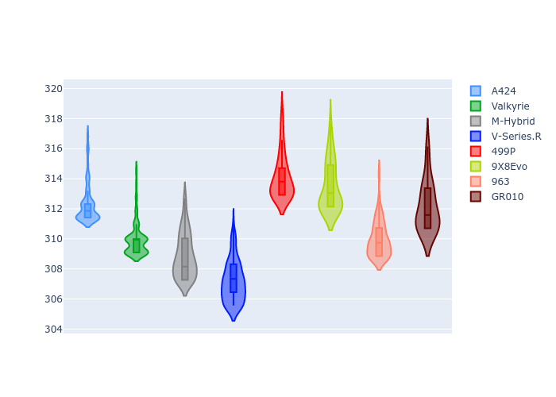
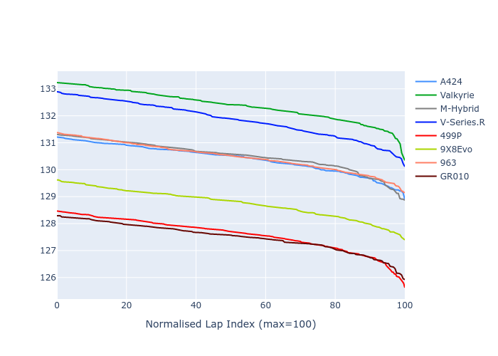

# Combined Plots

## Metadata

- BoP Accuracy: 38.12%
- Overall BoP Grade: Ω1
- Track: REFERENCETRACK
- Threshhold: 0.0kph
- Average Laptime: 2:09.93
- Average Quali Laptime: 2:04.51
- Average Topspeed: 314.88kph

## BoP Table
| Manufacturer   | Car        | Weight   | Power   | PINC   | E/Stint   | FDS   | RDP    | QDP    | TDP    |
|:---------------|:-----------|:---------|:--------|:-------|:----------|:------|:-------|:-------|:-------|
| Alpine         | A424       | 1030kg   | 520.0kw | -      | 920MJ     | -     | 50.00% | 66.67% | 11.49% |
| Aston Martin   | Valkyrie   | 1030kg   | 520.0kw | -      | 911MJ     | -     | 53.85% | 66.67% | 18.16% |
| BMW            | M-Hybrid   | 1030kg   | 520.0kw | -      | 916MJ     | -     | 50.71% | 18.18% | 45.69% |
| Cadillac       | V-Series.R | 1030kg   | 520.0kw | -      | 910MJ     | -     | 49.05% | 25.00% | 34.93% |
| Ferrari        | 499P       | 1030kg   | 520.0kw | -      | 913MJ     | -     | 47.40% | 60.00% | 6.77%  |
| Peugeot        | 9X8Evo     | 1030kg   | 520.0kw | -      | 916MJ     | -     | 50.94% | 40.00% | 10.63% |
| Porsche        | 963        | 1030kg   | 520.0kw | -      | 914MJ     | -     | 51.42% | 50.00% | 19.00% |
| Toyota         | GR010      | 1030kg   | 520.0kw | -      | 912MJ     | -     | 50.71% | 42.86% | 4.49%  |

## Performance Table
| Manufacturer   | Car        | RP      | QP      | Vavg      |   RDLC | BOP-Grade   | Match   |
|:---------------|:-----------|:--------|:--------|:----------|-------:|:------------|:--------|
| Alpine         | A424       | 2:10.41 | 2:05.06 | 316.28kph |   1.04 | +C2         | 73.58%  |
| Aston Martin   | Valkyrie   | 2:12.37 | 2:07.46 | 313.81kph |   1.04 | +Ω1         | 1.34%   |
| BMW            | M-Hybrid   | 2:10.51 | 2:04.91 | 312.74kph |   1.04 | +D2         | 64.19%  |
| Cadillac       | V-Series.R | 2:11.85 | 2:05.97 | 310.95kph |   1.05 | +Ω1         | 8.21%   |
| Ferrari        | 499P       | 2:07.59 | 2:01.36 | 318.03kph |   1.05 | -Ω1         | 10.30%  |
| Peugeot        | 9X8Evo     | 2:08.75 | 2:03.60 | 317.43kph |   1.04 | -C1         | 77.78%  |
| Porsche        | 963        | 2:10.48 | 2:05.54 | 313.81kph |   1.04 | +D1         | 68.20%  |
| Toyota         | GR010      | 2:07.49 | 2:02.21 | 315.96kph |   1.04 | -Ω1         | 1.40%   |

## Race Laptimes

## Quali Laptimes

## Topspeeds

## Laptimes Lineplot

