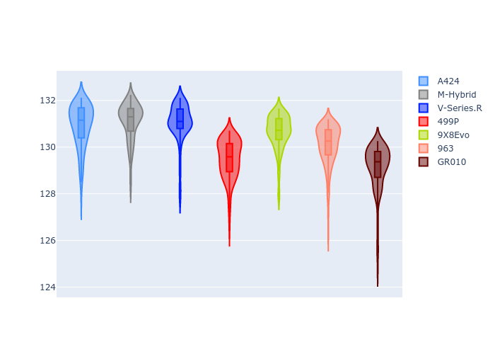
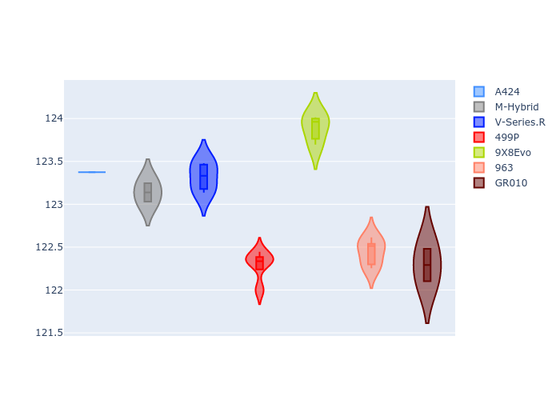
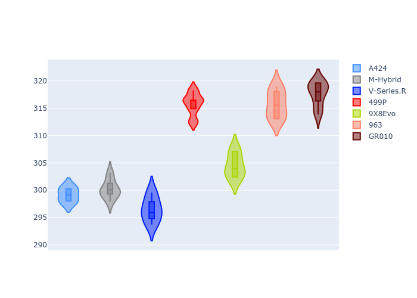
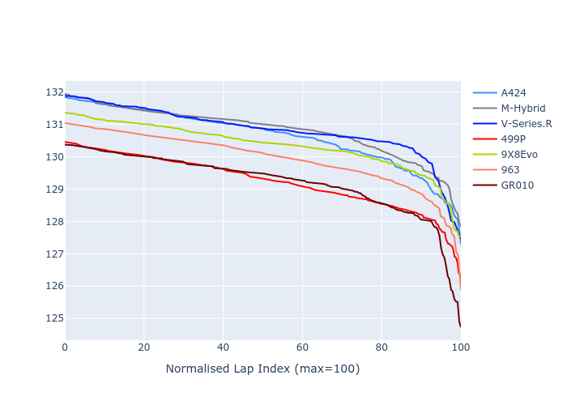

# Combined Plots

## Metadata

- BoP Accuracy: 83.65%
- Overall BoP Grade: B2
- Track: REFERENCETRACK
- Threshhold: 0.0kph
- Average Laptime: 2:10.34
- Average Quali Laptime: 2:03.14
- Laptime Std Dev: 0.74 seconds
- Filtered Average Topspeed: 306.70kph

## BoP Table
| Manufacturer   | Car        | Weight   | Power   | PINC   | E/Stint   | FDS   | RDP    | QDP    | TDP   |
|:---------------|:-----------|:---------|:--------|:-------|:----------|:------|:-------|:-------|:------|
| Alpine         | A424       | 1030kg   | 520.0kw | -      | 915MJ     | -     | 48.08% | 25.00% | 0.83% |
| BMW            | M-Hybrid   | 1030kg   | 520.0kw | -      | 914MJ     | -     | 52.24% | 40.00% | 1.43% |
| Cadillac       | V-Series.R | 1030kg   | 520.0kw | -      | 911MJ     | -     | 52.99% | 80.00% | 3.59% |
| Ferrari        | 499P       | 1030kg   | 520.0kw | -      | 913MJ     | -     | 52.77% | 62.50% | 1.33% |
| Peugeot        | 9X8Evo     | 1030kg   | 520.0kw | -      | 916MJ     | -     | 49.25% | 75.00% | 1.24% |
| Porsche        | 963        | 1030kg   | 520.0kw | -      | 913MJ     | -     | 51.62% | 41.67% | 0.96% |
| Toyota         | GR010      | 1030kg   | 520.0kw | -      | 914MJ     | -     | 51.27% | 25.00% | 3.54% |

## Performance Table
| Manufacturer   | Car        | RP      | QP      | Vavg      |   RDLC | BOP-Grade   | Match   |
|:---------------|:-----------|:--------|:--------|:----------|-------:|:------------|:--------|
| Alpine         | A424       | 2:10.92 | 2:03.63 | 298.80kph |   1.06 | +D1         | 68.00%  |
| BMW            | M-Hybrid   | 2:11.10 | 2:03.40 | 299.86kph |   1.06 | +D2         | 60.82%  |
| Cadillac       | V-Series.R | 2:11.04 | 2:03.53 | 296.15kph |   1.06 | +C2         | 70.97%  |
| Ferrari        | 499P       | 2:09.48 | 2:02.52 | 315.38kph |   1.06 | ~A1         | 99.19%  |
| Peugeot        | 9X8Evo     | 2:10.64 | 2:04.15 | 304.14kph |   1.05 | +A2         | 92.21%  |
| Porsche        | 963        | 2:10.08 | 2:02.58 | 315.34kph |   1.06 | ~A1         | 99.34%  |
| Toyota         | GR010      | 2:09.10 | 2:02.20 | 317.25kph |   1.06 | ~A1         | 95.04%  |

## Race Laptimes

## Quali Laptimes

## Topspeeds

## Laptimes Lineplot

