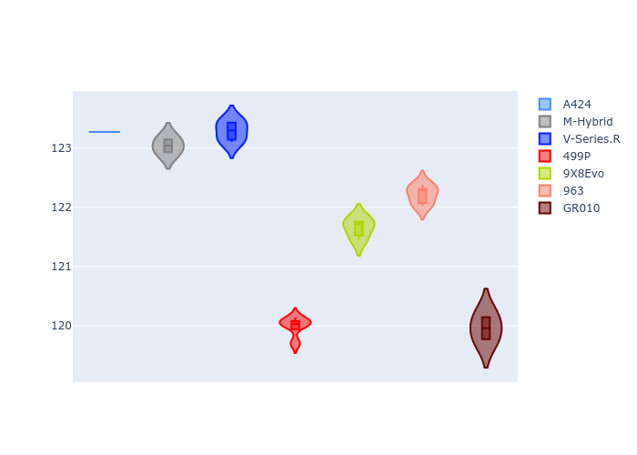
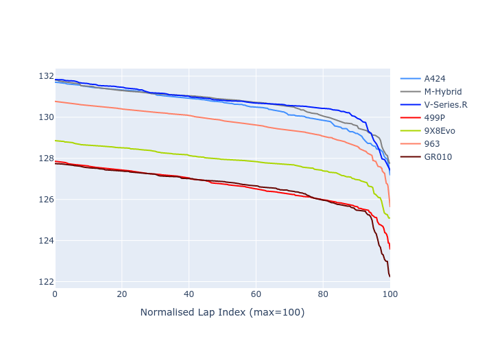

# Combined Plots

## Metadata

- BoP Accuracy: 47.87%
- Overall BoP Grade: Ω1
- Track: REFERENCETRACK
- Threshhold: 0.0kph

## BoP Table
| Manufacturer   | Car        | Weight   | Power   | PINC   | E/Stint   | FDS   | RDP    | QDP    | TDP   |
|:---------------|:-----------|:---------|:--------|:-------|:----------|:------|:-------|:-------|:------|
| Alpine         | A424       | 1030kg   | 520.0kw | -      | 915MJ     | -     | 48.08% | 25.00% | 0.83% |
| BMW            | M-Hybrid   | 1030kg   | 520.0kw | -      | 914MJ     | -     | 52.24% | 40.00% | 1.43% |
| Cadillac       | V-Series.R | 1030kg   | 520.0kw | -      | 910MJ     | -     | 52.99% | 80.00% | 3.59% |
| Ferrari        | 499P       | 1030kg   | 520.0kw | -      | 913MJ     | -     | 52.77% | 62.50% | 1.33% |
| Peugeot        | 9X8Evo     | 1030kg   | 520.0kw | -      | 916MJ     | -     | 49.25% | 75.00% | 1.24% |
| Porsche        | 963        | 1030kg   | 520.0kw | -      | 913MJ     | -     | 51.62% | 41.67% | 0.96% |
| Toyota         | GR010      | 1030kg   | 520.0kw | -      | 915MJ     | -     | 51.27% | 25.00% | 3.54% |

## Performance Table
| Manufacturer   | Car        | RP      | QP      | Vavg      |   RDLC | BOP-Grade   | Match   |
|:---------------|:-----------|:--------|:--------|:----------|-------:|:------------|:--------|
| Alpine         | A424       | 2:12.59 | 2:05.21 | 298.78kph |   1.06 | +Ω1         | 17.33%  |
| BMW            | M-Hybrid   | 2:12.76 | 2:04.96 | 299.85kph |   1.06 | +Ω1         | 11.43%  |
| Cadillac       | V-Series.R | 2:12.71 | 2:05.11 | 296.12kph |   1.06 | +Ω1         | 8.87%   |
| Ferrari        | 499P       | 2:07.89 | 2:01.17 | 315.38kph |   1.06 | -B2         | 82.80%  |
| Peugeot        | 9X8Evo     | 2:09.02 | 2:02.77 | 304.13kph |   1.05 | ~A1         | 96.97%  |
| Porsche        | 963        | 2:11.73 | 2:04.13 | 315.33kph |   1.06 | +Ω1         | 42.90%  |
| Toyota         | GR010      | 2:07.52 | 2:00.86 | 317.26kph |   1.06 | -C2         | 74.79%  |

## Race Laptimes

## Quali Laptimes

## Topspeeds

## Laptimes Lineplot

