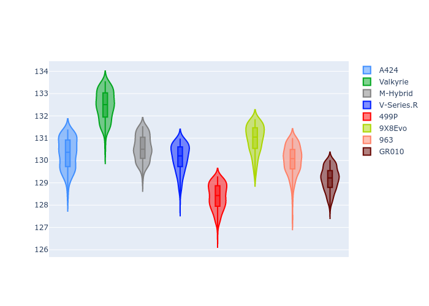
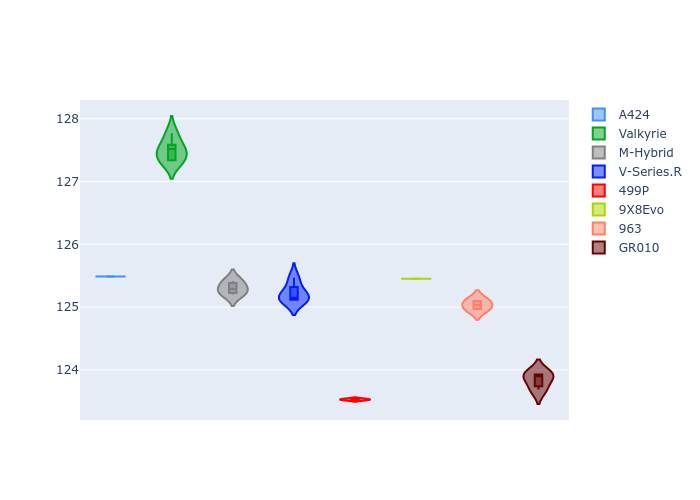
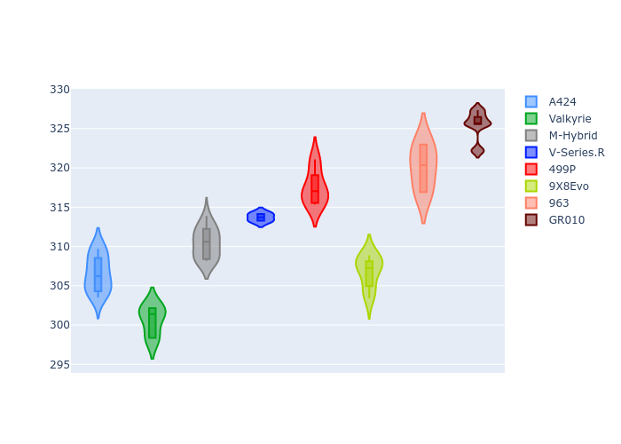
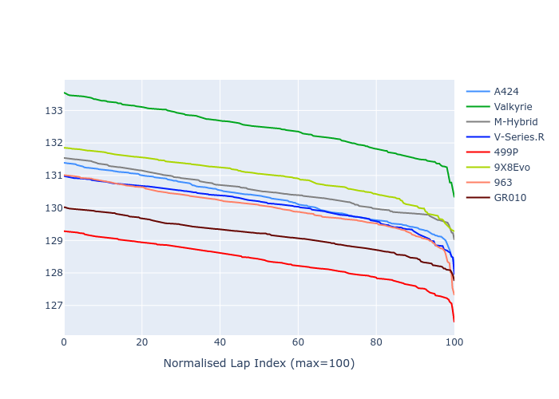

# Combined Plots

## Metadata

- BoP Accuracy: 72.68%
- Overall BoP Grade: C2
- Track: REFERENCETRACK
- Threshhold: 0.0kph
- Average Laptime: 2:10.24
- Average Quali Laptime: 2:05.17
- Laptime Std Dev: 1.13 seconds
- Filtered Average Topspeed: 312.65kph

## BoP Table
| Manufacturer   | Car        | Weight   | Power   | PINC   | E/Stint   | FDS   | RDP    | QDP     | TDP   |
|:---------------|:-----------|:---------|:--------|:-------|:----------|:------|:-------|:--------|:------|
| Alpine         | A424       | 1030kg   | 520.0kw | -      | 910MJ     | -     | 60.91% | 33.33%  | 3.52% |
| Aston Martin   | Valkyrie   | 1030kg   | 520.0kw | -      | 919MJ     | -     | 54.72% | 71.43%  | 1.22% |
| BMW            | M-Hybrid   | 1030kg   | 520.0kw | -      | 915MJ     | -     | 62.20% | 60.00%  | 3.07% |
| Cadillac       | V-Series.R | 1030kg   | 520.0kw | -      | 911MJ     | -     | 55.17% | 100.00% | 0.77% |
| Ferrari        | 499P       | 1030kg   | 520.0kw | -      | 939MJ     | -     | 57.80% | 50.00%  | 1.47% |
| Peugeot        | 9X8Evo     | 1030kg   | 520.0kw | -      | 912MJ     | -     | 59.38% | 16.67%  | 1.95% |
| Porsche        | 963        | 1030kg   | 520.0kw | -      | 918MJ     | -     | 54.91% | 18.18%  | 0.78% |
| Toyota         | GR010      | 1030kg   | 520.0kw | -      | 949MJ     | -     | 61.30% | 42.86%  | 2.00% |

## Performance Table
| Manufacturer   | Car        | RP      | QP      | Vavg      |   RDLC | BOP-Grade   | Match   |
|:---------------|:-----------|:--------|:--------|:----------|-------:|:------------|:--------|
| Alpine         | A424       | 2:10.30 | 2:05.49 | 306.56kph |   1.04 | -A2         | 91.04%  |
| Aston Martin   | Valkyrie   | 2:12.46 | 2:07.50 | 300.63kph |   1.04 | +Ω1         | 1.92%   |
| BMW            | M-Hybrid   | 2:10.56 | 2:05.30 | 310.40kph |   1.04 | +B2         | 82.64%  |
| Cadillac       | V-Series.R | 2:10.10 | 2:05.22 | 313.71kph |   1.04 | ~A1         | 99.63%  |
| Ferrari        | 499P       | 2:08.38 | 2:03.53 | 317.52kph |   1.04 | -E1         | 56.39%  |
| Peugeot        | 9X8Evo     | 2:10.96 | 2:05.45 | 306.84kph |   1.04 | +E1         | 57.19%  |
| Porsche        | 963        | 2:10.01 | 2:05.03 | 320.08kph |   1.04 | ~A1         | 98.74%  |
| Toyota         | GR010      | 2:09.17 | 2:03.84 | 325.43kph |   1.04 | -A2         | 93.86%  |

## Race Laptimes

## Quali Laptimes

## Topspeeds

## Laptimes Lineplot

