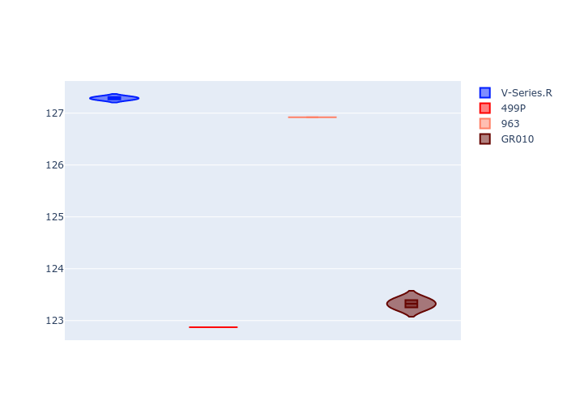

# Combined Plots

## Metadata

- BoP Accuracy: 39.93%
- Overall BoP Grade: Ω1
- Track: REFERENCETRACK
- Threshhold: 0.0kph

## BoP Table
| Manufacturer   | Car        | Weight   | Power   | PINC   | E/Stint   | FDS   | RDP    | QDP    | TDP    |
|:---------------|:-----------|:---------|:--------|:-------|:----------|:------|:-------|:-------|:-------|
| Cadillac       | V-Series.R | 1030kg   | 520.0kw | -      | 909MJ     | -     | 38.01% | 28.57% | 13.28% |
| Ferrari        | 499P       | 1030kg   | 520.0kw | -      | 907MJ     | -     | 38.44% | 16.67% | 5.59%  |
| Porsche        | 963        | 1030kg   | 520.0kw | -      | 912MJ     | -     | 35.21% | 25.00% | 3.20%  |
| Toyota         | GR010      | 1030kg   | 520.0kw | -      | 910MJ     | -     | 37.75% | 40.00% | 2.44%  |

## Performance Table
| Manufacturer   | Car        | RP      | QP      | Vavg      |   RDLC | BOP-Grade   | Match   |
|:---------------|:-----------|:--------|:--------|:----------|-------:|:------------|:--------|
| Cadillac       | V-Series.R | 2:09.47 | 2:05.72 | 312.48kph |   1.03 | +Ω1         | 20.68%  |
| Ferrari        | 499P       | 2:05.75 | 2:01.68 | 318.47kph |   1.03 | -Ω1         | 47.89%  |
| Porsche        | 963        | 2:09.40 | 2:05.38 | 314.39kph |   1.03 | +Ω1         | 21.51%  |
| Toyota         | GR010      | 2:06.07 | 2:02.13 | 318.21kph |   1.03 | -D1         | 69.64%  |

## Race Laptimes

## Quali Laptimes

## Topspeeds

## Laptimes Lineplot

