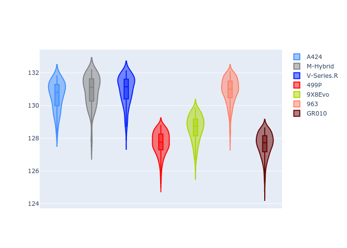
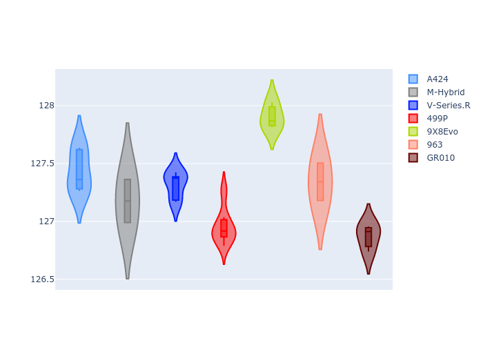
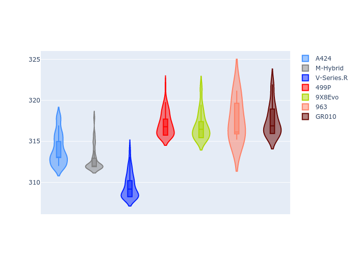
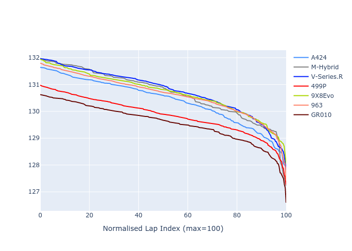

# Combined Plots

## Metadata

- BoP Accuracy: 91.19%
- Overall BoP Grade: A2
- Track: REFERENCETRACK
- Threshhold: 0.0kph
- Average Laptime: 2:10.59
- Average Quali Laptime: 2:07.33
- Laptime Std Dev: 0.40 seconds
- Filtered Average Topspeed: 314.71kph

## BoP Table
| Manufacturer   | Car        | Weight   | Power   | PINC   | E/Stint   | FDS   | RDP    | QDP    | TDP    |
|:---------------|:-----------|:---------|:--------|:-------|:----------|:------|:-------|:-------|:-------|
| Alpine         | A424       | 1030kg   | 520.0kw | -      | 911MJ     | -     | 44.91% | 62.50% | 24.00% |
| BMW            | M-Hybrid   | 1030kg   | 520.0kw | -      | 911MJ     | -     | 41.75% | 50.00% | 8.15%  |
| Cadillac       | V-Series.R | 1030kg   | 520.0kw | -      | 909MJ     | -     | 31.03% | 75.00% | 11.68% |
| Ferrari        | 499P       | 1030kg   | 520.0kw | -      | 902MJ     | -     | 36.57% | 70.00% | 5.75%  |
| Peugeot        | 9X8Evo     | 1030kg   | 520.0kw | -      | 905MJ     | -     | 31.11% | 37.50% | 4.26%  |
| Porsche        | 963        | 1030kg   | 520.0kw | -      | 911MJ     | -     | 33.39% | 11.11% | 0.20%  |
| Toyota         | GR010      | 1030kg   | 520.0kw | -      | 912MJ     | -     | 32.95% | 42.86% | 4.38%  |

## Performance Table
| Manufacturer   | Car        | RP      | QP      | Vavg      |   RDLC | BOP-Grade   | Match   |
|:---------------|:-----------|:--------|:--------|:----------|-------:|:------------|:--------|
| Alpine         | A424       | 2:10.56 | 2:07.42 | 313.68kph |   1.02 | ~A1         | 98.34%  |
| BMW            | M-Hybrid   | 2:10.86 | 2:07.18 | 312.42kph |   1.03 | -B2         | 80.81%  |
| Cadillac       | V-Series.R | 2:10.90 | 2:07.28 | 309.23kph |   1.03 | +B1         | 86.00%  |
| Ferrari        | 499P       | 2:10.04 | 2:06.97 | 316.74kph |   1.02 | ~A1         | 99.55%  |
| Peugeot        | 9X8Evo     | 2:10.98 | 2:08.00 | 316.51kph |   1.02 | +B2         | 84.38%  |
| Porsche        | 963        | 2:10.86 | 2:07.41 | 317.19kph |   1.03 | -A2         | 90.28%  |
| Toyota         | GR010      | 2:09.94 | 2:07.06 | 317.17kph |   1.02 | ~A1         | 98.95%  |

## Race Laptimes

## Quali Laptimes

## Topspeeds

## Laptimes Lineplot

