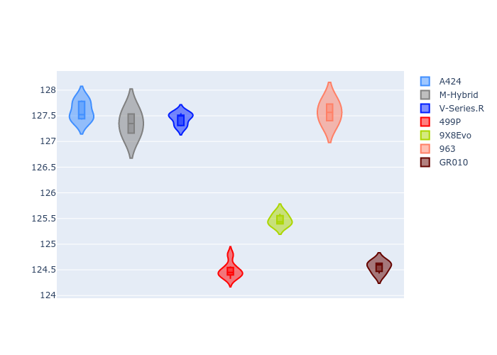
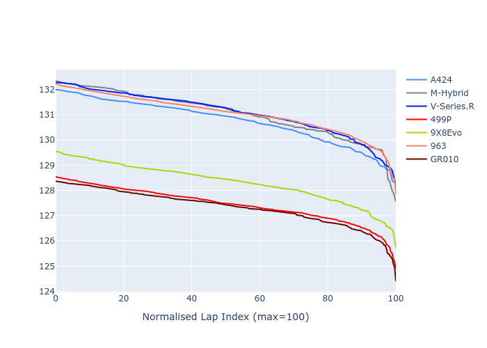

# Combined Plots

## Metadata

- BoP Accuracy: 58.24%
- Overall BoP Grade: E1
- Track: REFERENCETRACK
- Threshhold: 0.0kph
- Average Laptime: 2:09.57
- Average Quali Laptime: 2:06.35
- Average Topspeed: 314.70kph

## BoP Table
| Manufacturer   | Car        | Weight   | Power   | PINC   | E/Stint   | FDS   | RDP    | QDP    | TDP    |
|:---------------|:-----------|:---------|:--------|:-------|:----------|:------|:-------|:-------|:-------|
| Alpine         | A424       | 1030kg   | 520.0kw | -      | 911MJ     | -     | 44.91% | 62.50% | 24.00% |
| BMW            | M-Hybrid   | 1030kg   | 520.0kw | -      | 911MJ     | -     | 41.75% | 50.00% | 8.15%  |
| Cadillac       | V-Series.R | 1030kg   | 520.0kw | -      | 909MJ     | -     | 31.03% | 75.00% | 11.68% |
| Ferrari        | 499P       | 1030kg   | 520.0kw | -      | 902MJ     | -     | 36.57% | 70.00% | 5.75%  |
| Peugeot        | 9X8Evo     | 1030kg   | 520.0kw | -      | 905MJ     | -     | 31.11% | 37.50% | 4.26%  |
| Porsche        | 963        | 1030kg   | 520.0kw | -      | 911MJ     | -     | 33.39% | 11.11% | 0.20%  |
| Toyota         | GR010      | 1030kg   | 520.0kw | -      | 912MJ     | -     | 32.95% | 42.86% | 4.38%  |

## Performance Table
| Manufacturer   | Car        | RP      | QP      | Vavg      |   RDLC | BOP-Grade   | Match   |
|:---------------|:-----------|:--------|:--------|:----------|-------:|:------------|:--------|
| Alpine         | A424       | 2:10.74 | 2:07.59 | 313.67kph |   1.02 | +Ω1         | 43.09%  |
| BMW            | M-Hybrid   | 2:11.03 | 2:07.35 | 312.41kph |   1.03 | +Ω1         | 37.21%  |
| Cadillac       | V-Series.R | 2:11.07 | 2:07.44 | 309.22kph |   1.03 | +Ω1         | 31.14%  |
| Ferrari        | 499P       | 2:07.44 | 2:04.49 | 316.73kph |   1.02 | -B1         | 86.38%  |
| Peugeot        | 9X8Evo     | 2:08.33 | 2:05.47 | 316.50kph |   1.02 | ~A1         | 96.88%  |
| Porsche        | 963        | 2:11.03 | 2:07.57 | 317.18kph |   1.03 | +Ω1         | 30.44%  |
| Toyota         | GR010      | 2:07.32 | 2:04.56 | 317.16kph |   1.02 | -B2         | 82.52%  |

## Race Laptimes

## Quali Laptimes

## Topspeeds

## Laptimes Lineplot

