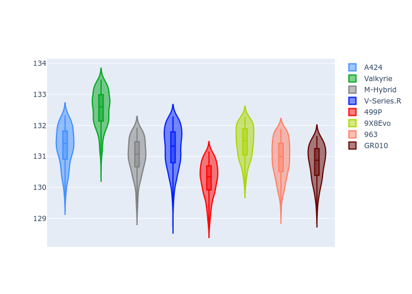
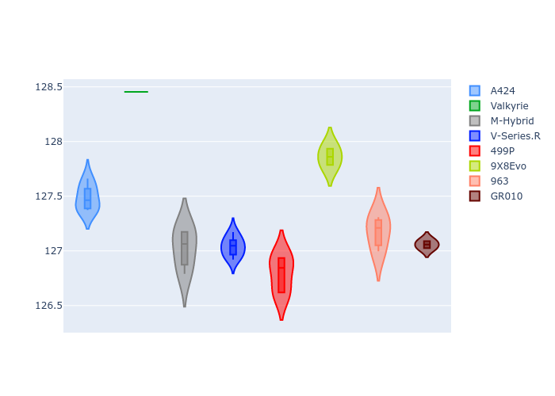
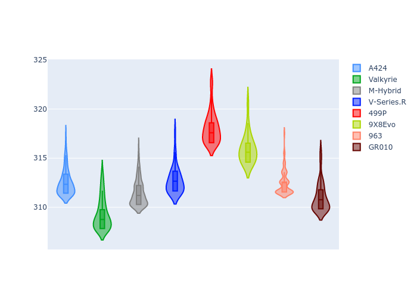
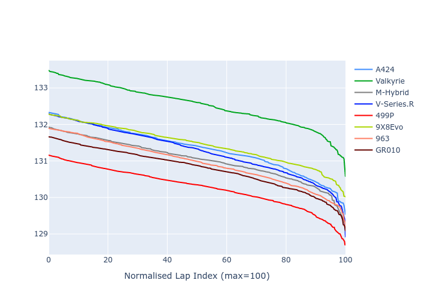

# Combined Plots

## Metadata

- BoP Accuracy: 85.97%
- Overall BoP Grade: B1
- Track: REFERENCETRACK
- Threshhold: 0.0kph
- Average Laptime: 2:11.20
- Average Quali Laptime: 2:07.36
- Laptime Std Dev: 0.61 seconds
- Filtered Average Topspeed: 312.94kph

## BoP Table
| Manufacturer   | Car        | Weight   | Power   | PINC   | E/Stint   | FDS   | RDP    | QDP    | TDP    |
|:---------------|:-----------|:---------|:--------|:-------|:----------|:------|:-------|:-------|:-------|
| Alpine         | A424       | 1030kg   | 520.0kw | -      | 903MJ     | -     | 51.89% | 42.86% | 16.41% |
| Aston Martin   | Valkyrie   | 1030kg   | 520.0kw | -      | 912MJ     | -     | 53.93% | 12.50% | 14.64% |
| BMW            | M-Hybrid   | 1030kg   | 520.0kw | -      | 922MJ     | -     | 52.72% | 44.44% | 37.84% |
| Cadillac       | V-Series.R | 1030kg   | 520.0kw | -      | 909MJ     | -     | 51.28% | 38.89% | 3.11%  |
| Ferrari        | 499P       | 1030kg   | 520.0kw | -      | 906MJ     | -     | 52.71% | 55.56% | 6.74%  |
| Peugeot        | 9X8Evo     | 1030kg   | 520.0kw | -      | 902MJ     | -     | 51.77% | 40.00% | 3.28%  |
| Porsche        | 963        | 1030kg   | 520.0kw | -      | 920MJ     | -     | 51.10% | 21.43% | 9.66%  |
| Toyota         | GR010      | 1030kg   | 520.0kw | -      | 915MJ     | -     | 54.44% | 50.00% | 16.38% |

## Performance Table
| Manufacturer   | Car        | RP      | QP      | Vavg      |   RDLC | BOP-Grade   | Match   |
|:---------------|:-----------|:--------|:--------|:----------|-------:|:------------|:--------|
| Alpine         | A424       | 2:11.33 | 2:07.49 | 312.50kph |   1.03 | +A2         | 91.23%  |
| Aston Martin   | Valkyrie   | 2:12.53 | 2:08.45 | 309.32kph |   1.03 | +Ω1         | 24.27%  |
| BMW            | M-Hybrid   | 2:11.02 | 2:07.02 | 311.46kph |   1.03 | ~A1         | 99.23%  |
| Cadillac       | V-Series.R | 2:11.26 | 2:07.04 | 312.73kph |   1.03 | -A2         | 90.81%  |
| Ferrari        | 499P       | 2:10.27 | 2:06.79 | 318.08kph |   1.03 | -A2         | 92.16%  |
| Peugeot        | 9X8Evo     | 2:11.45 | 2:07.86 | 315.94kph |   1.03 | +A2         | 91.90%  |
| Porsche        | 963        | 2:10.94 | 2:07.17 | 312.48kph |   1.03 | ~A1         | 99.37%  |
| Toyota         | GR010      | 2:10.79 | 2:07.06 | 311.02kph |   1.03 | ~A1         | 98.80%  |

## Race Laptimes

## Quali Laptimes

## Topspeeds

## Laptimes Lineplot

