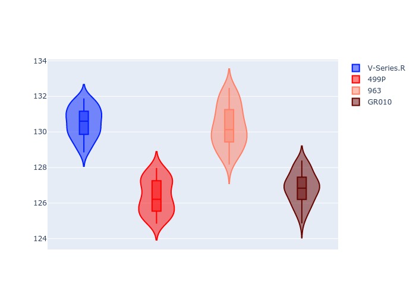
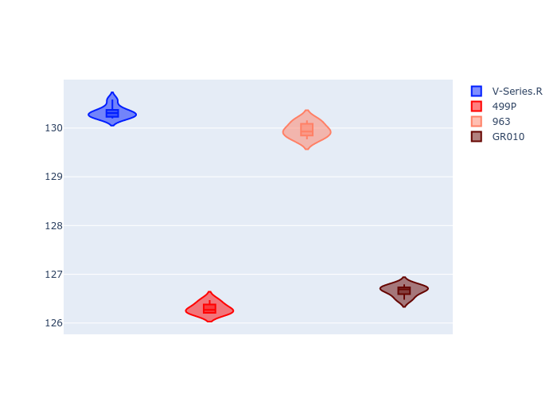
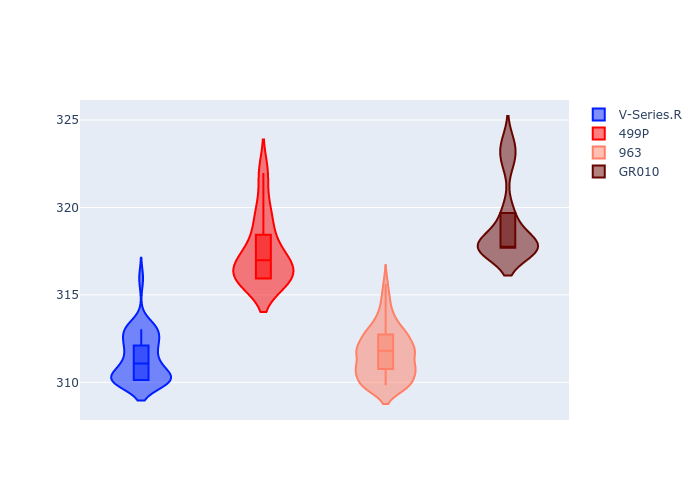
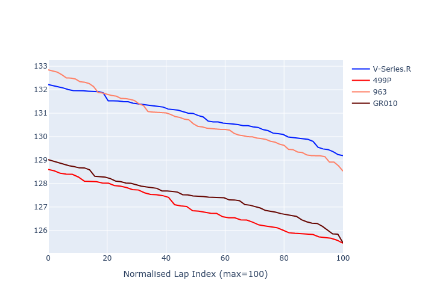

# Combined Plots

## Metadata

- BoP Accuracy: 51.42%
- Overall BoP Grade: E2
- Track: REFERENCETRACK
- Threshhold: 0.0kph

## BoP Table
| Manufacturer   | Car        | Weight   | Power   | PINC   | E/Stint   | FDS   | RDP    | QDP    | TDP    |
|:---------------|:-----------|:---------|:--------|:-------|:----------|:------|:-------|:-------|:-------|
| Cadillac       | V-Series.R | 1030kg   | 520.0kw | -      | 909MJ     | -     | 36.81% | 66.67% | 20.86% |
| Ferrari        | 499P       | 1030kg   | 520.0kw | -      | 907MJ     | -     | 39.06% | 25.00% | 9.38%  |
| Porsche        | 963        | 1030kg   | 520.0kw | -      | 912MJ     | -     | 33.50% | 32.00% | 28.93% |
| Toyota         | GR010      | 1030kg   | 520.0kw | -      | 910MJ     | -     | 43.94% | 60.00% | 7.58%  |

## Performance Table
| Manufacturer   | Car        | RP      | QP      | Vavg      |   RDLC | BOP-Grade   | Match   |
|:---------------|:-----------|:--------|:--------|:----------|-------:|:------------|:--------|
| Cadillac       | V-Series.R | 2:10.86 | 2:09.14 | 308.63kph |   1.01 | +Ω1         | 46.67%  |
| Ferrari        | 499P       | 2:07.00 | 2:05.47 | 314.60kph |   1.01 | -Ω1         | 42.00%  |
| Porsche        | 963        | 2:10.69 | 2:08.80 | 308.80kph |   1.01 | +E2         | 51.52%  |
| Toyota         | GR010      | 2:07.47 | 2:05.84 | 316.23kph |   1.01 | -D1         | 65.52%  |

## Race Laptimes

## Quali Laptimes

## Topspeeds

## Laptimes Lineplot

