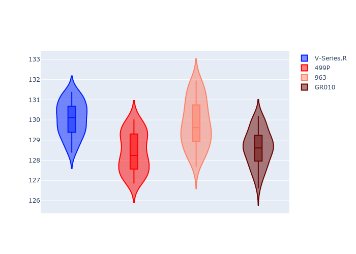
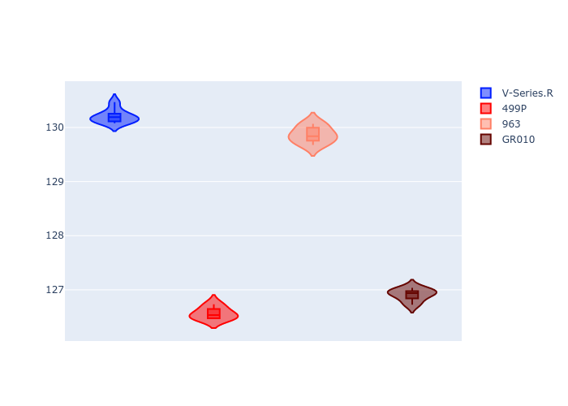
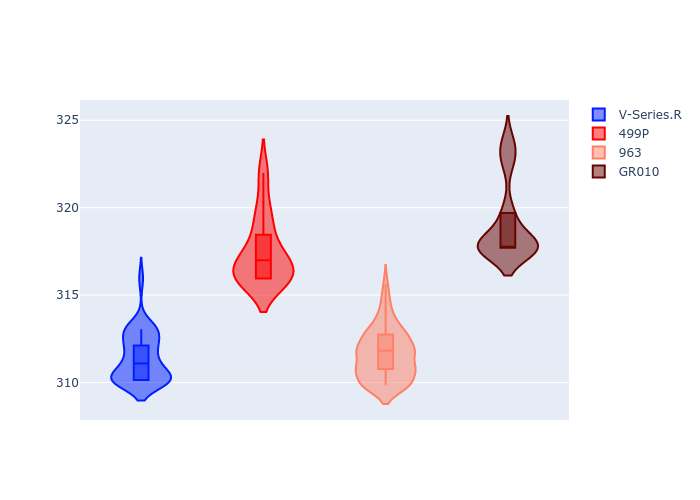
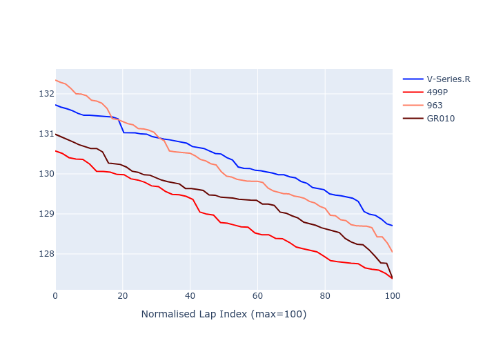

# Combined Plots

## Metadata

- BoP Accuracy: 84.11%
- Overall BoP Grade: B2
- Track: REFERENCETRACK
- Threshhold: 0.0kph
- Average Laptime: 2:09.61
- Average Quali Laptime: 2:09.73
- Laptime Std Dev: 0.62 seconds
- Filtered Average Topspeed: 314.99kph

## BoP Table
| Manufacturer   | Car        | Weight   | Power   | PINC   | E/Stint   | FDS   | RDP    | QDP    | TDP    |
|:---------------|:-----------|:---------|:--------|:-------|:----------|:------|:-------|:-------|:-------|
| Cadillac       | V-Series.R | 1030kg   | 520.0kw | -      | 909MJ     | -     | 36.81% | 66.67% | 20.86% |
| Ferrari        | 499P       | 1030kg   | 520.0kw | -      | 907MJ     | -     | 39.06% | 25.00% | 9.38%  |
| Porsche        | 963        | 1030kg   | 520.0kw | -      | 912MJ     | -     | 33.50% | 32.00% | 28.93% |
| Toyota         | GR010      | 1030kg   | 520.0kw | -      | 910MJ     | -     | 43.94% | 60.00% | 7.58%  |

## Performance Table
| Manufacturer   | Car        | RP      | QP      | Vavg      |   RDLC | BOP-Grade   | Match   |
|:---------------|:-----------|:--------|:--------|:----------|-------:|:------------|:--------|
| Cadillac       | V-Series.R | 2:10.35 | 2:10.47 | 311.52kph |      1 | +C1         | 80.00%  |
| Ferrari        | 499P       | 2:08.87 | 2:09.11 | 317.55kph |      1 | -C1         | 80.00%  |
| Porsche        | 963        | 2:10.09 | 2:10.05 | 311.70kph |      1 | +B2         | 83.33%  |
| Toyota         | GR010      | 2:09.14 | 2:09.27 | 319.19kph |      1 | -A2         | 93.10%  |

## Race Laptimes

## Quali Laptimes

## Topspeeds

## Laptimes Lineplot

