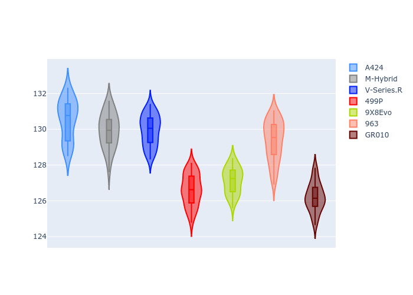
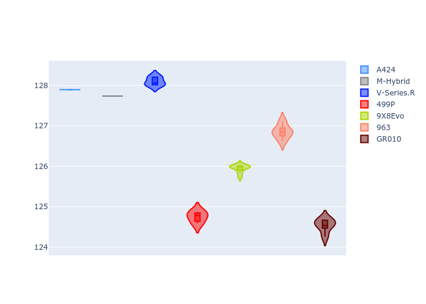
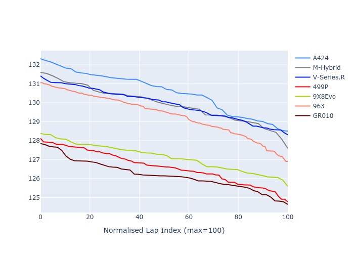

# Combined Plots

## Metadata

- BoP Accuracy: 45.50%
- Overall BoP Grade: Ω1
- Track: REFERENCETRACK
- Threshhold: 0.0kph
- Average Laptime: 2:09.24
- Average Quali Laptime: 2:07.24
- Average Topspeed: 312.51kph

## BoP Table
| Manufacturer   | Car        | Weight   | Power   | PINC   | E/Stint   | FDS   | RDP    | QDP    | TDP    |
|:---------------|:-----------|:---------|:--------|:-------|:----------|:------|:-------|:-------|:-------|
| Alpine         | A424       | 1030kg   | 520.0kw | -      | 911MJ     | -     | 40.00% | 20.00% | 28.80% |
| BMW            | M-Hybrid   | 1030kg   | 520.0kw | -      | 911MJ     | -     | 37.07% | 20.00% | 7.76%  |
| Cadillac       | V-Series.R | 1030kg   | 520.0kw | -      | 909MJ     | -     | 41.14% | 33.33% | 12.00% |
| Ferrari        | 499P       | 1030kg   | 520.0kw | -      | 902MJ     | -     | 39.80% | 18.75% | 16.42% |
| Peugeot        | 9X8Evo     | 1030kg   | 520.0kw | -      | 905MJ     | -     | 42.02% | 34.78% | 29.91% |
| Porsche        | 963        | 1030kg   | 520.0kw | -      | 911MJ     | -     | 35.99% | 45.45% | 33.88% |
| Toyota         | GR010      | 1030kg   | 520.0kw | -      | 912MJ     | -     | 40.97% | 62.50% | 23.61% |

## Performance Table
| Manufacturer   | Car        | RP      | QP      | Vavg      |   RDLC | BOP-Grade   | Match   |
|:---------------|:-----------|:--------|:--------|:----------|-------:|:------------|:--------|
| Alpine         | A424       | 2:11.45 | 2:08.77 | 310.44kph |   1.02 | +Ω1         | 30.00%  |
| BMW            | M-Hybrid   | 2:10.81 | 2:08.60 | 314.33kph |   1.02 | +Ω1         | 48.84%  |
| Cadillac       | V-Series.R | 2:10.80 | 2:08.96 | 308.66kph |   1.01 | +Ω1         | 45.83%  |
| Ferrari        | 499P       | 2:07.11 | 2:05.23 | 312.38kph |   1.02 | -Ω1         | 41.25%  |
| Peugeot        | 9X8Evo     | 2:07.62 | 2:06.43 | 315.97kph |   1.01 | -D2         | 64.00%  |
| Porsche        | 963        | 2:10.22 | 2:07.69 | 311.07kph |   1.02 | +D2         | 64.89%  |
| Toyota         | GR010      | 2:06.69 | 2:05.01 | 314.71kph |   1.01 | -Ω1         | 23.73%  |

## Race Laptimes

## Quali Laptimes

## Topspeeds

## Laptimes Lineplot

