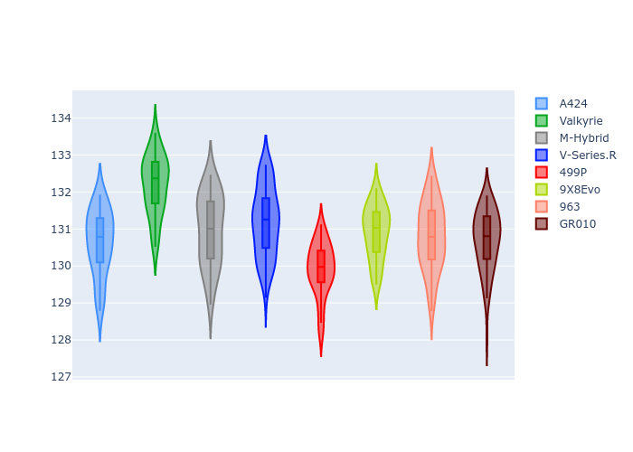
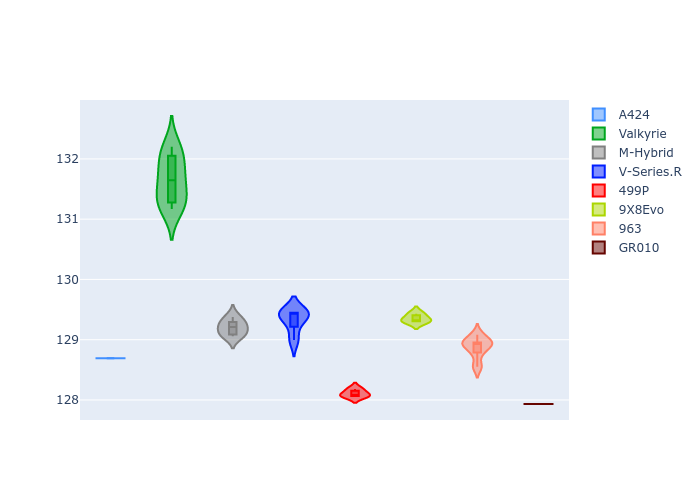
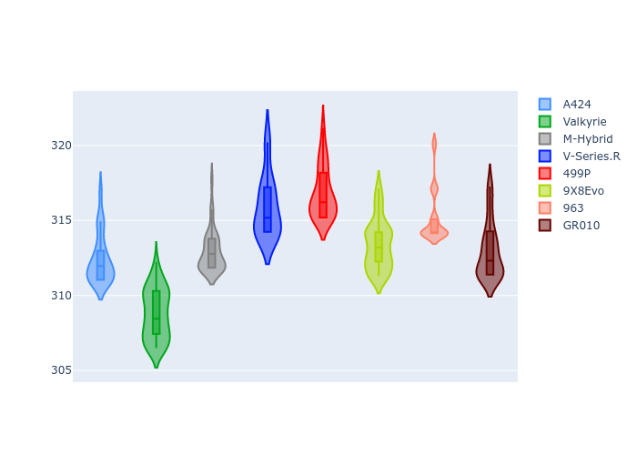
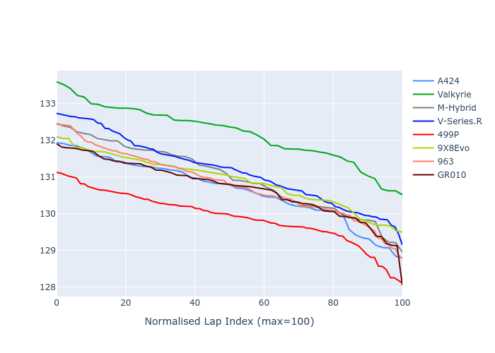

# Combined Plots

## Metadata

- BoP Accuracy: 87.35%
- Overall BoP Grade: B1
- Track: REFERENCETRACK
- Threshhold: 0.0kph
- Average Laptime: 2:10.91
- Average Quali Laptime: 2:09.14
- Laptime Std Dev: 0.60 seconds
- Filtered Average Topspeed: 313.55kph

## BoP Table
| Manufacturer   | Car        | Weight   | Power   | PINC   | E/Stint   | FDS   | RDP    | QDP    | TDP    |
|:---------------|:-----------|:---------|:--------|:-------|:----------|:------|:-------|:-------|:-------|
| Alpine         | A424       | 1030kg   | 520.0kw | -      | 903MJ     | -     | 38.69% | 6.25%  | 17.52% |
| Aston Martin   | Valkyrie   | 1030kg   | 520.0kw | -      | 912MJ     | -     | 40.80% | 50.00% | 36.00% |
| BMW            | M-Hybrid   | 1030kg   | 520.0kw | -      | 922MJ     | -     | 39.39% | 38.46% | 29.55% |
| Cadillac       | V-Series.R | 1030kg   | 520.0kw | -      | 909MJ     | -     | 37.15% | 45.45% | 3.56%  |
| Ferrari        | 499P       | 1030kg   | 520.0kw | -      | 906MJ     | -     | 43.14% | 15.00% | 13.73% |
| Peugeot        | 9X8Evo     | 1030kg   | 520.0kw | -      | 902MJ     | -     | 42.34% | 30.00% | 29.93% |
| Porsche        | 963        | 1030kg   | 520.0kw | -      | 920MJ     | -     | 39.37% | 27.27% | 5.12%  |
| Toyota         | GR010      | 1030kg   | 520.0kw | -      | 915MJ     | -     | 47.52% | 9.09%  | 30.50% |

## Performance Table
| Manufacturer   | Car        | RP      | QP      | Vavg      |   RDLC | BOP-Grade   | Match   |
|:---------------|:-----------|:--------|:--------|:----------|-------:|:------------|:--------|
| Alpine         | A424       | 2:10.64 | 2:08.69 | 312.41kph |   1.02 | ~A1         | 96.23%  |
| Aston Martin   | Valkyrie   | 2:12.19 | 2:11.65 | 308.77kph |   1    | +Ω1         | 47.06%  |
| BMW            | M-Hybrid   | 2:10.97 | 2:09.20 | 312.91kph |   1.01 | -A2         | 92.31%  |
| Cadillac       | V-Series.R | 2:11.18 | 2:09.32 | 315.89kph |   1.01 | +B2         | 84.04%  |
| Ferrari        | 499P       | 2:09.91 | 2:08.11 | 316.84kph |   1.01 | -B1         | 88.64%  |
| Peugeot        | 9X8Evo     | 2:10.90 | 2:09.35 | 313.40kph |   1.01 | ~A1         | 100.00% |
| Porsche        | 963        | 2:10.80 | 2:08.87 | 315.20kph |   1.01 | -A2         | 92.00%  |
| Toyota         | GR010      | 2:10.69 | 2:07.93 | 312.97kph |   1.02 | ~A1         | 98.51%  |

## Race Laptimes

## Quali Laptimes

## Topspeeds

## Laptimes Lineplot

