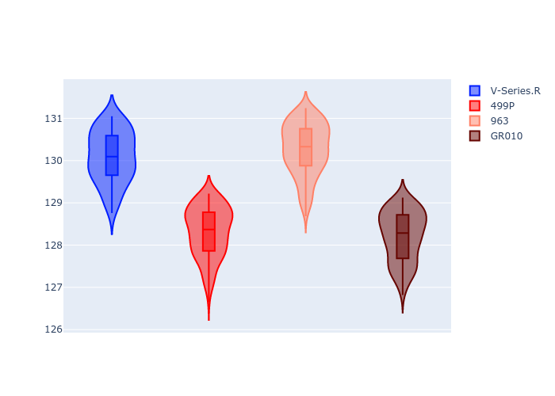
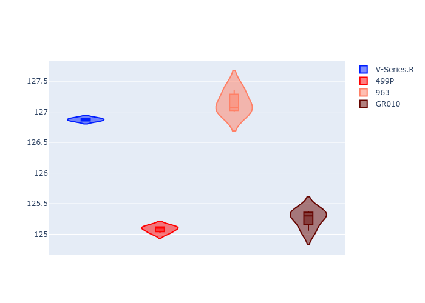
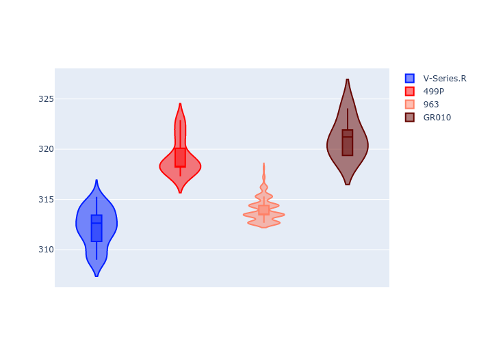
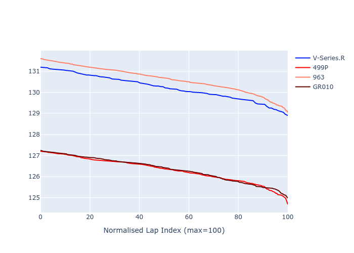

# Combined Plots

## Metadata

- BoP Accuracy: 62.90%
- Overall BoP Grade: D2
- Track: REFERENCETRACK
- Threshhold: 0.0kph
- Average Laptime: 2:09.22
- Average Quali Laptime: 2:06.09
- Laptime Std Dev: 0.96 seconds
- Filtered Average Topspeed: 316.97kph

## BoP Table
| Manufacturer   | Car        | Weight   | Power   | PINC   | E/Stint   | FDS   | RDP    | QDP    | TDP    |
|:---------------|:-----------|:---------|:--------|:-------|:----------|:------|:-------|:-------|:-------|
| Cadillac       | V-Series.R | 1030kg   | 520.0kw | -      | 909MJ     | -     | 54.55% | 66.67% | 35.38% |
| Ferrari        | 499P       | 1030kg   | 520.0kw | -      | 909MJ     | -     | 56.89% | 60.00% | 4.73%  |
| Porsche        | 963        | 1030kg   | 520.0kw | -      | 909MJ     | -     | 58.36% | 37.50% | 32.75% |
| Toyota         | GR010      | 1030kg   | 520.0kw | -      | 914MJ     | -     | 57.39% | 80.00% | 1.18%  |

## Performance Table
| Manufacturer   | Car        | RP      | QP      | Vavg      |   RDLC | BOP-Grade   | Match   |
|:---------------|:-----------|:--------|:--------|:----------|-------:|:------------|:--------|
| Cadillac       | V-Series.R | 2:10.09 | 2:06.87 | 312.55kph |   1.03 | +E2         | 53.70%  |
| Ferrari        | 499P       | 2:08.31 | 2:05.08 | 319.57kph |   1.03 | -B2         | 82.82%  |
| Porsche        | 963        | 2:10.27 | 2:07.15 | 314.33kph |   1.02 | +Ω1         | 40.85%  |
| Toyota         | GR010      | 2:08.21 | 2:05.26 | 321.41kph |   1.02 | -C2         | 74.24%  |

## Race Laptimes

## Quali Laptimes

## Topspeeds

## Laptimes Lineplot

