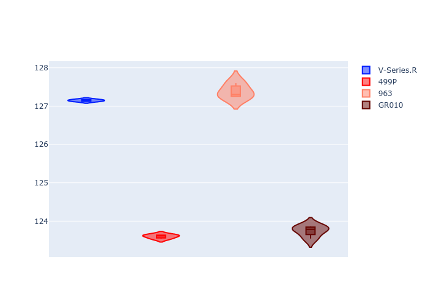

# Combined Plots

## Metadata

- BoP Accuracy: 19.89%
- Overall BoP Grade: Ω1
- Track: REFERENCETRACK
- Threshhold: 0.0kph
- Average Laptime: 2:08.56
- Average Quali Laptime: 2:05.47
- Average Topspeed: 316.59kph

## BoP Table
| Manufacturer   | Car        | Weight   | Power   | PINC   | E/Stint   | FDS   | RDP    | QDP    | TDP    |
|:---------------|:-----------|:---------|:--------|:-------|:----------|:------|:-------|:-------|:-------|
| Cadillac       | V-Series.R | 1030kg   | 520.0kw | -      | 909MJ     | -     | 54.55% | 66.67% | 35.38% |
| Ferrari        | 499P       | 1030kg   | 520.0kw | -      | 909MJ     | -     | 56.89% | 60.00% | 4.73%  |
| Porsche        | 963        | 1030kg   | 520.0kw | -      | 909MJ     | -     | 58.36% | 37.50% | 32.75% |
| Toyota         | GR010      | 1030kg   | 520.0kw | -      | 914MJ     | -     | 57.39% | 80.00% | 1.18%  |

## Performance Table
| Manufacturer   | Car        | RP      | QP      | Vavg      |   RDLC | BOP-Grade   | Match   |
|:---------------|:-----------|:--------|:--------|:----------|-------:|:------------|:--------|
| Cadillac       | V-Series.R | 2:10.37 | 2:07.15 | 312.18kph |   1.03 | +Ω1         | 9.26%   |
| Ferrari        | 499P       | 2:06.75 | 2:03.60 | 319.19kph |   1.03 | -Ω1         | 35.24%  |
| Porsche        | 963        | 2:10.51 | 2:07.38 | 313.96kph |   1.02 | +Ω1         | 7.98%   |
| Toyota         | GR010      | 2:06.62 | 2:03.75 | 321.04kph |   1.02 | -Ω1         | 27.07%  |

## Race Laptimes

## Quali Laptimes

## Topspeeds

## Laptimes Lineplot

