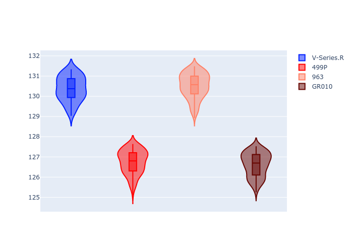
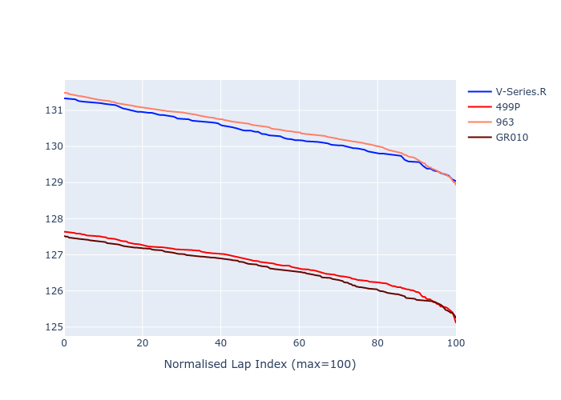

# Combined Plots

## Metadata

- BoP Accuracy: 11.10%
- Overall BoP Grade: Ω1
- Track: REFERENCETRACK
- Threshhold: 0.0kph

## BoP Table
| Manufacturer   | Car        | Weight   | Power   | PINC   | E/Stint   | FDS   | RDP    | QDP    | TDP    |
|:---------------|:-----------|:---------|:--------|:-------|:----------|:------|:-------|:-------|:-------|
| Cadillac       | V-Series.R | 1030kg   | 520.0kw | -      | 909MJ     | -     | 54.55% | 66.67% | 35.38% |
| Ferrari        | 499P       | 1030kg   | 520.0kw | -      | 909MJ     | -     | 56.89% | 60.00% | 4.73%  |
| Porsche        | 963        | 1030kg   | 520.0kw | -      | 909MJ     | -     | 58.08% | 37.50% | 32.75% |
| Toyota         | GR010      | 1030kg   | 520.0kw | -      | 914MJ     | -     | 57.39% | 80.00% | 1.18%  |

## Performance Table
| Manufacturer   | Car        | RP      | QP      | Vavg      |   RDLC | BOP-Grade   | Match   |
|:---------------|:-----------|:--------|:--------|:----------|-------:|:------------|:--------|
| Cadillac       | V-Series.R | 2:08.29 | 2:04.98 | 299.37kph |   1.03 | +Ω1         | 8.33%   |
| Ferrari        | 499P       | 2:04.35 | 2:01.14 | 306.10kph |   1.03 | -Ω1         | 14.54%  |
| Porsche        | 963        | 2:08.69 | 2:05.46 | 301.08kph |   1.03 | +Ω1         | 1.89%   |
| Toyota         | GR010      | 2:04.42 | 2:01.47 | 307.86kph |   1.02 | -Ω1         | 19.65%  |

## Race Laptimes

## Quali Laptimes

## Topspeeds

## Laptimes Lineplot

