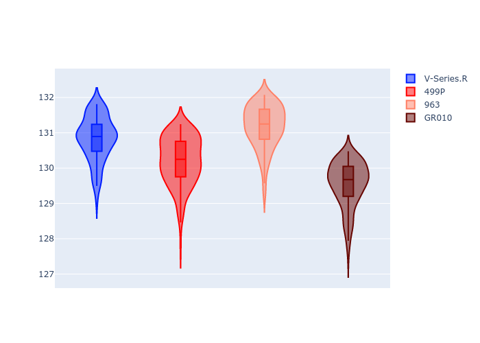
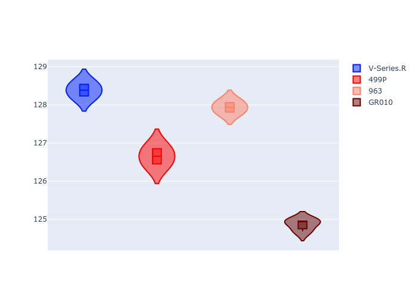
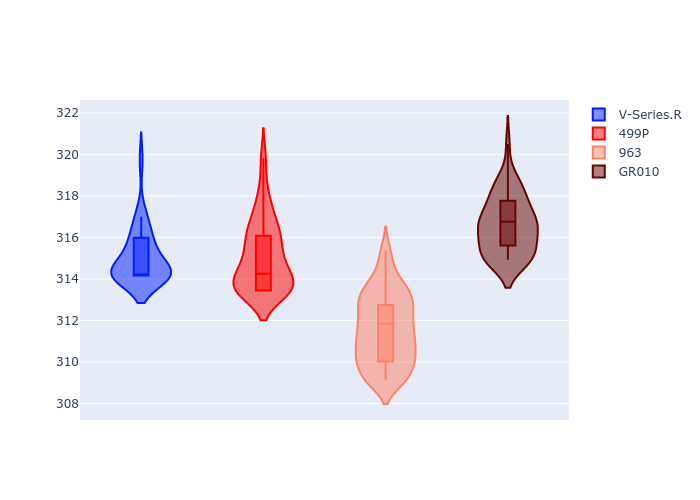
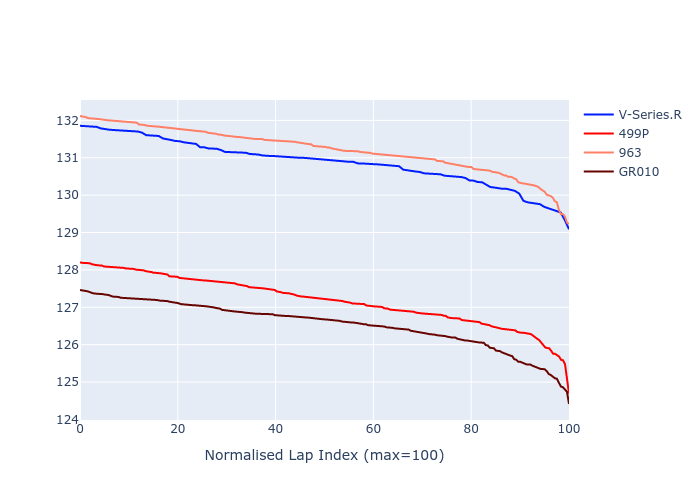

# Combined Plots

## Metadata

- BoP Accuracy: 82.25%
- Overall BoP Grade: B2
- Track: REFERENCETRACK
- Threshhold: 0.0kph
- Average Laptime: 2:10.36
- Average Quali Laptime: 2:06.88
- Laptime Std Dev: 0.63 seconds
- Filtered Average Topspeed: 314.67kph

## BoP Table
| Manufacturer   | Car        | Weight   | Power   | PINC   | E/Stint   | FDS   | RDP    | QDP    | TDP    |
|:---------------|:-----------|:---------|:--------|:-------|:----------|:------|:-------|:-------|:-------|
| Cadillac       | V-Series.R | 1030kg   | 520.0kw | -      | 909MJ     | -     | 54.09% | 66.67% | 14.80% |
| Ferrari        | 499P       | 1030kg   | 520.0kw | -      | 908MJ     | -     | 56.14% | 50.00% | 21.06% |
| Porsche        | 963        | 1030kg   | 520.0kw | -      | 912MJ     | -     | 59.02% | 40.00% | 76.50% |
| Toyota         | GR010      | 1030kg   | 520.0kw | -      | 910MJ     | -     | 55.38% | 75.00% | 10.23% |

## Performance Table
| Manufacturer   | Car        | RP      | QP      | Vavg      |   RDLC | BOP-Grade   | Match   |
|:---------------|:-----------|:--------|:--------|:----------|-------:|:------------|:--------|
| Cadillac       | V-Series.R | 2:10.76 | 2:08.31 | 315.13kph |   1.02 | +C1         | 78.99%  |
| Ferrari        | 499P       | 2:10.11 | 2:06.56 | 315.18kph |   1.03 | ~A1         | 99.19%  |
| Porsche        | 963        | 2:11.11 | 2:07.87 | 311.68kph |   1.03 | +E1         | 56.61%  |
| Toyota         | GR010      | 2:09.46 | 2:04.79 | 316.67kph |   1.04 | -A2         | 94.21%  |

## Race Laptimes

## Quali Laptimes

## Topspeeds

## Laptimes Lineplot

