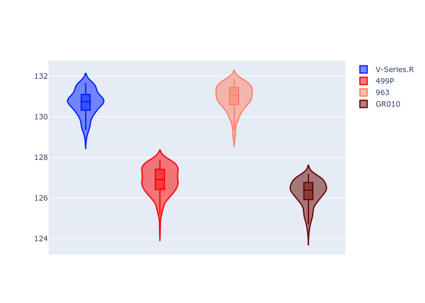

# Combined Plots

## Metadata

- BoP Accuracy: 28.62%
- Overall BoP Grade: Ω1
- Track: REFERENCETRACK
- Threshhold: 0.0kph

## BoP Table
| Manufacturer   | Car        | Weight   | Power   | PINC   | E/Stint   | FDS   | RDP    | QDP    | TDP    |
|:---------------|:-----------|:---------|:--------|:-------|:----------|:------|:-------|:-------|:-------|
| Cadillac       | V-Series.R | 1030kg   | 520.0kw | -      | 909MJ     | -     | 54.09% | 66.67% | 14.80% |
| Ferrari        | 499P       | 1030kg   | 520.0kw | -      | 908MJ     | -     | 56.14% | 50.00% | 21.06% |
| Porsche        | 963        | 1030kg   | 520.0kw | -      | 912MJ     | -     | 58.78% | 40.00% | 76.50% |
| Toyota         | GR010      | 1030kg   | 520.0kw | -      | 910MJ     | -     | 56.06% | 75.00% | 10.23% |

## Performance Table
| Manufacturer   | Car        | RP      | QP      | Vavg      |   RDLC | BOP-Grade   | Match   |
|:---------------|:-----------|:--------|:--------|:----------|-------:|:------------|:--------|
| Cadillac       | V-Series.R | 2:09.95 | 2:07.72 | 311.94kph |   1.02 | +Ω1         | 10.08%  |
| Ferrari        | 499P       | 2:06.23 | 2:03.05 | 312.00kph |   1.03 | -D1         | 67.61%  |
| Porsche        | 963        | 2:10.29 | 2:07.28 | 308.53kph |   1.02 | +Ω1         | 3.32%   |
| Toyota         | GR010      | 2:05.61 | 2:01.36 | 313.47kph |   1.04 | -Ω1         | 33.47%  |

## Race Laptimes

## Quali Laptimes

## Topspeeds

## Laptimes Lineplot

